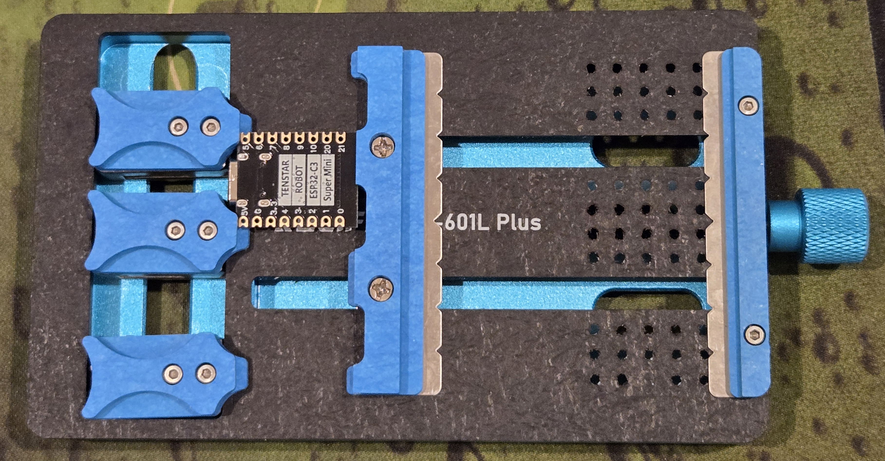

Updating my soldering tools.

<!-- more -->

```toc
# This code block gets replaced with the TOC
```

Last September, I wrote about [mmWave sensors I created using ESP8266 boards and HiLink LD2410 sensors](/diy-mmwave-presence-detectors/). I built these using my high school soldering equipment, along with a few extra tools I purchased to [install a modchip in my Nintendo Switch](nintendo-switch-oled-modding/#modchip).

I recently needed to install [Bluetooth proxies for Home Assistant](https://www.home-assistant.io/integrations/bluetooth/#remote-adapters-bluetooth-proxies) around the house. An easy solution would be to replace existing ESP8266 devices with ESP32. With the monthly AliExpress sales (and boosted cashback on top), I went ahead and upgraded my tools to make the job a lot quicker and easier.


## ESP32 C3 Super Mini

I chose to replace all my D1 Mini ESP8266 boards with the ESP32-C3 Super Mini. The ESP32-C3 is [recommended as the **replacement** for the ESP8266 by ESPHome developer Keith Burzinski](https://old.reddit.com/r/Esphome/comments/1big3vv/best_chipboard_choice/kvn5b6s/). I purchased mine from the [TENSTAR Robot Store from AliExpress](https://www.aliexpress.com/store/1103035012) for $3 AUD each.

In comparison to my ESP8266 boards, the ESP32-C3 Super Mini is:

- Lower cost: $1 cheaper ($3 vs $4).
- More energy efficient: the newer chip uses less power.
- Has more features: Can be used as Bluetooth proxies in Home Assistant.
- Smaller: About 50% the size of a D1 Mini.
- Has the same amount of GPIO pins.

There's also an expansion board available to speed up testing.


I've also [redesigned my snap fit lid case](https://www.printables.com/model/1117998-esp32-c3-super-mini-and-ld2410) to fit the ESP32-C3 Super Mini.


In the future, I hope to replace them all with the ESP32 C6. The C6 is similar to the C3 in raw processing power, but has slightly more RAM and WiFi 6 + 802.15.4 (Zigbee/Thread). Having each work as a Zigbee Router would vastly improve their usefulness. [ESPHome is still working on supporting Zigbee/Thread at this time](https://github.com/esphome/feature-requests/issues/1397).

## Multimeter

I've replaced my [old Jaycar DT-830B multimeter](https://www.jaycar.com.au/low-cost-digital-multimeter-dmm/p/QM1500) with new [Brymen's BM2257](https://brymen.eu/shop/bm2257/) from [The EEVBlog Store](https://eevblog.store/products/eevblog-bm2257-multimeter). The BM2257 is a step up from the BM235.


The biggest benefits to me so far have been:

- Auto-range functionality
- Backlit screen for dim working conditions
- Certified CAT IV rating to work with mains voltages (would've been good for the [Bottlehead Crack](/bottlehead-crack-build-log/))
- Banana plug test leads which make connecting crocodile clips so much easier
- The case has cutouts to hold the test leads when not in use


I squeezed everything into an AliExpress hard shell case measuring 13cm x 7cm x 17cm.


## PCB Holders

I replaced my Doc Ock helping hands holder with two different PCB holders. The helping hands style requires getting every bend and angle correct, and made it difficult to solder at different angles. In comparison, the new one takes only a few seconds to put a board in place and can even rotate!


The base is made of metal, so I can attach magnetic helping hands whenever I need cables to be held for tinning.


For other types of jobs, I bought a clamp style PCB holder which should suit bigger boards.



## Wire Stripper

I bought this Wire Stripper from Bunnings, but AliExpress has a bunch of identical clones. It adapts to the size of the cable and the amount of material stripped can also be adjusted. It is so much better than using pliers.


## Tip

A small, but impactful change has been switching soldering tips from a bent tip (JL02) to a knife tip (KU). I read good things about chisel tips (D) as well for SMD work and will have to give it a try next time.

The transfer of heat and surface area on bent tips were always very poor. I would have to hold the iron against the board or solder for a few seconds before the solder would flow.


## Solder Stand

I am now using a stand that has brass instead of a wet sponge to clean my soldering iron tips. It's not perfect, but is an upgrade from the older one.


## Cutting Mat

I've upgraded my cutting mat size from A5 to A3 for extra room to work. There are two types of these mats on AliExpress and the one made from foam instead of plastic is superior as it does not slide around the table.


## Tweezers

The last upgrade was to replace my tweezer set. The old set would transfer heat up to my fingers when the iron was touching them. The new set has ceramic tips which prevents this issue.


The tweezers are also self-closing (also known as reverse-action, cross-locking, or cross-action), meaning they don't require constant pressure to hold items.


But just in case, I also bought regular ceramic tweezers too.


