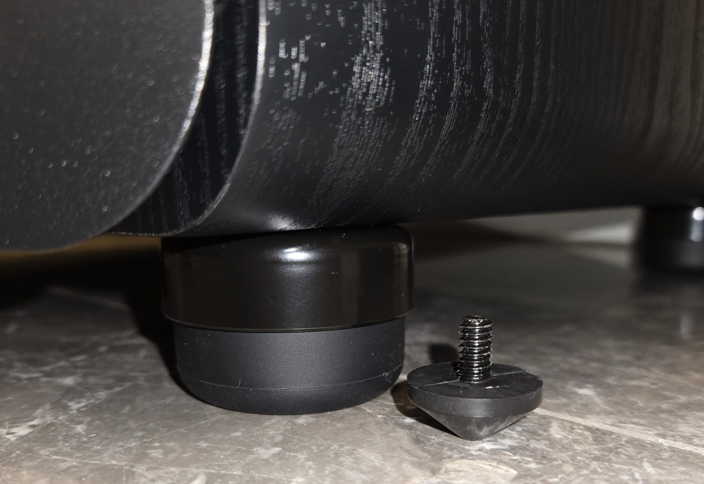
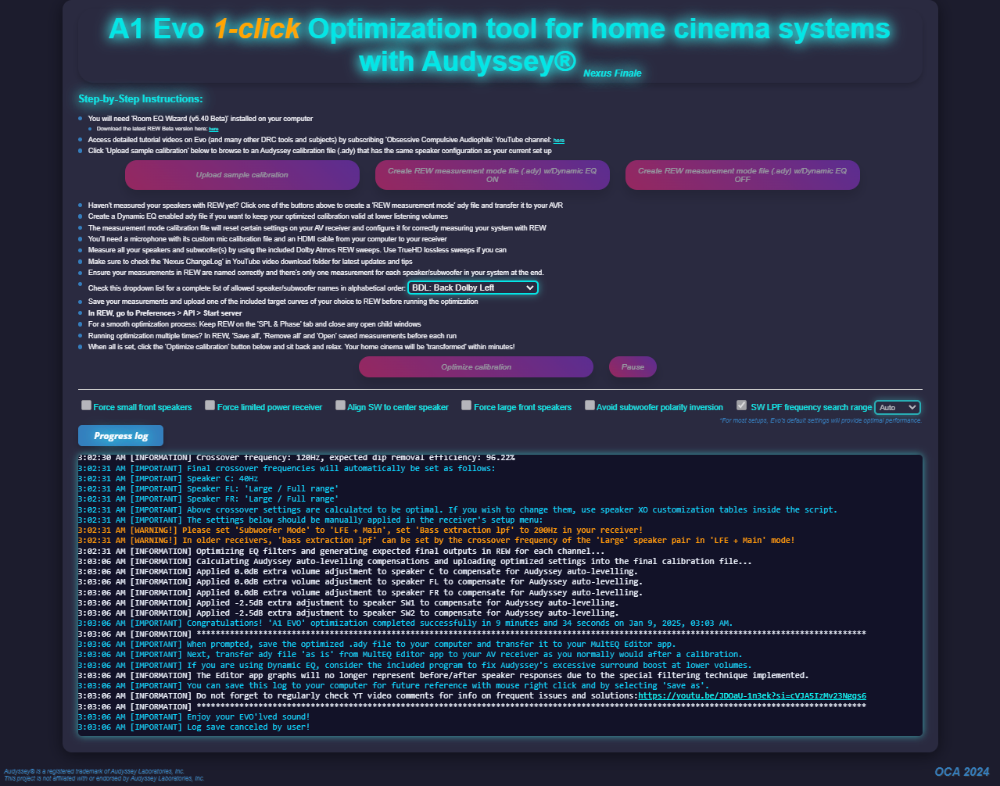

I added two SVS SB-3000 subwoofers to my living room entertainment area.

<!-- more -->

```toc
# This code block gets replaced with the TOC
```

## SVS SB-3000 Subwoofers

The [SVS SB-3000 is a 13-inch 800 watt sealed cabinet subwoofer](https://www.svsound.com/products/sb-3000) with a frequency response of 18-270Hz ±3 dB. The sealed design tightens the bass response and minimises distortion, making it ideal for my 50/50 music/movie listening. Another benefit of the sealed design is the compact dimensions.

I have been looking for subwoofers and surround speakers to pair my current [SVS Ultra Towers and Center](/living-room-entertainment/#svs-ultra-speakers) from the 2022 Black Friday sales. So last year (2024), I purchased two SVS SB-3000 subwoofers from West Coast Hi-Fi for $1,799 each (reduced from $2,599).


I placed both subwoofers on the inside of my towers. While not acoustically optimal, symmetry and aesthetics were important considerations (IYKYK).


Both subwoofers are connected using [AmazonBasics 2-Male to 2-Male RCA cables](https://www.amazon.com.au/dp/B01D5H8PQ0). I split the cable and connected each side to my Denon X3800H AVR. While there is an [AmazonBasics subwoofer cable](https://www.amazon.com.au/dp/B01D5H8GYG) available, it's likely the same as these RCA cables but coloured purple.


## West Coast Hi-Fi

A quick shoutout to Conor from West Coast Hi-Fi. He replied to my messages at all hours and helped me place an order while I was waiting for my new credit card to arrive. Delivery took 3 weeks from payment.


## SVS SoundPath Subwoofer Isolation System

Along with subwoofers, I also purchased the [SVS SoundPath Subwoofer Isolation System](https://www.svsound.com/products/soundpath-subwoofer-isolation-system) for $99 each. These are four big rubber replacement feet that help reduce vibration and noise artifacts by decoupling the subwoofer from the floor. While the effect might be placebo, I feel better knowing there might be a possibility of tighter and cleaner sounding bass.


Compared to the original feet:



## A1 Evo Nexus

### Measurements

I integrated the subwoofers using A1 Evo Nexus instead of Denon's Audyssey. A1 Evo Nexus is the second-generation room correction algorithm by Obsessive Compulsive Audiophile. I had previously used the first-generation A1 Evo and experienced noticeable improvements in audio quality. They are currently working on a third-generation [A1 Evo Neuron](https://www.youtube.com/watch?v=mwmUpjwUgSk), which I plan to try once it's out of testing.

I followed these two tutorial videos:

<iframe src="https://www.youtube.com/embed/tNj-nWR-Yyo" allowfullscreen width="1280" height="720"></iframe>

<iframe src="https://www.youtube.com/embed/JDOaU-1n3ek" allowfullscreen width="1280" height="720"></iframe>

For each measurement, I connected my computer to the AVR and TV, then positioned myself on the kitchen bench to avoid interfering with the recordings.


I used the Audyssey microphone on a tripod, positioned at ear level.


I took measurements on the middle, left and right of my main listening position (MLP). I captured 5 good samples and averaged them. The AVR was set to `Dolby Audio - TrueHD + DSurround` in Movie mode to utilise the subwoofers. I did not get any output on the subwoofers in `Stereo` or `Multi-Channel Stereo`. I chose the `Dirac Harman 8dB` target curve to get more bass from the subwoofers.


### Tips

- Turn ECO mode `Off` during measurement. Return it to `Auto` when finished.
    - 
- Disable `CinemaEQ` and `Loudness Management`.
    - 
- Ensure subwoofers do not interfere with speaker measurements:
  - Ensure crossover is `Off (Full Range)`.
  - Ensure subwoofer output is `LFE` and not `LFE + Main`.
  - Better yet, turn off the subwoofers when measuring the speakers.
- Each subwoofer is measured individually. Turn off other subwoofers to measure a single unit (SW1/SW2/SWx...)
- Get the middle position (or skip if not MLP) within 3cm. Every measurement is aligned to this at the end.
    - 

### Results

After the calibration, the application told me to:

1. Set Low Pass Filter to `250Hz`.
1. Set Subwoofer Output to `LFE + Main`.
1. Set Bass Extraction LPF to `200Hz`.
1. Switch the polarity on both subwoofers.
1. Run [fixDynamicEQ](https://github.com/pulento/fixDynamicEQ).



## Home Assistant Automations

I created these two automations in Home Assistant to ensure the right sound mode is picked on the AVR for the content being played.

For Plex, it uses `AUTO` so the content being played determines the sound mode (i.e. Dolby, Stereo, etc.):

```yaml
alias: Denon AVR - Sound Mode for Plex
triggers:
  - trigger: state
    entity_id: [media_player.shield]
    attribute: app_id
    to: com.plexapp.android
actions:
  - action: media_player.select_sound_mode
    data:
      sound_mode: AUTO
    target:
      entity_id: media_player.denon_avc_x3800h
mode: single
```

For SmartTube and Spotify, they will only ever be stereo:

```yaml
alias: Denon AVR - Sound Mode for SmartTube/Spotify
triggers:
  - trigger: state
    entity_id: [media_player.shield]
    attribute: app_id
    to: com.teamsmart.videomanager.tv
  - trigger: state
    entity_id: [media_player.shield]
    attribute: app_id
    to: com.spotify.tv.android
actions:
  - action: media_player.select_sound_mode
    data:
      sound_mode: MCH STEREO
    target:
      entity_id: media_player.denon_avc_x3800h
mode: single
```
