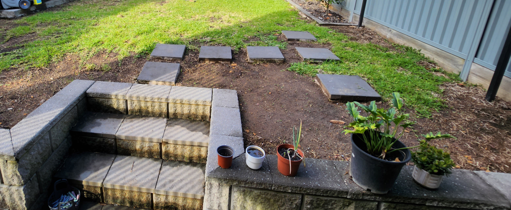
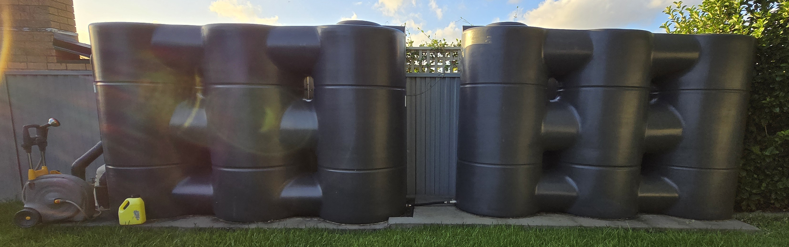

This is the first in a two-part post on my gardening adventure. In this post, I will cover pulling weeds, laying down new turf, watering equipment and lawn care. In part 2, I will cover the technological aspects including the automatic watering schedules and plant sensors.

<!-- more -->

```toc
# This code block gets replaced with the TOC
```

## Introduction

During my time living at home, I dreaded mowing the lawn. It felt like a never-ending chore that needed to be tackled regularly. When I moved into my place, I found myself equally frustrated with the size of my backyard, and its sprawling lawn.

At first, I toyed with the idea of tearing it all out and replacing it with concrete. I paid little attention to the garden and only mowed when the grass grew too long. However, as time passed, I began to understand that maintaining a beautiful home also meant caring for the garden and lawn.

This is how it looked like back in June 2022. A lot of dead buffalo grass and weeds.


There was also a big ditch I had to fill in.


## Pulling Weeds

For five months, from November 2022 to April 2023, I dedicated my evenings to pulling weeds. Each day after work, I set a goal to fill an entire bucket with weeds. I suspect that most of the weeds were blown in by the wind from the busy road nearby, along with seeds dropped by the large tree in my neighbour's yard, which hosts a multitude of birds.




My weeder of choice is the [Fiskars Aluminium Weeder](https://www.bunnings.com.au/fiskars-aluminium-weeder_p3360133) I got from Bunnings. I have been using it to this day. It hasn't bent at all, but I wish the contour was larger to get more leverage. My gloves are the [Cyclone Fully Synthetic Garden Gloves](https://www.bunnings.com.au/cyclone-fully-synthetic-garden-gloves-medium_p0033036) which are also available at Bunnings.


This is a picture my wife took of me from inside.


## Laying Turf

After five months of pulling weeds, I was left with large gaps in the lawn. I could have waited for the existing Buffalo grass to fill in those spaces, but I knew that if I left them unattended for too long, the weeds would just return to claim their territory.

I rented a van and headed to Bunnings to pick up 12 rolls of fresh Buffalo grass. Fortunately, I opted for a hire vehicle instead of my own, as it ended up making quite a mess.


To lay down turf, the steps were:

1. Till the soil. I used the [Trojan Multi-Hoe](https://www.bunnings.com.au/trojan-fibreglass-handle-multi-hoe_p0101388).
1. Cut the turf to size. I used the hoe to do that as well.
1. Lay down the turf
1. Water three times a day for two or three weeks or until roots take hold.


## Watering

The house came equipped with two 5,000-liter slimline water tanks. These tanks are used for watering the garden and are also connected to the toilets in the house.



In the backyard, I use the [Hozelock Wheeled Fast Cart](https://www.hozelock.com/product/wheeled-fast-cart/) as my hose reel. It holds a 40-meter hose, allowing me to easily wash my car with rainwater at the front of the house. One of its great features is the automatic layering system for neatly rewinding the hose. However, since I rarely move the cart, I regret not opting for the cheaper [Fast Reel](https://www.hozelock.com/product/free-standing-fast-reel/) without the cart feature instead.


At the front of the house is a Pope hose reel the last owners left behind. It lacks automatic layering and leaks a bit from the inlet. I wouldn't recommend it. I am a fan of the Pope Perma Fit hose fittings which stop the fitting from falling off.


At the tap, I have the [GARDENA Twin Tap Connector](https://www.gardena.com/au/products/watering/hose-fittings/twin-tap-connector/901160701.html) installed. One side is designated for my regular hose, while the other accommodates any watering automation systems I use.


I use [GARDENA multi-sprayers](https://www.gardena.com/au/products/watering/nozzles-sprayers/comfort-multi-sprayer/967102201.html) in both the backyard and front yard. The one in the backyard is the [metal variant](https://www.gardena.com/au/products/watering/nozzles-sprayers/premium-multi-sprayer/967102401.html), which is resistant to UV degradation. Since it's more expensive, I prefer not to leave it in the front yard for fear of it being stolen.


Finally, I use [Hozelock AquaStop adapters](https://www.hozelock.com/product-category/watering/fittings-and-connectors/gun-sprinkler-connectors/) to connect the hose and sprayer. The AquaStop feature prevents water from flowing when the hose isn't connected to anything, which comes in handy when I switch from using the sprayer to my pressure washer.


## Lawn Mower

Since moving in, I've gone through several mowers, primarily opting for electric ones because they can be stored upright easily. However, tackling the lawn has been quite a challenge. When I arrived, the grass was severely overgrown, with layers of thatch that made mowing difficult. I attempted to use several different mowers, but sadly, none of them delivered the results I was hoping for:

- [Ozito 18V Cylinder](https://www.ozito.com.au/p/3000554-pxcpm-018/): stalled instantly.
- [Ozito 18V Brushless](https://www.ozito.com.au/p/3000490-pxclms-018/): stalled instantly.
- [Ozito 36V Steel Deck](https://www.ozito.com.au/p/3001208-pxbms-3647/): stalled a few times, but was able to complete a mow.
- [EGO LM1903E](https://egopowerplus.com.au/47cm-mower/): scalped up the grass even on a high setting.


The mower I've decided to keep is the [EGO Power+ 52cm Select Cut (LM2135E-SP)](https://egopowerplus.com.au/52-cm-self-propelled-mower-select-cut/). While it still stalls if I try to cut too low (which tends to scalp the grass anyway), its self-propelled feature makes a noticeable difference. With this mower, it moves forward on its own, allowing me to simply steer, which has been a huge advantage, especially since my backyard is on a slope. EGOEGO ran a promotion at the time of purchase, which included a [blower](https://egopowerplus.com.au/power-900m-h-blower-1/).


## Line Trimmer

Staying with the EGO family, I got the [Power+ 38cm Line Trimmer](https://egopowerplus.com.au/power-38cm-powerload-brushless-line-trimmer/) with a lighter [5.0Ah battery](https://egopowerplus.com.au/battery-5ampt/). Its special feature is it is the world's first self-winding line trimmer. Whenever it runs out, I can load a new line with a push of a button.

<iframe src="https://www.youtube.com/embed/s3ysNSFlVug" allowfullscreen width="1280" height="720"></iframe>
