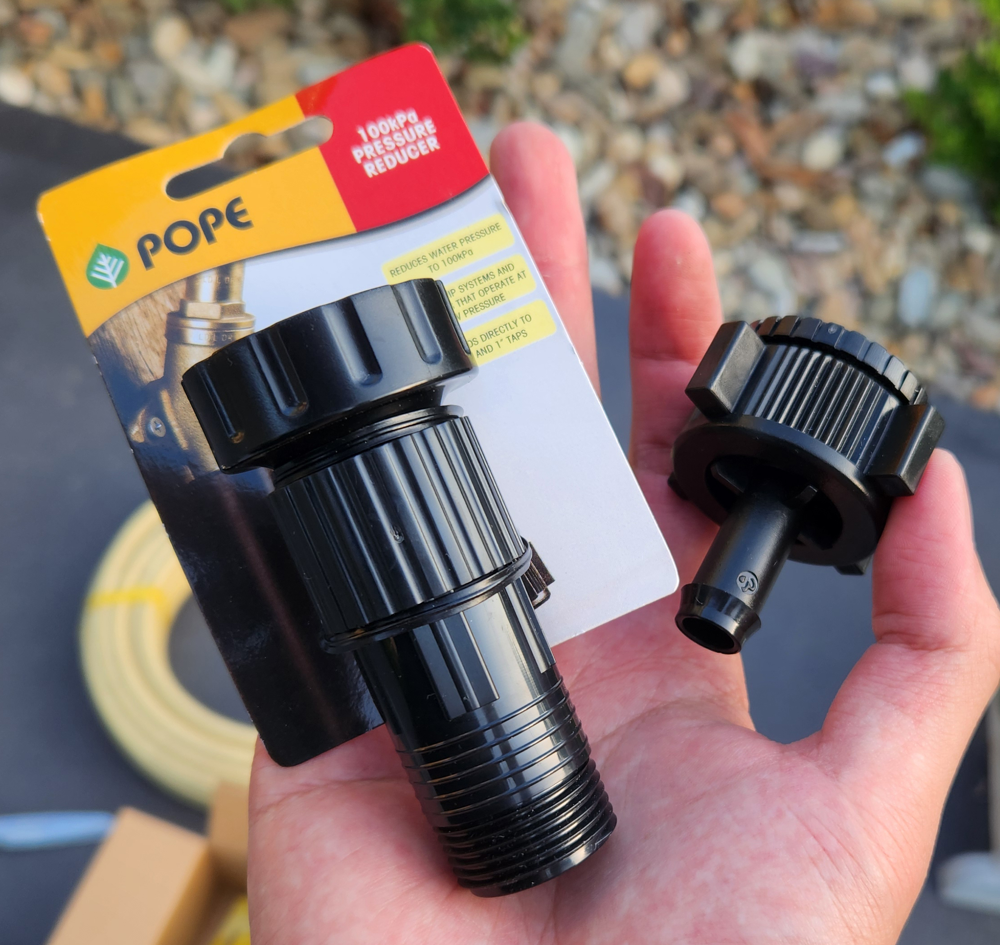

In [Part 1](/gardening-part-1), I worked on improving the lawn. Then in [Part 2](/gardening-part-2), I covered the jet water pump, sprinklers, indoor plant sensors, and fixing bent plants. Now, in this final post, I'm sharing how I automated my watering system using poly pipe, LinkTap, and Home Assistant to make watering easier and more efficient.

<!-- more -->

```toc
# This code block gets replaced with the TOC
```

## LinkTap

I came across [LinkTap](https://www.link-tap.com/) when researching automatic watering timers. They are an Australian company based in Canberra (our capital) that has been around for 10 years. Their products use batteries and run a proprietary protocol on top of the Zigbee to extend battery life for up to 2 years. Everyone loved LinkTap, but not so much other brands.

I purchased a G2-S (1 zone, $199) and D1 (2 zones, $245) models through Amazon. The G2-S was bundled with a gateway.


Both devices require 1.5v AA batteries, which rules out my 1.2v Eneloop recharge collection. The market for rechargeable 1.5v is expensive and untested. It didn't make financial sense to buy those when disposable 1.5v batteries were a lot cheaper from reputable brands like AmazonBasics.


The D1 in my backyard would often disconnect from the gateway, which was about 40 metres and 4 brick walls away. As mentioned earlier, the network runs over Zigbee, a low-power **mesh network**, which wasn't made to work with a single gateway/router. Thankfully, earlier this year, [LinkTap released a gateway extender](https://www.link-tap.com/#!/linktap-gateway-and-extender/en) which I placed right between both devices.


This improved my signal quality from 52 to 77 and signal strength from -77 to -66 dBm. I haven't had a disconnection since then.


## Poly Pipe

Poly pipe is a plastic piping system commonly used in garden irrigation. Because it is used worldwide, many accessories and components are compatible across different brands.

### Sizing

Poly pipe comes in various diameters and types. [At Bunnings](https://www.bunnings.com.au/products/garden/irrigation/irrigation-supplies/poly-pipes), they sell low-density poly pipe in 4mm, 13mm, 19mm and 25mm in black and beige with matching accessories. Ultimately, I will be using drippers, which only fit onto 4mm drip tubes.

The diameter to use is dependent on the water pressure from the source and the total length of the run. The steps I took to calculate this were:

First, calculate the water pressure. I used the [Holman Pressure Gauge](https://www.bunnings.com.au/holman-pressure-gauge_p3120293) on both LinkTap devices.


Second, calculate the litres per minute (LPM) using the [water bucket test](https://popeirrigation.com.au/installation-calculators/). Convert this to litres per second (LPS) using [another calculator](https://www.unitconverters.net/flow/liter-minute-to-liter-second.htm).

Finally, take that number and the length of the installation into this [calculator](https://www.irrigationbox.com.au/minimum-required-pipe-size-calculator) to determine the minimum diameter poly pipe. The minimum pressure required for drippers is at least 100 kPa, so convert the psi reading from the pressure gauge if necessary.


Both taps had over 300 kPa, which is the limit of what low-density poly pipe can handle. I purchased a 300 kPa and 100 kPa reducer and it took the pressure down to safer levels.




My final numbers were as follows:

| Device                 | kPa | LPM | Metres | Size |
|:-----------------------|:----|:----|:-------|:-----|
| G2-S                   | 300 | 18  | 10     | 13mm |
| G2-S (300 kPa reducer) | 180 | 15  | 10     | 13mm |
| D1                     | 410 | 33  | 40     | 19mm |
| D1 (300 kPa reducer)   | 360 | 20  | 40     | 19mm |
| D1 (100 kPa reducer)   | 140 | 19  | 40     | 19mm |

### Fittings

To get everything connected, I had to buy a bunch of poly pipe fittings for doing elbows, splitting, joining, capping and mounting all held together with ratchet clamps. Ultimately, anything to get water from the tap to the drippers on the other side.

The majority of our items ended up [being from Holman](https://www.holmanindustries.com.au/drip-irrigation/), as their beige tubing and fittings blend into the rocks in our garden.


### Installation

Installation took two afternoons, one for each zone.

Straight down from the tap, I have an elbow that turns the pipe into the garden. The tap is in the middle of the garden, so I have a splitter to run piping in both directions.


The poly pipe is held down using metal pins.


Meanwhile, my wife helps out by connecting the drippers and barbed threads to the drip tubes with boiling water.


Along each plant, I puncture the pipe and connect the drip tube. I pull the barbed thread out slightly which prevents it from leaking.


Eventually, all plants have their own dripper.


Once I'm happy, I hide all the piping underneath the rocks and cap both ends.


Turn the water on, and check for leaks.


As I couldn't run piping across or under my driveway, I ran a pipe from my backyard all to the front yard along the side of the house.


I cable-tied it to the existing conduit and then used nails to attach it to wooden side fencing.


At the front, the larger 19mm pipe is converted back to a 13mm using an adapter. This is so it bends into the rocks again.


## Home Assistant

After all the piping was installed, the final step was to get it all automated using Home Assistant.

### LinkTap Integration

On GitHub, [sh00t2kill has developed a LinkTap integration](https://github.com/sh00t2kill/linktap_local_http_component) that uses its local HTTP API instead of MQTT/Zigbee.


It also includes a few Actions, including a "Start Watering for X seconds" in case Home Assistant goes offline and your automation never gets around to the "stop watering" step.


### Smart Irrigation

The [Smart Irrigation](https://github.com/jeroenterheerdt/HAsmartirrigation) integration by jeroenterheerdt automatically calculates optimal irrigation timing by monitoring moisture loss through [evapotranspiration](https://en.wikipedia.org/wiki/Evapotranspiration). It factors in precipitation (rain/snow) and weather forecasts to determine when watering is needed. The integration tracks changes using a "bucket" method and supports multiple irrigation zones, each with individual settings for precise water management of gardens, lawns, or crops.

Start by creating a zone in the Smart Irrigation for each zone. Follow [the instructions](https://jeroenterheerdt.github.io/HAsmartirrigation/configuration-zones.html#configuring-a-zone) to configure the zone based on its size, throughput and drainage rate.


This also creates a corresponding sensor within the integration indicating how many seconds to water for. It will take a couple of days for this to be calculated the first time.


Finally, create an automation to water the plants and clear the zone's bucket. As my backyard sprinklers are watering [buffalo grass](/gardening-part-1/#laying-turf), I added conditions to account for the season.

```yaml
alias: Gardening - Backyard Sprinklers
description: ""
triggers:
  - at: "09:00:00"
    trigger: time
conditions:
  - condition: numeric_state
    entity_id: sensor.smart_irrigation_backyard_sprinklers
    above: 0
  - condition: not
    conditions:
      - condition: state
        entity_id: sensor.meteorological_season
        state: winter
    alias: Not Winter
  - alias: Season / Day of Week
    condition: or
    conditions:
      - alias: Summer
        condition: and
        conditions:
          - condition: state
            entity_id: sensor.meteorological_season
            state: summer
          - condition: time
            weekday:
              - mon
              - wed
              - fri
      - alias: Spring
        condition: and
        conditions:
          - condition: state
            entity_id: sensor.meteorological_season
            state: spring
          - condition: time
            weekday:
              - mon
      - alias: Autumn
        condition: and
        conditions:
          - condition: state
            entity_id: sensor.meteorological_season
            state: autumn
          - condition: time
            weekday:
              - mon
actions:
  - action: linktap.start_watering
    target:
      entity_id: valve.linktap_d1_sprinklers
    data:
      seconds: "{{ states(\"sensor.smart_irrigation_backyard_sprinklers\") }}"
  - action: smart_irrigation.reset_bucket
    metadata: {}
    data: {}
    target:
      entity_id: sensor.smart_irrigation_backyard_sprinklers
mode: single
```
