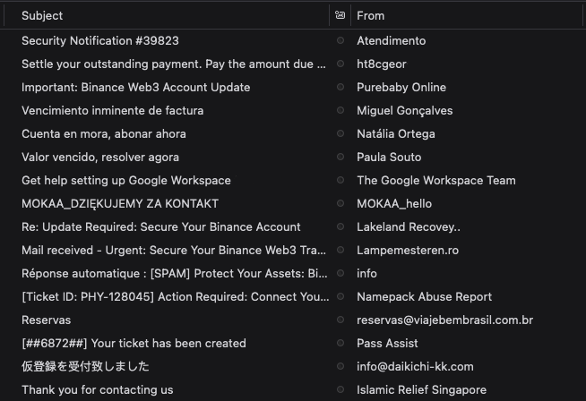
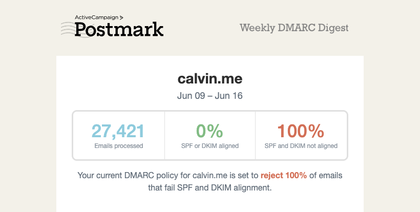
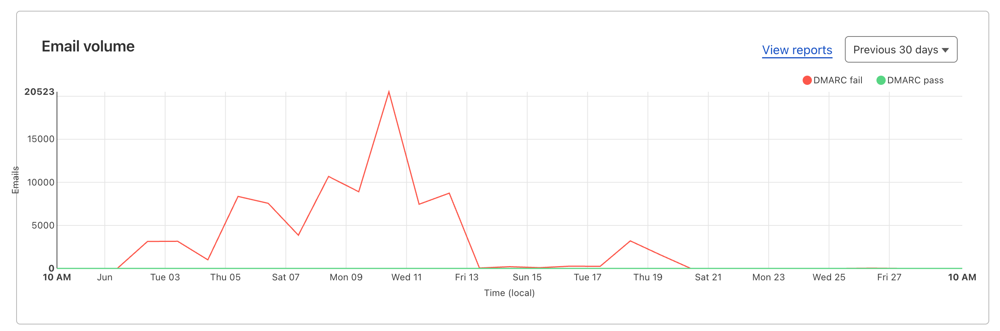
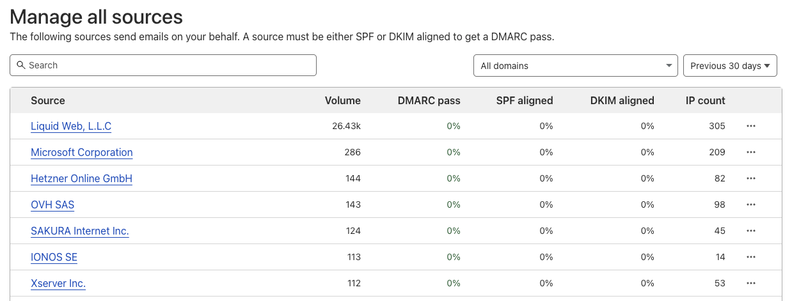
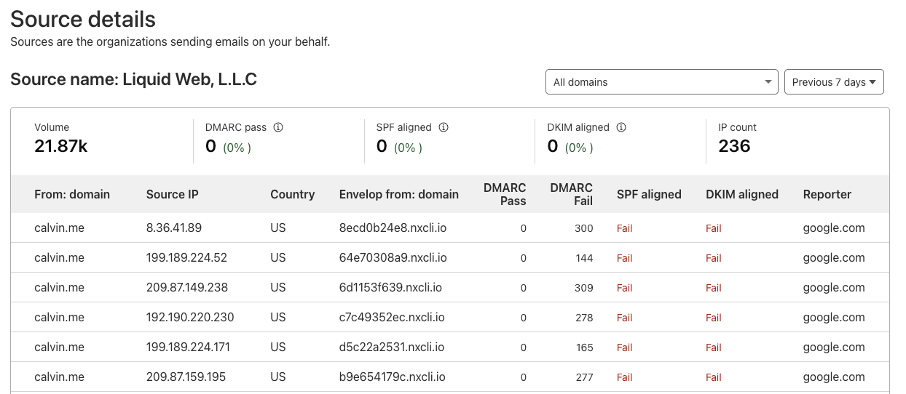
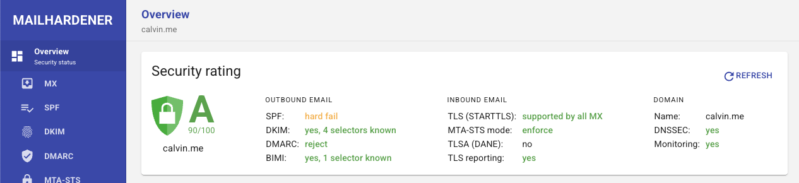
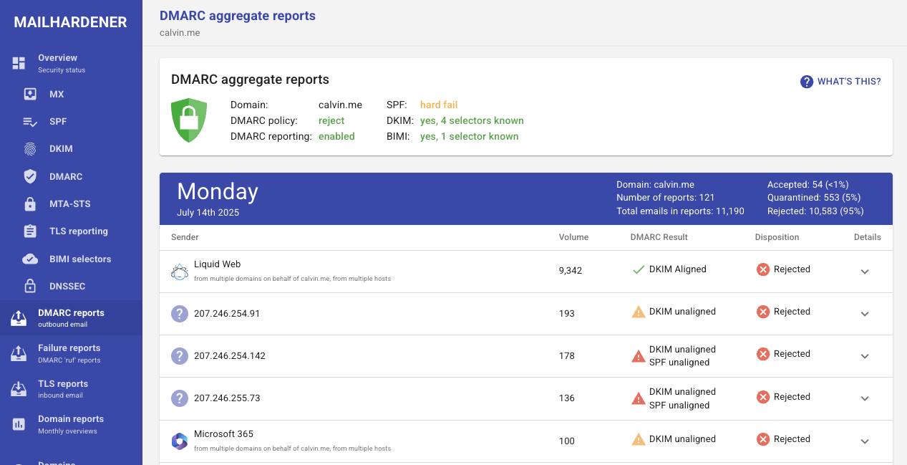
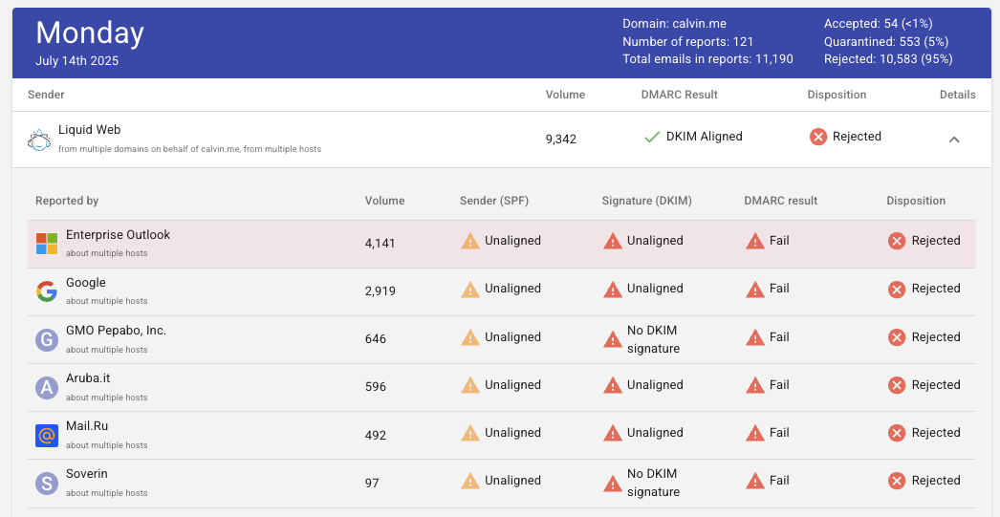
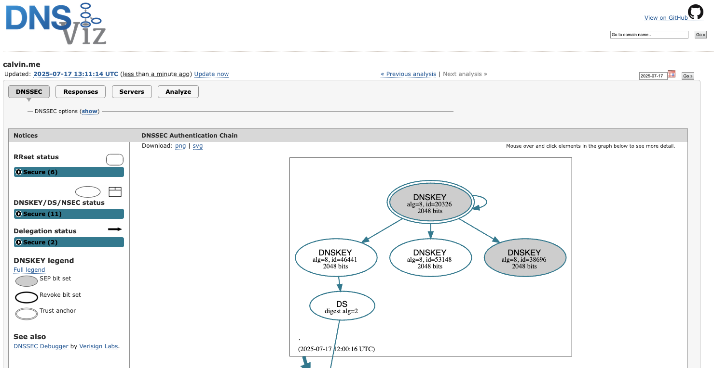

Three weeks ago, I discovered that spammers had started using my email domain to send thousands of spam messages. This is how I am fighting back.

<!-- more -->

```toc
# This code block gets replaced with the TOC
```

## Discovery

My inbox began filling with bounce-back emails from confused recipients, and I quickly realised my domain's reputation was being trashed by criminals I'd never met. What started as an annoying trickle of misdirected complaints soon became a flood of 135,000 illegitimately sent emails.



Here's how I fought back to protect my domain's email deliverability and stop the spoofing attacks in their tracks.

## Email Authentication Protocols

A quick refresher:

- SPF (**S**ender **P**olicy **F**ramework): a list of senders allowed to send emails on my behalf.
- DKIM (**D**omain **K**eys **I**dentified **M**ail): cryptographically sign email via keys shared as DNS records
- DMARC (**D**omain-based **M**essage **A**uthentication, **R**eporting and **C**onformance): a policy on how receivers should handle emails sent from my domain.

I thought I had my email authentication protocols (SPF, DKIM and DMARC) all locked up and hardened, but I was wrong. I identified two issues with how I configured them.

The first issue was that my SPF policy was set to `?all`. This is a neutral qualifier, meaning it's up to the receiver to decide what to do with emails claiming to come from my domain. I changed this to the hard fail `-all`, which instructs receivers to reject emails that originate from servers not listed in the SPF record.

[Experts suggest](https://www.mailhardener.com/blog/why-mailhardener-recommends-spf-softfail-over-fail) that a soft fail (`~all`) is recommended over a hard fail, but this doesn't apply to me for the following reasons:

- I only send emails from my email provider.
- I am not dealing with complex corporate email flows.
- I want maximum spoofing/impersonation protection.
- I want to send a clear signal that unauthorised emails should be rejected.

The second issue was that my DMARC policy was set to `p=none`. This is the recommended policy when starting off to ensure everything still works. I never got back around to changing it to `p=reject` to ask receivers to outright reject messages that failed DMARC. I also added the `adkim`, `aspf` and `sp` tags in their strictest forms to further harden my domain.

## DMARC Reporting

DMARC reporting summarises email authentication results. Since the start, I have been using the [free DMARC service provided by Postmark](https://dmarc.postmarkapp.com/). They send out a weekly summary showing how many emails have been processed and their sources.



I found that [Cloudflare also offered DMARC reporting](https://developers.cloudflare.com/dmarc-management/). Their DMARC reporting updates in a few hours, which was tremendously better than waiting for the weekly report from Postmark. Multiple reporting endpoints are possible by comma separating them, i.e. `rua=mailto:first@dmarc,second@cloudflare;`.



Cloudflare also allow drilling down into each source to see fine-grain details. Here, we can see that 99% of the emails originate from Liquid Web, L.L.C., which is the owner of [Nexcess](https://www.nexcess.net/). I have tried contacting them, but haven't received any reply. They don't seem to care based on [all their other complaints](https://www.spam.org/complaints?f=domain&i=nxcli.io).





Mailhardener is another excellent tool I came across while looking for a free inbound SMTP TLS reporting endpoint (more on that later). They provide a free plan for one domain, which unlocks almost all their features. They evaluated my domain and provided recommendations to improve its security rating.



Their DMARC reporting is similar to Cloudflare's offering. Each day can be drilled down to see fine-grained details, including the report itself.





## DNSSEC

The last measure I took was to enable DNSSEC (DNS Security Extensions), which protects against DNS tampering and ensures the DNS responses are authentic and haven't been modified. This prevents tampering with all the previously mentioned email authentication protocols (SPF, DKIM, DMARC).

Enabling DNSSEC requires coordination between your domain registrar and DNS provider to create `DS` records. This process is unique to each provider. Be extremely careful transferring DNSSEC-enabled domains between registrars. If the new registrar doesn't properly handle your cryptographic signing keys during transfer, your domain can become completely unreachable.

[DNSViz](https://dnsviz.net/) can be used to confirm DNSSEC is working.



## Terraform/OpenTofu

I've written Terraform code to create all the necessary DNS records for the email authentication protocols. It is available on my GitHub at [calvinbui/infra](https://github.com/calvinbui/infra/tree/master/email). This includes additional functionality such as deploying BIMI, MTA-STS and TLS-RPT using Cloudflare's free-tier services.

I've also [written terraform code](https://github.com/calvinbui/infra/tree/master/no-email) to protect domains that do not send email. This is based on advice from the [UK Government](https://www.gov.uk/guidance/protect-domains-that-dont-send-email) and [Cloudflare](https://www.cloudflare.com/en-gb/learning/dns/dns-records/protect-domains-without-email/).

## Other

- CAA (**C**ertificate **A**uthority **A**uthorization): controls which Certificate Authorities can issue SSL certificates for your domain. Since you don't need certificates on an email-only domain, you can use a restrictive CAA record like `<domain> CAA 0 issue ";"`

- ADSP (**A**uthor **D**omain **S**igning **P**ractices): an early email authentication protocol that's now obsolete and deprecated. DMARC already provides superior protection compared to what ADSP ever offered.

- BIMI (**B**rand **I**ndicators for **M**essage **I**dentification): displays brand logos next to emails in supported email clients. The trademark and certificate requirements make it impractical for personal domains. The BIMI guidelines suggest that the certificate is optional, but in reality, you will need a VM certificate for BIMI to work with most mail providers. Without it, it would be too easy for scammers to phish users.

- DANE (**DNS**-based **A**uthentication of **N**amed **E**ntities): works by using DNS records to specify which SSL/TLS certificates are valid for your services. You generally cannot use DANE with hosted email services because you don't control the certificates.

- MTA-STS (**M**ail **T**ransfer **A**gent **S**trict **T**ransport **S**ecurity): enables domains to require TLS 1.2+ encryption and valid certificate validation for all inbound SMTP connections, preventing downgrade and man-in-the-middle attacks.

- TLS-RPT (**T**ransport **L**ayer **S**ecurity **R**e**p**or**t**ing): complements MTA-STS by allowing MTAs to send JSON-formatted aggregate reports of TLS negotiation failures, giving visibility into encryption issues.
