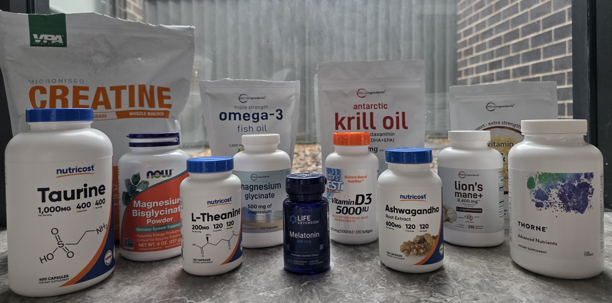
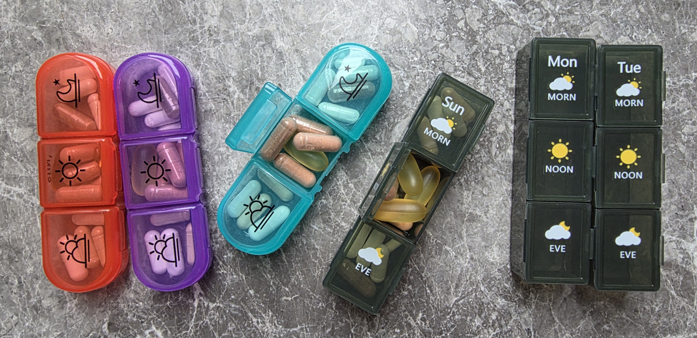
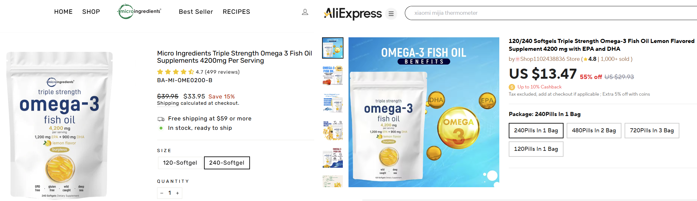
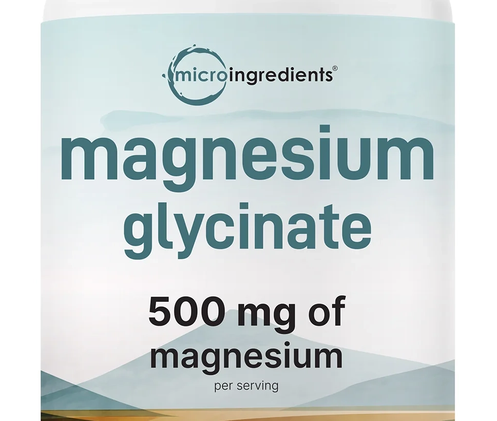
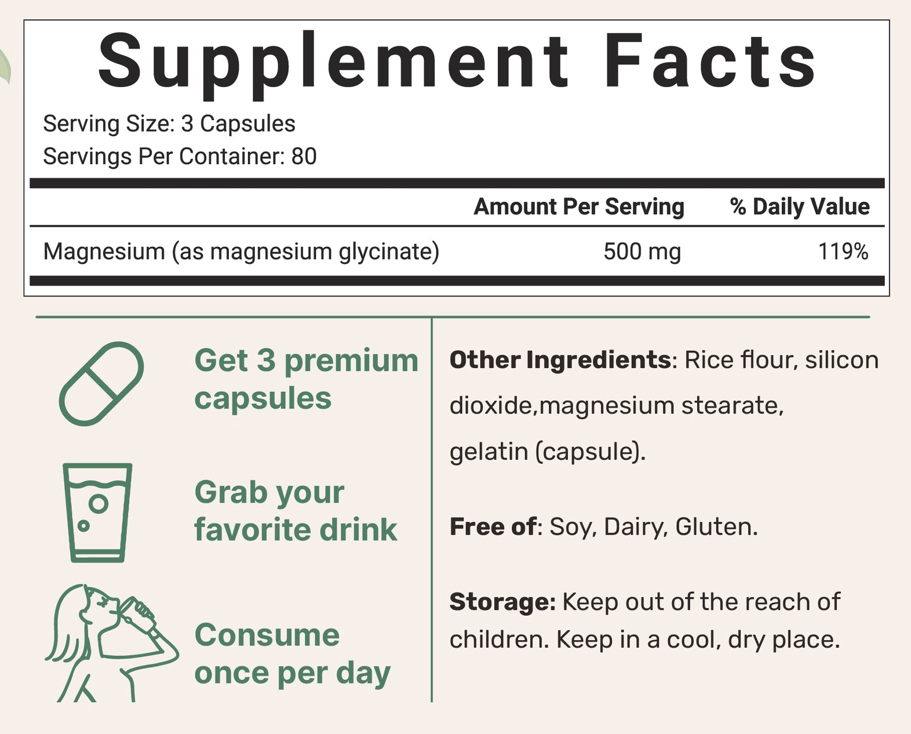

For a while now, I've been taking vitamins and supplements to support my energy, focus and overall well-being. This is not medical advice, and I strongly recommend consulting with a healthcare provider before starting any supplement routine, especially if you have existing health conditions or take medications.

<!-- more -->

```toc
# This code block gets replaced with the TOC
```



This routine has helped me maintain steady energy, better focus, improved recovery, and more consistent sleep. Everyone's needs are different, so what works for me might need adjusting for others.

## Routine

Dosages listed are what I take. Consult a healthcare provider for appropriate dosing for your situation. Individual responses vary significantly. This routine works for me, but should not be copied without considering your health status, medications, and needs.

### Morning

I take these with my morning coffee to improve my memory, mental clarity and energy levels.

- [L-Theanine](https://en.wikipedia.org/wiki/Theanine) (200 mg): An amino acid from green tea that promotes calm focus without drowsiness. It does this by modulating neurotransmitters such as [GABA](https://en.wikipedia.org/wiki/GABA), [serotonin](https://en.wikipedia.org/wiki/Serotonin) and [dopamine](https://en.wikipedia.org/wiki/Dopamine), which reduce stress and improve mood. When combined with caffeine, it enhances focus and reaction time while reducing jitteriness and crashes.
- [Lion's Mane](https://en.wikipedia.org/wiki/Hericium_erinaceus) (560 mg): A mushroom that supports cognitive function and nerve health by stimulating its growth. I take it in the morning to boost my brain during working hours.
- [Taurine](https://en.wikipedia.org/wiki/Taurine) (1000 mg): An amino acid found in the heart and brain. It supports cardiovascular health, muscle function and has sustained energising properties.
- [Creatine](https://en.wikipedia.org/wiki/Creatine) (5 g): Replenishes [ATP](https://en.wikipedia.org/wiki/Adenosine_triphosphate), the primary energy molecule in muscle and brain cells. Listen to the [Science VS podcast episode](https://open.spotify.com/episode/0tTBxK0aJwinS0GKxzIOyk) to learn more.

### Lunch

My lunchtime supplements are focused on foundational nutrients and are timed with food for optimal absorption. Always take fat-soluble vitamins with meals containing healthy fats.

- Multivitamin: I take a multivitamin to cover all the vitamins and minerals I have missed throughout the day. I chose one that delivers nutrients in their most absorbable, active forms and avoids unnecessary fillers. Because I take other targeted supplements, I reduce the multivitamin dose in half to avoid excessive intake of certain nutrients.
- [Fish Oil](https://en.wikipedia.org/wiki/Omega%E2%88%923_fatty_acid) (1200 mg EPA + 900 mg DHA): Omega-3 fatty acids EPA and DHA are essential fats that our bodies cannot produce on their own. EPA reduces inflammation and supports cardiovascular health. DHA is crucial for brain function, memory retention, cognitive performance and eye health. Together, they support joint comfort, immune function and healthy cell membrane integrity. Quality matters significantly with fish oil; look for third-party tested products for purity and potency.
- [Vitamin D3](https://en.wikipedia.org/wiki/Cholecalciferol) (10000 IU): Sunshine in a pill. Vitamin D3 for immune function, bone health and mood regulation. My dosage of D3 is well above the conventional recommendation of 1000-4000 IU.

### Evening

My evening supplements focus on recovery, relaxation and supporting my body's natural repair process.

- [Collagen](https://en.wikipedia.org/wiki/Collagen) (1100 mg): Provides amino acids like glycine, proline and hydroxyproline for skin elasticity, joint health and muscle recovery. Taking it in the evening aligns with when our bodies naturally focus on tissue repair.
- [Magnesium Glycinate](https://en.wikipedia.org/wiki/Magnesium_glycinate) (500 mg): This mineral supports muscle and nerve function, helps regulate blood pressure, maintains heart rhythm, and plays a role in protein synthesis and blood glucose control. It also activates the Vitamin D I take at lunch. It is one of the most crucial minerals for optimal health, involved in over 300 biochemical reactions in the body.
- [Ashwagandha](https://en.wikipedia.org/wiki/Withania_somnifera) (600 mg): A herb that helps my body manage stress by balancing cortisol levels. Its effects vary depending on the individual. For me, it promotes relaxation, but for others, it empowers them through the afternoon slump.

### Night

About 30-60 minutes before bed.

- [Melatonin](https://en.wikipedia.org/wiki/Melatonin) (300 mcg): A hormone naturally produced by the body in response to darkness, making it easier to fall asleep and improving sleep quality. I take this to signal my brain that it's time to wind down. It helps regulate my circadian rhythm and supports quality sleep. Less is often more with melatonin; many people take too much.

## Pill Organiser

One of the best decisions I made for my supplement routine was investing in a quality weekly pill organiser. It has been essential for my long-term consistency.

The organiser we use have three compartments per day (morning, noon, evening), which perfectly matches our supplement timing schedule. This also provides visual confirmation of consistency. I can instantly see if I missed any doses and track my adherence throughout the week. It's helpful when travelling, as I can take just the day's organiser rather than carrying multiple bottles.


Every Sunday evening, I spend 5 minutes filling up the daily compartments with all my supplements for the week. This has transformed my daily routine from a tedious process of opening multiple bottles to a quick grab-and-go system.



## Avoid Micro Ingredients

[Micro Ingredients](https://www.microingredients.com/) is a very cost-friendly brand on iHerb that you should avoid. I have purchased a lot of their products, but will be avoiding them moving forward.

The first reason is that I have found their product on AliExpress, albeit without their logo. They are most likely sourcing their product from low-cost Chinese bulk supplements and marking them up heavily.



The second reason is their [Magnesium Glycinate promises 500 mg of elemental magnesium from three capsules](https://www.microingredients.com/products/magnesium-glycinate-500mg?_pos=1&_sid=fe88a27a7&_ss=r), but a deep dive into the numbers shows that claim can't be true.

1. Three capsules weigh 2 grams, including roughly 234 mg of capsule shells, leaving only 1766 mg for active ingredients and fillers.
1. Pure magnesium glycinate delivers at most 14% elemental magnesium.
1. 14% of 1766 mg is 247.24 mg, not even half of the advertised amount.

This analysis assumes minimal fillers, so the actual elemental magnesium content is likely even lower. Such labelling discrepancies raise concerns about quality control and transparency.




