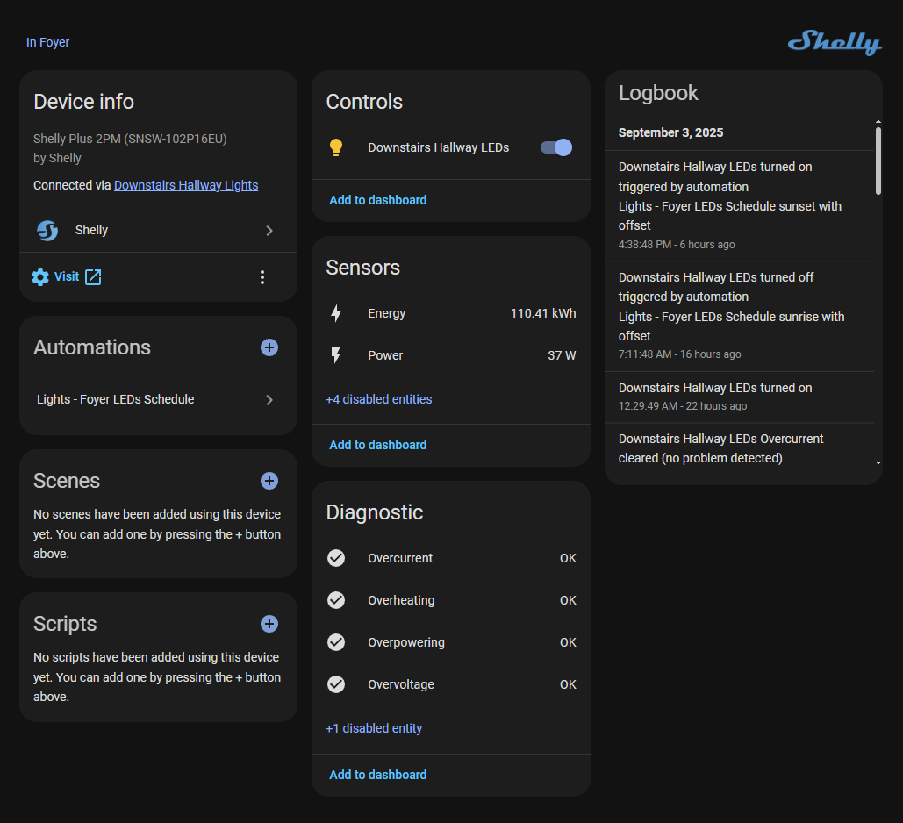

I've installed a Shelly smart relay for every possible light switch in my home over the past three and a half years. These are great devices that work over Wi-Fi, Bluetooth, Matter and Zigbee.

<!-- more -->

```toc
# This code block gets replaced with the TOC
```

## Shelly Smart Relays

Shelly smart relays are compact, Wi-Fi-enabled relays that turn electrical appliances and lighting into smart devices without requiring rewiring or a complete system overhaul. All Shelly devices can be controlled locally without requiring cloud services. They can be operated through the browser, API, MQTT, Bluetooth (Gen2+), Matter (Gen3+), Zigbee (Gen4) and Z-Wave (Wave series).

I have retrofitted them behind each light switch in my house while maintaining their look and functionality. It lets your light switches work normally while the relay behind the scenes handles smart control. Unlike smart light bulbs, they don't have to be left on to control them. No more "please don't touch that switch" conversations, no more dead smart bulbs after someone accidentally flips the wrong switch, and no standby power waste from keeping switches permanently enabled. The physical switches remain intuitive and functional while automation continues working seamlessly in the background.

I've taken this photo from their website, because all my wiring photos shown later are nasty.


## My Device Line Up

I currently have 19 Shelly relays across the house. I've found the best time to buy them is during Black Friday sales from the Shelly website, or when there's a big cashback and coupon deal on AliExpress.

June 2022: Common areas like kitchen, dining, living, hallway, alfresco and garage.

- **4 x Shelly 2.5 (Gen1)**: Dual-channel relay for controlling two circuits. Great for controlling two light switches. These are notorious for eventually failing, but mine haven't. They can be fixed by soldering on new capacitors if that does happen. I still replaced them all with the Gen2 and Gen4 below to be safe.

- **4 x Shelly Plus 1PM (Gen2)**: Single-channel relays for controlling one circuit. Also supports power monitoring (PM).


November 2024: Private areas like bathrooms, bedrooms, and studies.

- **6 x Shelly Plus 2PM (Gen2/4)**: Upgraded version of the 2.5. The Gen2 gave me Bluetooth.

- **4 x Shelly 1PM Mini (Gen3)**: The same as above, but much smaller. Supports up to 8A, but works fine for light switches.


August 2025: All remaining areas like balconies, walk-ins, and replace the Gen1 2.5s.

- **3 x Shelly 2PM (Gen4)**: Upgraded version of the Plus 2PM with Zigbee.

- **2 x Shelly 1PM Mini (Gen4)**: Upgraded version of the Gen3 with Zigbee support.


## Light Switches

Wherever I installed a Shelly, I also replaced the light switch with a [Clipsal Saturn Zen](https://www.clipsal.com/products/power-points-switches/saturn-zen). They are push-button light switches with a [blue LED showing their state](clipsal/led-wiring.png). I wanted push buttons instead of flip switches, so the state of the light would automatically match the light switch. I've also added [pictograms](https://www.clipsal.com/products/power-points-switches/saturn-zen/button-identification-cap-60zpbc?itemno=60ZPBC-ZW) to all switches with 2 or more gangs.


Unfortunately, I would advise everyone to avoid the Clipsal Saturn Zen switches. They are expensive junk that suffer from fundamental design problems that make them unsuitable for reliable home use. The push buttons jam frequently due to poor dust sealing, and the fragile faceplate clips snap off during basic maintenance tasks. I've had to buy so many replacement faceplates at $64+ each. I bought them in bulk for a discount, so the sunk cost fallacy got me.


If I had to do it again, I would instead get either Clipsal's Iconic line with [LED bell press mechs](https://www.clipsal.com/products/power-points-switches/clipsal-iconic/switch-mechanism-bell-press-return-led-230-240v-10a-40mbprl) or the [Hager Silhouette](https://hager.com/au/products/switches-and-sockets/silhouette/switches-and-plates) series.

## Wiring

All electrical work in Australia must be done by a licensed or registered electrician.

### Neutral

To start off, there needs to be a neutral cable available where the Shelly is installed. Most homes in Australia do not have a neutral at the light switch. Mine didn't, but neutral is available at the light itself. I had to have my electrician pull it from the downlight to the light switch, but you could also install the Shelly in the ceiling next to the light to avoid that.


### Single Light

A light switch is wired like this:


To add a Shelly:

- Neutral to `N`.
- Switched active to `O`. Also, connect the `LED` if there is one.
- Live/active to `L`. The `LED` can remain in the light switch, or also be connected to the Shelly.
- L1 or L2 to `SW`.


### Two-Way Light

A two-way light is wired like this in Australia.

- L1 and L2 are travellers strapped to each other.
- Live/active is only on one side.
- Switched active is only on one side.


To add a Shelly, the easiest way is to place it on the side that has the switched active and pull a new live/active cable. The same wiring as the single light above applies here.


### Examples

In reality, wiring is not as pretty as the diagrams.


## Home Assistant

The [official Home Assistant integration for Shelly](https://www.home-assistant.io/integrations/shelly) works perfectly and does everything I want. It communicates using WebSockets over HTTP (RPC), exposes all sensors and supports firmware updates directly from Home Assistant.




For Gen1 devices (like my 2.5), MQTT (via [bienui/ha-shellies-discovery](https://github.com/bieniu/ha-shellies-discovery)) is much more stable than the official Home Assistant integration. The Gen1 devices used CoAP/CoIoT for pushing state to Home Assistant, which was flaky. I would often have lights that were slow to trigger or not at all.

## Bluetooth

Shelly Gen2 and newer devices can act as [Bluetooth proxies within Home Assistant](https://www.home-assistant.io/integrations/bluetooth). I set mine in passive mode to receive all traffic.


This has been very helpful to add Bluetooth devices from Xiaomi, like the [battery-powered occupancy sensor (XMOSB01XS)](https://smarthomescene.com/reviews/xiaomi-battery-ble-occupancy-sensor-review/) and [MiFlora plant sensors (HHCCJCY01)](https://smarthomescene.com/reviews/xiaomi-miflora-plant-sensor-tuya-version-hhccjcy10-review/). Here's my [visualisation](https://my.home-assistant.io/redirect/bluetooth_advertisement_monitor/) of Bluetooth devices added in 2025.6.


Unfortunately, devices running the Zigbee firmware cannot be used as Bluetooth proxies.


## Matter

Matter was enabled on Gen3 devices starting with firmware 1.6.0 and natively on Gen4. I don't use Matter, so there's nothing to say here.

## Zigbee

Zigbee support was added in Gen4 devices. The relays run the Matter firmware by default, but switching over can be done in the web console with a few clicks.


My [1PM Mini Gen4](https://www.zigbee2mqtt.io/devices/S4SW-001P8EU.html) and [2PM Gen4](https://www.zigbee2mqtt.io/devices/S4SW-002P16EU-SWITCH.html) are already supported by Zigbee2MQTT.


I anticipated the inclusion of Zigbee, but have been let down so far. Being crammed into the wall means the LQI and signal strength suffer. I thought I could replace all my ugly fat repeaters around the house, but they're still around for now. I imagine it would be better if I had upgraded all my relays to Gen4.


## Automations

Listing my automations and integrations that make use of smart light switches.

- **Motion-sensored lights**: Toggling lights using occupancy sensors like the [DIY ones I built in the past](/diy-mmwave-presence-detectors/) or the battery-powered Xiaomi XMOSB01XS I mentioned earlier.
- **Door fan**: When the bathroom door is closed (door sensor) and someone is inside (with an occupancy sensor), turn on the fan.
- **Dryer fan**: When the dryer is running and the door is closed, turn on the fan.
- **Garage door light**: When the garage is opened, turn on the light to make it easier to see when driving in.
- [**Presence Simulation**](https://github.com/slashback100/presence_simulation): Turns on and off lights while you're away to look like you're at home using the history of those devices.
- [**Bermuda BLE**](https://github.com/agittins/bermuda): Track Bluetooth devices (and the people carrying them) making use of Shelly's Bluetooth proxy feature.
