Oracle Cloud Infrastructure (OCI) provide a very generous free tier that is capable of running a highly available Kubernetes cluster.

<!-- more -->

```toc
# This code block gets replaced with the TOC
```

## Preface

Back in August, I wanted to try out [Tailscale](https://tailscale.com/), a mesh VPN built on WireGuard. Unfortunately, they didn't use traditional username/password logins. Instead, it required an identity provider, such as Google, Microsoft, GitHub, Apple, or OIDC. My first instinct was to use my own OIDC ([Authelia](https://www.authelia.com/)), but that created a paradox; if I'm not home and the server fails, my OIDC fails too, locking me out of the VPN I would need to fix it.

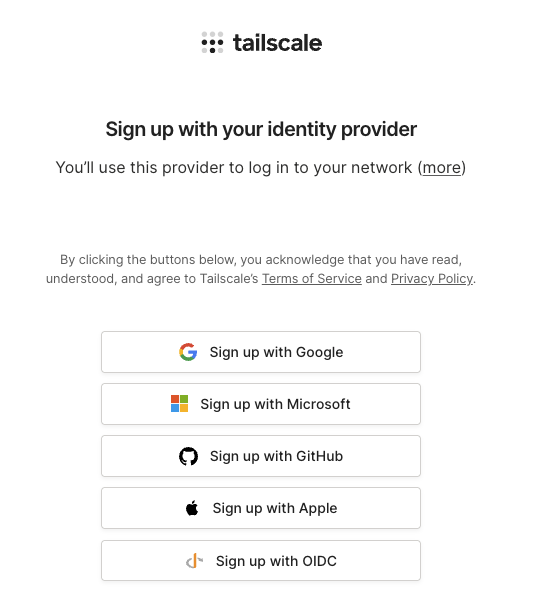

## Free Tier Resources

OCI accounts, whether free or paid, have a set of resources that are [free of charge](https://www.oracle.com/cloud/free/) in the home region of the tenancy, for the life of the account. Using the *Always Free* resources, you can provision a virtual machine (VM) instance, the networking, load balancing, and storage resources needed to support the applications that you want to build. With these resources, you can run a small-scale Kubernetes cluster. The search for this solution led me to discover the generous free tier from Oracle Cloud for hosting.

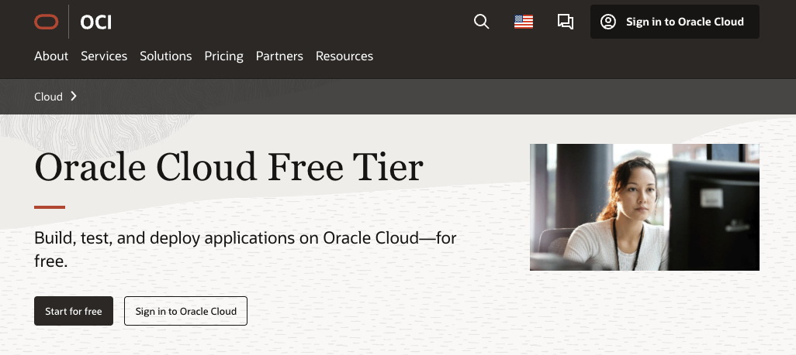

### OCI Kubernetes Engine (OKE)

[OCI Kubernetes Engine (OKE)](https://www.oracle.com/cloud/cloud-native/kubernetes-engine/) is the managed Kubernetes service provided by Oracle, similar to GKE/AKS/EKS provided by the other major cloud providers. With a managed Kubernetes service, [the control plane](https://kubernetes.io/docs/concepts/overview/components/#control-plane-components) is handled by the cloud provider while the user manages the nodes and pods.

OKE provides [basic](https://docs.oracle.com/en-us/iaas/Content/ContEng/Tasks/contengcomparingenhancedwithbasicclusters_topic.htm#contengcomparingenhancedwithbasicclusters_topic-basicclusters) and [enhanced clusters](https://docs.oracle.com/en-us/iaas/Content/ContEng/Tasks/contengcomparingenhancedwithbasicclusters_topic.htm#contengcomparingenhancedwithbasicclusters_topic-enhancedclusters). From the [pricing page](https://www.oracle.com/cloud/cloud-native/kubernetes-engine/pricing/), a basic cluster is free of charge, while enhanced clusters are $0.10 per hour. The differences between them are covered in the OCI docs.

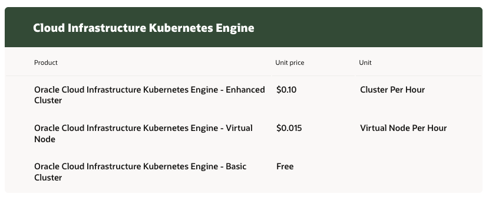

### Compute

Two [compute instances shapes](https://docs.oracle.com/en-us/iaas/Content/FreeTier/freetier_topic-Always_Free_Resources.htm#compute) are listed as always free:

- 2 x `VM.Standard.E2.1.Micro`: AMD 1/8 OCPU and 1 GB memory
- 1 to 4 x `VM.Standard.A1.Flex`: ARM Ampere A1 cores and 24 GB of memory

The AMD instances are too small and not supported by OKE anyway. The ARM instances, however, provide a total of 4 ARM vCPUs and 24 GB RAM that can be split across 1 to 4 instances. It makes the most sense to either do two (2 CPU/12 GB) or four (1 CPU/6 GB) nodes within Kubernetes for high availability and even distribution of resources.

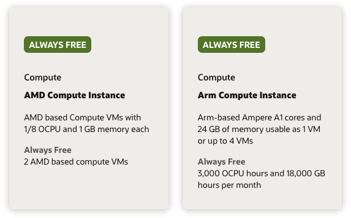

### Storage

[Up to 2 block volumes, 200 GB total](https://docs.oracle.com/en-us/iaas/Content/FreeTier/freetier_topic-Always_Free_Resources.htm#blockvolume) is included in the Always Free resources. Furthermore, [20 GB of object storage](https://docs.oracle.com/en-us/iaas/Content/FreeTier/freetier_topic-Always_Free_Resources.htm#objectstorage) is also included.

The 200 GB total applies to both [boot volumes](https://docs.oracle.com/iaas/Content/Block/Concepts/bootvolumes.htm) (50 GB minimum) and block volumes combined.

The "up to 2 block volumes" limit refers to additional block volumes, not including the boot volumes that are required for the compute instances. With a managed Kubernetes service, each `PersistentVolume` creates its own cloud-backed block volume, which could easily take it over the limit. This can be overcome by maximising the boot volume (i.e. 100 GB for two instances) and using Ceph/Rook, OpenEBS or [Longhorn (see below)](#longhorn) to use it as a `PersistentVolume`.

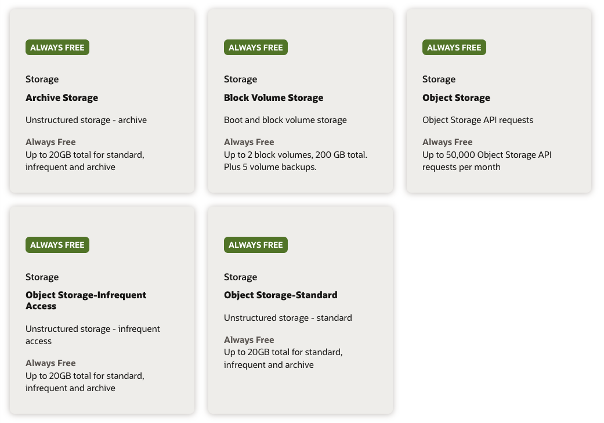

### Networking

[Two Virtual Cloud Networks (VCNs)](https://docs.oracle.com/en-us/iaas/Content/FreeTier/freetier_topic-Always_Free_Resources.htm#freetier_topic_Always_Free_Resources_VCNs) can be created in the Always Free tier. This includes all its associated resources such as Subnets (unlimited), NAT Gateways (1), Service Gateways (1), Internet Gateways (1) and Security Lists (5).

Data ingress is free, like all other cloud providers. [Data egress is free for the first 10 TB each month](https://docs.oracle.com/en-us/iaas/Content/FreeTier/freetier_topic-Always_Free_Resources.htm#freetier_topic_Always_Free_Resources_Outbound_Data_Transfer). This is practically unlimited for the vast majority of users, equivalent to ~333 GB per day or over 800 hours of 4K video each month.

Unfortunately, there is only a [single Availability Domain](https://docs.oracle.com/en-us/iaas/Content/General/Concepts/regions.htm) for most OCI regions. The entire region operates as a single large data centre, but with multiple [Fault Domains](https://docs.oracle.com/en-us/iaas/Content/General/Concepts/regions.htm#fault).


### Load Balancer

One [Flexible Network Load Balancer](https://docs.oracle.com/en-us/iaas/Content/FreeTier/freetier_topic-Always_Free_Resources.htm#NetworkLoadBalancer) (L3/L4) and one [regular Load Balancer](https://docs.oracle.com/en-us/iaas/Content/FreeTier/freetier_topic-Always_Free_Resources.htm#loadbalancing) (L4/L7) are provided in the Always Free tier.

Managed Kubernetes services often create a new load balancer for each ingress/gateway. Using a controller like [ingress-nginx](https://github.com/kubernetes/ingress-nginx) or [Traefik (see below)](#gateway-api) routes everything through a `Service` with type `LoadBalancer`, which only requires a single resource.

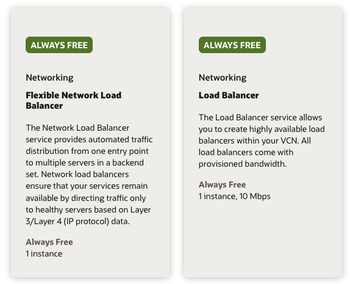

## Terraform/OpenTofu

The Terraform/OpenTofu code for the examples below can be found in my GitHub repo [calvinbui/infra](https://github.com/calvinbui/infra/tree/master/oracle-cloud).

### Budget Alerts

Launching the ARM instances with a free account is a hassle as the compute is in high demand, leading to an "Out of Host Capacity" error. I upgraded my account to Pay As You Go to get the instances to launch, but this meant I could be charged if resources went over the Always Free limits.

The code for this can be found in my GitHub repo [calvinbui/infra](https://github.com/calvinbui/infra/tree/master/oracle-cloud/budget).

To be cautious, I created a [$1 budget and two 1% alert rules](https://docs.oracle.com/en-us/iaas/Content/Billing/Concepts/budgetsoverview.htm) to be notified whenever the account begins accruing costs.

- Budget: [oci_budget_budget](https://registry.terraform.io/providers/oracle/oci/latest/docs/resources/budget_budget)
- Budget Alert Rule: [oci_budget_alert_rule](https://registry.terraform.io/providers/oracle/oci/latest/docs/resources/budget_alert_rule)

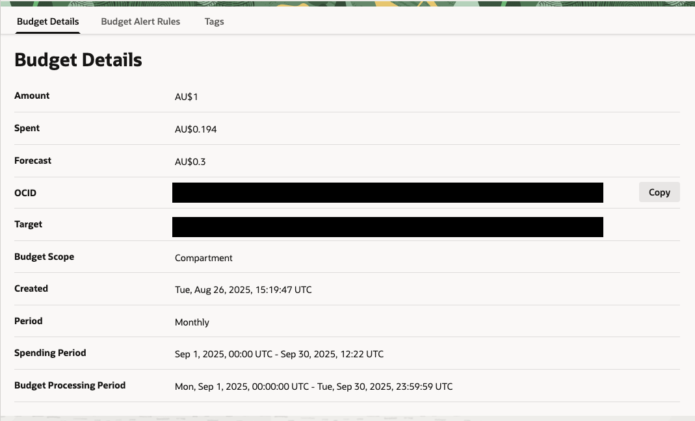


This has already saved me when I recreated my ingress-nginx controller, but for some reason, it didn't delete the orphaned Network Load Balancer.

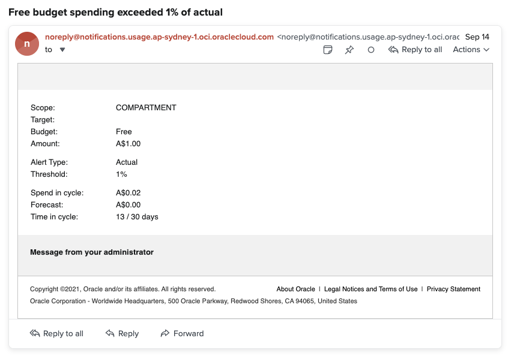

### OKE

Here's my attempt at a draw.io diagram to show all the free resources used to run a Kubernetes cluster in OCI:

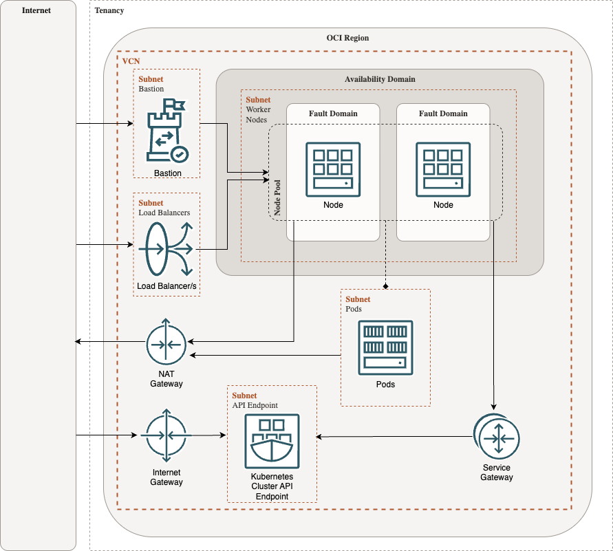

These are the resources required (in order):

- Virtual Cloud Network (VCN) ([oci_core_vcn](https://registry.terraform.io/providers/oracle/oci/latest/docs/resources/core_vcn)): software-defined network.
- Route Tables ([oci_core_route_table](https://registry.terraform.io/providers/oracle/oci/latest/docs/resources/core_route_table)): specify how traffic should be routed.
- Security Lists ([oci_core_security_list](https://registry.terraform.io/providers/oracle/oci/latest/docs/resources/core_security_list)): allow ingress/egress to and from the cluster and nodes.
- Subnets ([oci_core_subnet](https://registry.terraform.io/providers/oracle/oci/latest/docs/resources/core_subnet)): subdivisions of the VCN, ideally divided into public and private.
- NAT Gateway ([oci_core_nat_gateway](https://registry.terraform.io/providers/oracle/oci/latest/docs/resources/core_nat_gateway)): internet access for resources in the private subnet (i.e. nodes)
- Service Gateway ([oci_core_service_gateway](https://registry.terraform.io/providers/oracle/oci/latest/docs/resources/core_service_gateway)): allows the nodes and control plane to interact privately.
- Internet Gateway ([oci_core_internet_gateway](https://registry.terraform.io/providers/oracle/oci/latest/docs/resources/core_internet_gateway)): allows access from the internet to resources in the public subnet (i.e. control plane and load balancers).
- Cluster ([oci_containerengine_cluster](https://registry.terraform.io/providers/oracle/oci/latest/docs/resources/containerengine_cluster)): OKE cluster.
- Node Pool ([oci_containerengine_node_pool](https://registry.terraform.io/providers/oracle/oci/latest/docs/resources/containerengine_node_pool)): OKE node pool.
- Bastion ([oci_bastion_bastion](https://registry.terraform.io/providers/oracle/oci/latest/docs/resources/bastion_bastion)): I've included a Bastion host for secure and public access to the node pools. It is also a free-tier resource.

The code for this can be found in my GitHub repo [calvinbui/infra](https://github.com/calvinbui/infra/tree/master/oracle-cloud/kubernetes/).

## Applications

After setting up the free cluster, my priorities changed. I no longer needed it for Tailscale. Instead, I identified two new, better uses for it.

1. Host a status page to keep users of my [Plex](https://www.plex.tv/), [Immich](https://immich.app/) and [Bitwarden](https://github.com/dani-garcia/vaultwarden) instances informed about uptime and maintenance.
1. The clusters I use at work are stable and robust, but that also means they're less dynamic. This cluster is a place for experimentation and pushing beyond my daily work.

Beyond the usual deployments of [external-dns](https://kubernetes-sigs.github.io/external-dns/), [cert-manager](https://cert-manager.io), [metrics-server](https://github.com/kubernetes-sigs/metrics-server) and [descheduler](https://github.com/kubernetes-sigs/descheduler), these are the applications I've experimented with and will continue using.

The code for my Kubernetes deployments can be found in my GitHub repo [calvinbui/k8s](https://github.com/calvinbui/k8s).

### Flux, Kustomize & SOPS

I experimented with a couple of deployment methods tools (like [Helmfile](https://github.com/helmfile/helmfile)), and landed on a combination of Flux, Kustomize and SOPS.

- [Flux](https://fluxcd.io/) is a continuous delivery tool to automate deployments. It's primarily a GitOps tool, but I'm using it in Gitless mode primarily for its [Helm Controller](https://fluxcd.io/flux/components/helm/).
- [Kustomize](https://kustomize.io/) is a Kubernetes native configuration management tool. It's made for layering environment-specific changes on top of a common set of base YAML files. I use it to group all my manifest files together in a deployment (i.e. namespace, helm release, CRDs, etc.)
- [SOPS (Secrets OPerationS)](https://getsops.io/) is an editor that encrypts values directly in YAML files, so they can be safely stored in Git. Sensitive values are encrypted with [age](https://age-encryption.org/), a modern alternative to PGP/GPG. With SOPS, I encrypt secret tokens and domain names.

This combination creates a streamlined and secure deployment workflow with these benefits:

- **Gitless and CLI-driven**: No GitOps required. Everything is initiated from the command line, and the feedback loop is almost instant.
- **One command** (`kustomize build --enable-alpha-plugins --enable-exec . | kubectl apply -f -`): Not the prettiest command, but it can be made into an alias. All applications are deployed in the same consistent way, instead of using different tools. I wanted to approach this like only having to use `ansible-playbook` for running Ansible Playbooks.
- **Deploy Helm Charts and regular manifests**: Uses regular YAML files to deploy resources as well as Helm charts using the Flux `HelmRelease` CRD. All deployments are consistent and packaged using Kustomize.
- **Standard CLI tools** (`kubectl` and `kustomize`): Kubernetes native and cross-platform. `kubectl` is the universal language of Kubernetes, and `kustomize` is now built into `kubectl` as well. This ensures long-term compatibility and avoids vendor-specific tools or complex plugins.
- **Code is public and open source**: With SOPS handling the encryption, my code can be made public like all my other repos, such as [this website](https://github.com/calvinbui/calvin.me), [Ansible playbooks](https://github.com/calvinbui/ansible-monorepo) and [Terraform/OpenTofu infrastructure](https://github.com/calvinbui/infra).

To deploy a new application, these are the steps I perform, using `cert-manager` as an example. The example below can be found in my GitHub repo [calvinbui/k8s](https://github.com/calvinbui/k8s/tree/master/cert-manager).

Start by creating a new folder with the name of the application and a namespace file if required.

<details>
<summary>namespace.yaml</summary>

 ```yaml
  ---

  apiVersion: v1
  kind: Namespace
  metadata:
    name: cert-manager
 ```

</details>

Create a Flux [`OCIRepository`](https://fluxcd.io/flux/components/source/ocirepositories/) or [`HelmRepository`](https://fluxcd.io/flux/components/source/helmrepositories/) resource depending on how the Helm chart is distributed. Flux's [Source Controller](https://fluxcd.io/flux/components/source/) will fetch the chart to be used for the Helm release.

<details>
<summary>oci-repository.yaml</summary>

 ```yaml
  ---

  apiVersion: source.toolkit.fluxcd.io/v1
  kind: OCIRepository
  metadata:
    name: cert-manager
  spec:
    interval: 24h
    url: oci://quay.io/jetstack/charts/cert-manager
    ref:
      tag: v1.18.2
    layerSelector:
      mediaType: application/vnd.cncf.helm.chart.content.v1.tar+gzip
 ```

</details>

Create the [`HelmRelease`](https://fluxcd.io/flux/components/helm/helmreleases/) to install the Helm chart. It references the previously created `OCIRepository` as its source. The chart version and values can also be provided.

<details>
<summary>helm-release.yaml</summary>

 ```yaml
  ---

  apiVersion: helm.toolkit.fluxcd.io/v2
  kind: HelmRelease
  metadata:
    name: cert-manager
  spec:
    interval: 5s
    chartRef:
      kind: OCIRepository
      name: cert-manager
    values:
      crds:
        enabled: true

      prometheus:
        enabled: false

      config:
        enableGatewayAPI: true
 ```

</details>

To use cert-manager, a [`ClusterIssuer`](https://cert-manager.io/docs/reference/api-docs/#cert-manager.io/v1.ClusterIssuer) is required. It is a CRD resource that can be written in YAML and similarly deployed using this method.

<details>
<summary>clusterissuer.yaml</summary>

 ```yaml
  ---

  apiVersion: cert-manager.io/v1
  kind: ClusterIssuer
  metadata:
    name: letsencrypt
  spec:
    acme:
      server: https://acme-v02.api.letsencrypt.org/directory
      privateKeySecretRef:
        name: cert-manager-letsencrypt
      solvers:
 - dns01:
            cloudflare:
              apiTokenSecretRef:
                name: cert-manager-cloudflare-token
                key: apiToken
 ```

</details>

The `ClusterIssuer` references a Kubernetes secret. This is when SOPS comes in. At the top level of my repo, I have a `.sops.yaml` file which contains the public key and what keys to encrypt.

<details>
<summary>.sops.yaml</summary>

 ```yaml
  ---

  creation_rules:
 -
      path_regex: '.*\.ya?ml$'
      age: "age1abcdefghijklmnopqrstuvwxyz"
      encrypted_regex: "^(data)$"
 ```

</details>

Next, create the secret file. I like to suffix it with `.sops.yaml` to indicate that it's an encrypted file.

<details>
<summary>secret-cloudflare-token.sops.yaml</summary>

 ```yaml
    ---

    apiVersion: v1
    kind: Secret
    metadata:
      name: cert-manager-cloudflare-token
    type: Opaque
    data:
      apiToken: c2VjcmV0Cg==
 ```

</details>

Afterwards, I encrypt the file by running `sops -e -i secret-cloudflare-token.sops.yaml`. Afterwards, if there are any changes I want to make to it, I use `sops secret-cloudflare-token.sops.yaml` to edit the file instead of decrypting first and encrypting it again afterwards.

<details>
<summary>encrypted secret-cloudflare-token.sops.yaml</summary>

 ```yaml
    ---

    apiVersion: v1
    kind: Secret
    metadata:
      name: cert-manager-cloudflare-token
    type: Opaque
    data:
      apiToken: ENC[AES256_GCM,data:jbQMtl0H+55Tt12fFvYHvppn5I0QFyiSQqbmPDgWECwRoI8T8eNoqU9IxyuZ7EwB70/Rl48S2=,iv:FVdDMIpi4a+8I6IIgnwbkUHLYB+Gp+ZH70kwLu6MVcU=,tag:BWC12irGO3zuVfhKUeNHRw==,type:str]
    sops:
      age:
 - recipient: age1abcdefghijklmnopqrstuvwxyz
          enc: |
 -----BEGIN AGE ENCRYPTED FILE-----
 321SlLWVuY3J5cHRpb24ub3JnL3YxCi0+IFgyNTUxOSB2M1BHc3dEaW1WQnR1dVQ5
 TjVDV1Q4bGNWRm92b05oMUFGa0M3YsasSVCmxtV0asdtZnBIL2ljcGNMM3M2cC9Y
 NjcyU3VtUmFGRnl1NWtvWkIwMmJpMWMKlqCm0GPTVeqnkZ28zmUzF58iEVMrWECw
 UOI/t0NNpO9G9HwuXynt/b2fjmTeA/dTlyLEGZi7NEZ5jRbEYMyUsQ==
 -----END AGE ENCRYPTED FILE-----
      lastmodified: "2025-10-09T12:26:30Z"
      mac: ENC[AES256_GCM,data:Q76lczr/T1jM137TRwvCqYUZwRG8dG7lhieCgoUO0ez3d4QTVEi2/Te52s1Q94e2/FG1MR8QL2/lcenpJ6+3YckXsnGpLDIbbiX58ZxyZjBHg6CQ7f/fm+cKEKAvv9cV1e0bQROC7PRBEvYDY/MK9MM+vEliFmAJ/pwbX4U3irE=,iv:hjSncvBg4BhAT5tBHByNW7rlAYYxQ1qsHjxNXl82rQc=,tag:P14057IZpECFojUteImfqA==,type:str]
      encrypted_regex: ^(data|hostname)$
      version: 3.10.2
 ```

</details>

Kubernetes cannot decode SOPS files and won't let you apply an encrypted file either. To decrypt files for deployment, I use [KSOPS](https://github.com/viaduct-ai/kustomize-sops), a Kustomize plugin by [Viaduct](https://www.viaduct.ai/). It acts as a [generator](https://kubectl.docs.kubernetes.io/guides/extending_kustomize/exec_plugins/) to decrypt SOPS-encrypted files when running `kustomize build`.

<details>
<summary>secret-generator.yaml</summary>

 ```yaml
    ---

    apiVersion: viaduct.ai/v1
    kind: ksops
    metadata:
      name: secret-generator
      annotations:
        config.kubernetes.io/function: |
 exec:
 path: ksops
    files:
 - cloudflare-token.sops.yaml
 ```

</details>

The final file is the kustomization file, which packages all our other files together.

<details>
<summary>kustomization.yaml</summary>

 ```yaml
  ---

  apiVersion: kustomize.config.k8s.io/v1beta1
  kind: Kustomization
  namespace: cert-manager
  generators:
 - secret-generator.yaml
  resources:
 - namespace.yaml
 - helm.yaml
 - cluster-issuer.yaml
 ```

</details>

To test everything works, I run `kustomize build --enable-alpha-plugins --enable-exec .` and check its output. To apply my changes, I pipe it to `kubectl`, which looks like:

```shell-session
$ kustomize build --enable-alpha-plugins --enable-exec . | kubectl apply -f -

namespace/cert-manager configured
secret/cert-manager-cloudflare-token configured
clusterissuer.cert-manager.io/letsencrypt configured
helmrelease.helm.toolkit.fluxcd.io/cert-manager configured
ocirepository.source.toolkit.fluxcd.io/cert-manager configured
```

Sometimes, the command will fail as CRDs may not exist yet. Wait a little bit and run the command again.

### Longhorn

[Longhorn](https://longhorn.io/) is a cloud native distributed block storage for Kubernetes. It takes the boot volume of each node into highly available persistent storage. Data is synchronously replicated between nodes automatically to ensure that if one node fails, data is still immediately available from replicas on other healthy nodes, with no data loss.

The total available space is around 60GB. As previously mentioned, the free tier is limited to 200GB. Disk space is also reserved for the operating system and container images automatically by Longhorn. As data is replicated, this cuts the total in half again.

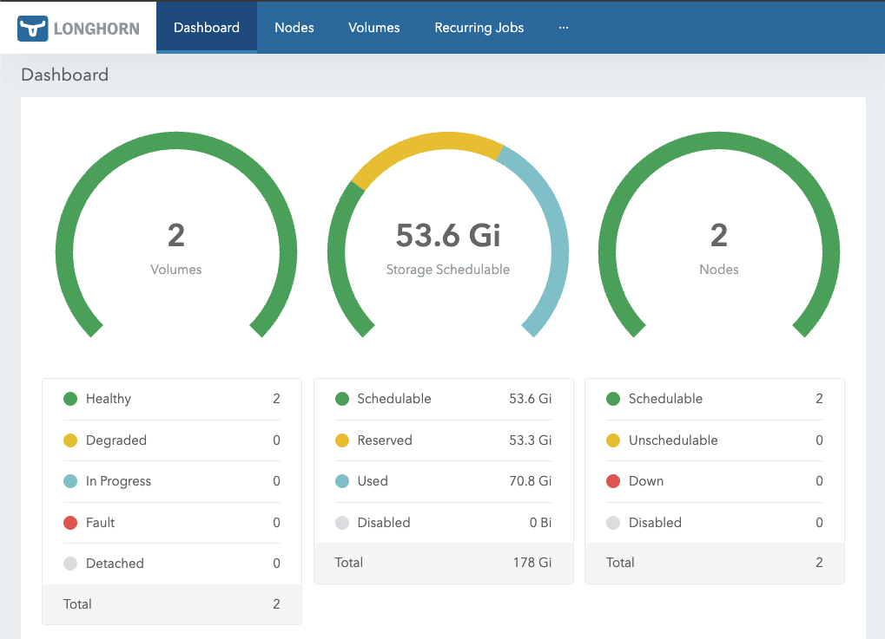

Total data loss is possible if both my nodes go down at the same time. The most critical rule is to never perform maintenance on multiple nodes simultaneously. Always upgrade nodes one by one, and before starting the next, wait for Longhorn to fully sync and rebuild the data replicas from other healthy nodes in the cluster.

### Gateway API

[Gateway API](https://gateway-api.sigs.k8s.io/) is the upcoming replacement for `Ingress`. It's been generally available since October 2023, and there's a [full list of controllers](https://gateway-api.sigs.k8s.io/implementations/#implementations_1) that support it.

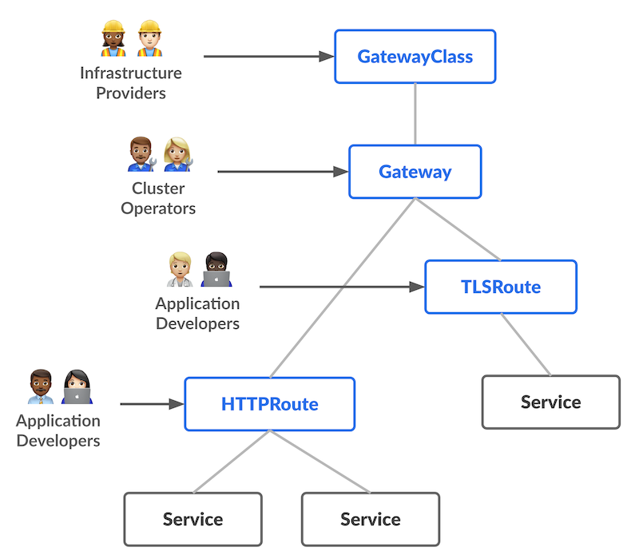

I started using [nginx-ingress](https://github.com/kubernetes/ingress-nginx), but it will [soon be deprecated](https://github.com/kubernetes/ingress-nginx/issues/13002) when [InGate](https://github.com/kubernetes-sigs/ingate) is available.

I chose to go with [Traefik](https://traefik.io/) as my Gateway Controller, as I was familiar with it for my own home server. The only issue I haven't resolved is getting HTTP3 working, as it is not possible to listen on TCP and UDP on the same Kubernetes `Service` with type `LoadBalancer`.

### OneUptime

[Oneuptime](https://oneuptime.com/) is the status page application I currently run on the cluster.

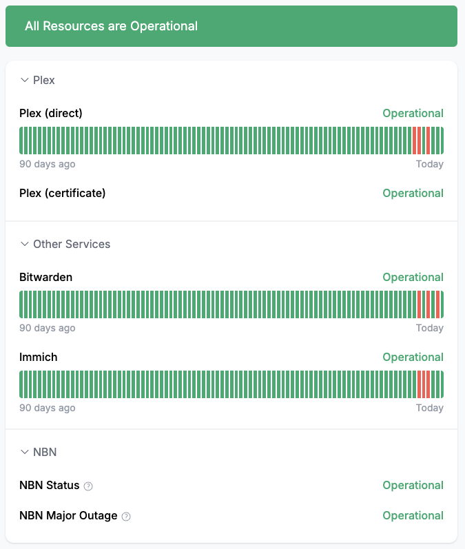

I wanted a service that could support a 'degraded' status, which only Oneuptime and [Kener](https://kener.ing/) supported. Kener [required writing JavaScript](https://kener.ing/docs/monitors-api#eval) to evaluate API/website responses, while Oneuptime was a few clicks. Other tools I looked into include [Uptime Kuma](https://uptime.kuma.pet/), [gatus](https://gatus.io/), [Checkmate](https://github.com/bluewave-labs/checkmate), [Peekaping](https://peekaping.com/) and [CheckCle](https://checkcle.io/).

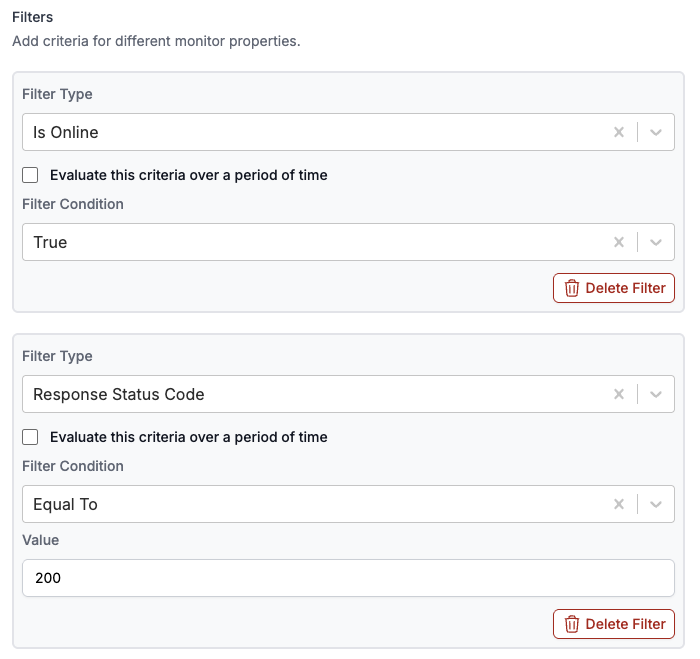

Oneuptime is a very resource-heavy application; its [system requirements](https://oneuptime.com/docs/installation/docker-compose) recommend a computer with 8 CPU cores, 16GB of RAM, and 400 GB of disk space. The first time I deployed it without knowing this, both nodes reached 100% memory usage. Obviously, this is beyond our limits, but I've made a few pull requests and changes that keep it much more usable:

1. Use the `Recreate` strategy ([PR #2023](https://github.com/OneUptime/oneuptime/pull/2023)), so a second full installation of Oneuptime doesn't kill the cluster.

1. Disable the auto-generated date label ([PR #2024](https://github.com/OneUptime/oneuptime/pull/2024)), so that each deployment doesn't cause all its pods to restart too.

1. Don't enable every service. Even services that aren't used chew up a lot of resources. These are the services I have safely disabled:

    - API Reference
    - Docs
    - Fluent Ingest
    - Home (only Dashboard is needed when self-hosting)
    - Incoming Request Ingest
    - Isolated VM
    - Open Telemetry Collector
    - Open Telemetry Ingest
    - Server Monitor Ingest
    - Worker
    - Workflow

1. Use [CloudNativePG](https://cloudnative-pg.io/) to run the PostgreSQL pod. The one provided with the chart is not as thorough and uses more resources.
