I built a new home server/lab a few months back to replace my [previous 7 year old server](/my-72tb-freenas-server/).

This post focuses solely on the hardware, the parts I selected and the reasoning behind those choices.  A subsequent post will cover the software running on the system.

<!-- more -->

## Table of Contents

```toc
# This code block gets replaced with the TOC
```

## Goals

I had 3 main goals for this new server over the previous server:

1. Better per-part performance than the previous server
1. Smaller physical size
1. Lower power usage

Those three constraints shaped pretty much every hardware decision.


## Hardware


| Type             | Item                                        | Price (AUD) |
|------------------|---------------------------------------------|-------------|
| **CPU**          | [Intel Core i7 14700]                       | $ 385.20    |
| **Motherboard**  | [ASUS Pro WS W680-ACE IPMI]                 | $ 460.00    |
| **Memory**       | [256GB (4 x 64GB) DDR5 ECC UDIMM 5600 Mhz]  | $ 2,078.63  |
| **Case**         | [Jonsbo N5]                                 | $ 237.48    |
| **Power Supply** | [Be Quiet! Dark Power 13 750W 80+ Titanium] | $ 275.48    |
| **SSD**          | 2 x [Samsung 990 Pro 2TB w/Heatsink]        | $ 357.04    |
| **HDD**          | 12 x [Seagate Exos ST24000NM000C 24TB]      | $ 5,628.00  |
| **CPU Cooler**   | [Thermalright Peerless Assassin 120 SE v2]  | $ 34.11     |
| **Case fans**    | [Thermalright TL-C12B-S v3 3 pack]          | $ 14.43     |
| **Case fans**    | [Thermalright TL-C12W-S v3 3 pack]          | $ 19.34     |
| **Case fans**    | [Arctic Cooling P14 PWM PST 140mm 5 Pack]   | $ 54.40     |
| **Other**        | Cables, adapters, RGB, etc.                 | $ 50.81     |
|                  |                                             |             |
|                  | **Grand Total**                             | $ 9594.91   |

[Intel Core i7 14700]: https://www.intel.com/content/www/us/en/products/sku/236781/intel-core-i7-processor-14700-33m-cache-up-to-5-40-ghz/specifications.html
[ASUS Pro WS W680-ACE IPMI]: https://www.asus.com/motherboards-components/motherboards/workstation/pro-ws-w680-ace-ipmi/
[256GB (4 x 64GB) DDR5 ECC UDIMM 5600 Mhz]: https://www.ebay.com.au/itm/197444967269
[Jonsbo N5]: https://www.jonsbo.com/en/products/N5Black.html
[Be Quiet! Dark Power 13 750W 80+ Titanium]: https://www.bequiet.com/en/powersupply/4055
[Samsung 990 Pro 2TB w/Heatsink]: https://www.samsung.com/au/memory-storage/nvme-ssd/nvme-pcie-gen-4-2tb-mz-v9p2t0cw/
[Seagate Exos ST24000NM000C 24TB]: https://east-digital.myshopify.com/products/st24000nm000c-seagate-exos-24tb-3-5-sata-7200rpm-256mb-enterprise-hard-drive-1?variant=51898392150289
[Thermalright Peerless Assassin 120 SE v2]: https://www.thermalright.com/product/peerless-assassin-120-se-v2/
[Thermalright TL-C12B-S v3 3 pack]: https://www.thermalright.com/product/tl-c12b-s-v3/
[Thermalright TL-C12W-S v3 3 pack]: https://www.thermalright.com/product/tl-c12w-s/
[Arctic Cooling P14 PWM PST 140mm 5 Pack]: https://www.arctic.de/en/P14-PWM-PST/ACFAN00138A/

### CPU


For this build I went with an Intel Core i7‑14700. The main reason was Intel UHD graphics with Quick Sync support. My previous server used a Xeon and had to rely on a dedicated GPU to get hardware acceleration for [Plex](https://www.plex.tv/) and similar workloads. On that platform I effectively had to choose between ECC (Xeon) and Quick Sync (Core i); with this generation, paired with a W680 board, I can finally have both in a single system.

Intel now supports ECC RAM on non‑Xeon CPUs when they’re paired with a W680 chipset motherboard, which fits this build and lets me keep ECC while getting integrated graphics and Quick Sync. That’s a big improvement over the previous “either Xeon with ECC or Core i with Quick Sync” trade‑off.

Raptor Lake does have some baggage. Intel’s 13th/14th gen desktop CPUs have had stability issues that required a series of microcode fixes, and certain models now carry an extended warranty. The whole line is somewhat tainted as a result, and I expect resale to be difficult.

I did consider the i5‑14500, which isn’t affected by the microcode issues and would be perfectly adequate right now. In the end I chose the i7‑14700 for more headroom. I’m planning for another 8-10 year lifespan for this server, with more containers, more AI/ML services, more databases, and general workload creep over time. The 14500 would be fine today; the goal is for the 14700 to still feel fine in 6-8 years.

A few other constraints narrowed it down:

- Avoided the T‑series. This server does work constantly and doesn’t need to chase the lowest possible idle power states.
- Avoided the K‑series. I don’t need overclocking on a 24/7 machine, and the K models generally consume more power.
- The i7‑14700 has a 65 W TDP, which is a substantial drop from my old Xeon E5‑1620 v4 at 140 W.
- Skipped the i7‑14900. It adds four more E‑cores, which don’t matter for my workloads, and comes with a price premium. For a system that spends most of its life running mostly idle containers, that money was better spent elsewhere.

Overall, the 14700 hits the balance I wanted between performance, efficiency, ECC support, and long‑term headroom.

For CPU stress testing I used `s-tui` on Linux to load all cores and monitor temperatures and frequencies.

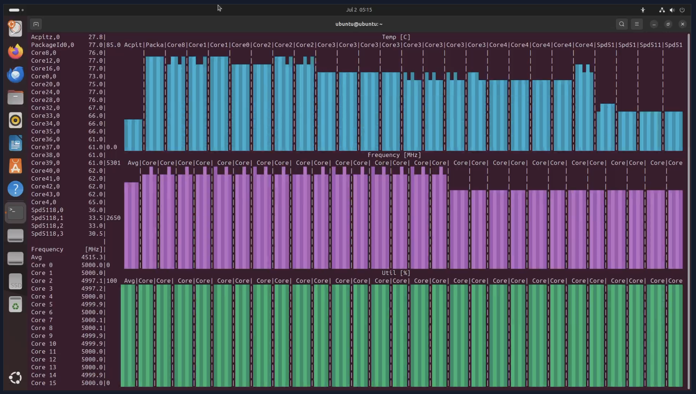

### Motherboard

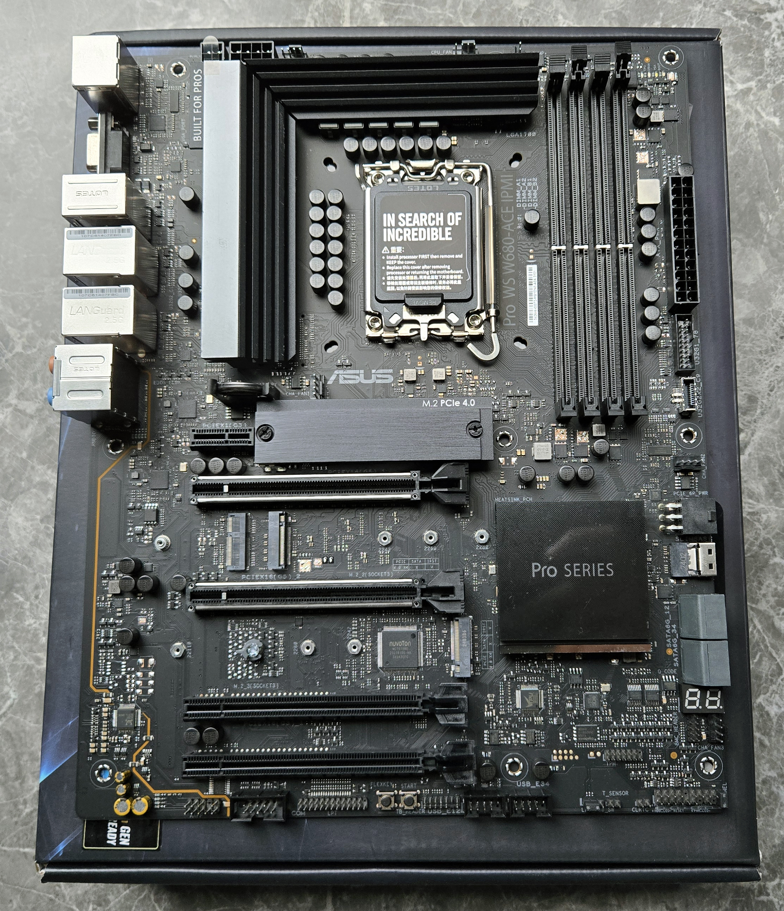

The [Jonsbo N5](https://www.jonsbo.com/en/products/N5Black.html) case supports full‑size ATX boards, which gave me a lot of flexibility in picking a motherboard.

I ended up with the [ASUS Pro WS W680‑ACE IPMI](https://www.asus.com/motherboards-components/motherboards/workstation/pro-ws-w680-ace-ipmi/), which I found brand new on the Overclockers Australia forums. The W680 chipset gives me ECC support with the i7‑14700, and the workstation‑class board has a few features that are particularly useful in a home server:

- An IPMI add‑in card. It’s a bit more tedious than having IPMI built into the board like older Supermicro gear, but it still provides remote management and out‑of‑band access.
- LED status codes, which make diagnosing boot/post issues a lot easier.
- A SlimSAS port for additional storage connectivity options.
- Three M.2 slots, giving plenty of room for SSDs for the OS, cache, and future additions without burning SATA ports.

The combination of ECC support, remote management, and expansion options made this board a good fit for a small but serious home server.

### Memory

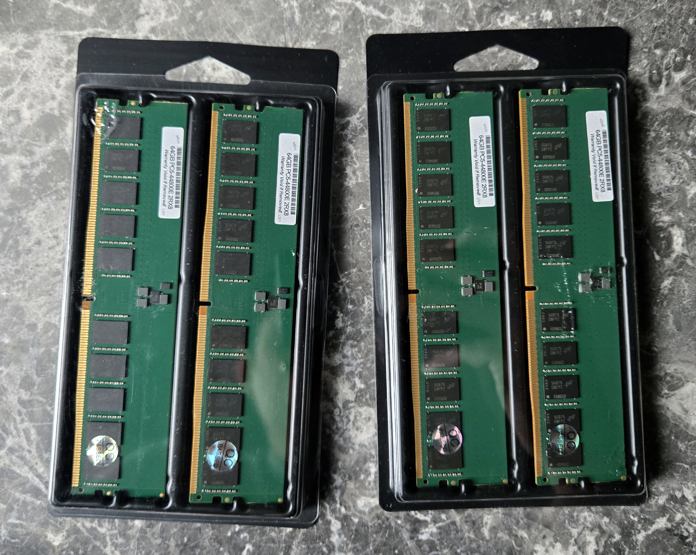

Modern boards in this class generally have four DIMM slots, which meant I couldn’t reuse my existing 8 x 16 GB DDR4 sticks from the previous build. At the same time, DDR5 pricing, especially for higher‑capacity ECC UDIMMs, is not exactly friendly.

I initially considered sticking with DDR4 to reuse what I had, but if I was moving to a new platform anyway it didn’t make much sense to do a minimal upgrade. I decided to go straight to DDR5 ECC and be done with it for a while.

I ended up with 256 GB (4 x 64 GB) DDR5 ECC UDIMM 5600 MHz from [Memory Bay](https://www.membay.com/), an eBay seller in the US that manufactures their own RAM and appears to use Micron chips. So far it has been stable.

With DDR5 it’s normal for the memory speed to clock down when you populate all the slots or use higher‑capacity modules. The advertised high speeds are usually for lower capacities and fewer sticks. For this server, capacity matters more than squeezing out a bit more frequency, so I’m fine with that trade‑off.

For memory testing I used a combination of [TestMem5](https://testmem5.com/) and [PassMark MemTest86](https://www.memtest86.com/memtest86.html) to check stability and catch any RAM issues.


### Case

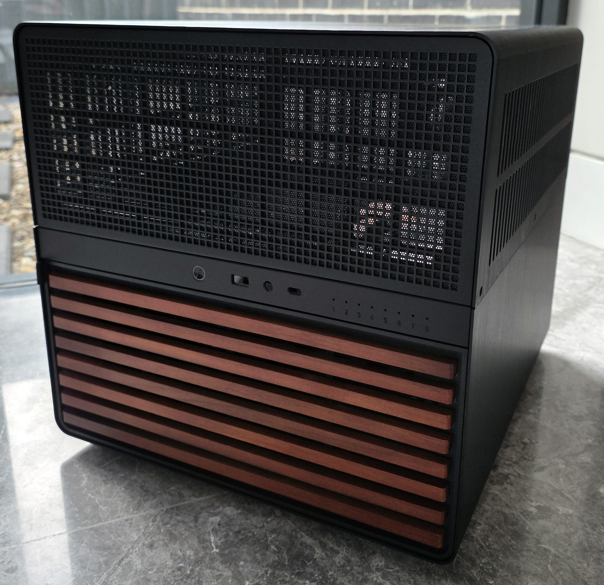

The case is a [Jonsbo N5](https://www.jonsbo.com/en/products/N5Black.html), which I’d been eyeing for a while and finally picked up from AliExpress.

Jonsbo is already known for their smaller NAS‑style cases (N2, N3, N4), and the N5 is basically the “scaled up” version. It’s around 50 L in volume but can still hold:

- 12 x 3.5" hard drives
- A full‑size ATX power supply
- CPU coolers up to 160 mm in height
- Up to E‑ATX motherboards

It’s one of the few ~50 L cases that can take 12 drives, a standard ATX PSU, and a large board without doing anything exotic, which made it an obvious choice for this build.

Out of the box, drive cooling isn’t great when you fully populate all the bays. The stock airflow path doesn’t push as much air over the drives as I’d like. To fix that I added extra fans at the front of the case, blowing directly over the drive stack. That change alone makes a noticeable difference to HDD temperatures under load and during long operations like scrubs.

### Power Supply


I briefly considered reusing my existing PSU, but it’s fairly old at this point. Capacitors degrade over time, which affects both stability and efficiency, and the warranty was long gone. For a system that’s supposed to run 24/7, it didn’t seem worth the risk.

To choose a replacement I used the well‑known [PSU tier list](https://docs.google.com/spreadsheets/d/1akCHL7Vhzk_EhrpIGkz8zTEvYfLDcaSpZRB6Xt6JWkc/edit#gid=931697732) as a starting point. Because this server runs 24/7, efficiency matters. I ended up with the [Be Quiet! Dark Power 13 750W 80+ Titanium](https://www.bequiet.com/en/powersupply/4055), which has about 94% efficiency at typical loads.

With current electricity prices in Australia, the differences between certification levels add up:

- Around $90/year saved compared to a Gold unit
- Around $43/year saved compared to a Platinum unit

The equivalent Platinum model was about $211; the Titanium unit was roughly $278, so the $67 difference should pay for itself in under two years in power savings. It also helped that this particular Titanium model wasn’t priced too far above others because it was being replaced by the newer Dark Power 14 series.

There was also a size constraint. To fit inside the Jonsbo N5 with all the drive cages, the PSU needs to be around 170 mm long. The Dark Power 13 750W is 175 mm and still fits, with just enough space to spare, making it one of the few high‑efficiency options that actually work in this case.

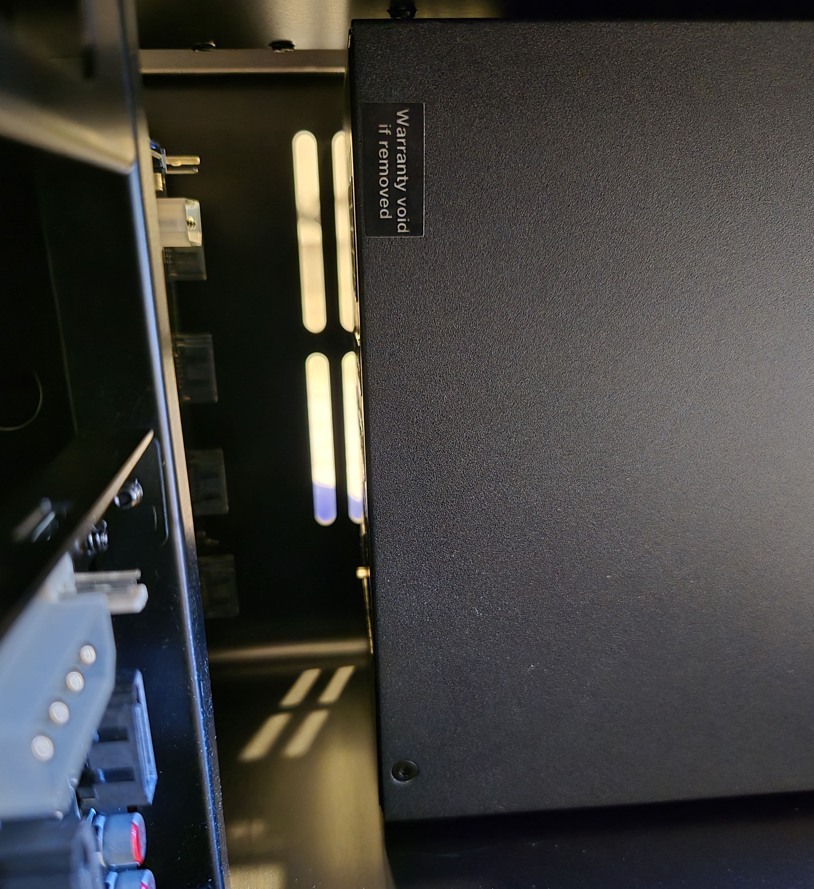

### SSD

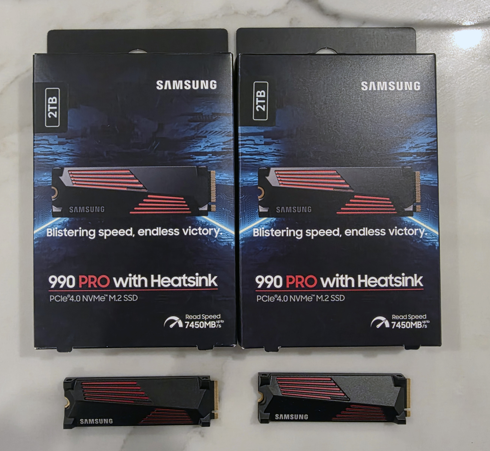

For SSD selection I leaned on a [community SSD tier list](https://docs.google.com/spreadsheets/d/1B27_j9NDPU3cNlj2HKcrfpJKHkOf-Oi1DbuuQva2gT4/edit#gid=0). I ended up with 2 x [Samsung 990 Pro 2 TB with heatsink](https://www.samsung.com/au/memory-storage/nvme-ssd/nvme-pcie-gen-4-2tb-mz-v9p2t0cw/), configured in mdadm software RAID.

The 990 Pro ticked a few boxes:

- Five‑year warranty and wide availability
- Comes with a heatsink, which is useful given how warm NVMe drives can get under sustained load
- A good balance of performance and endurance for boot, containers, and general “fast” storage

The motherboard only supports PCIe 4.0 NVMe, so there was no point in paying a premium for newer PCIe 5.0 models (like the 990 Pro’s successors) that I can’t fully utilise.

Earlier revisions of the 990 Pro had some firmware issues. I did see one issue myself where a drive disappeared from the mdadm array. A firmware update fixed it and it hasn’t reoccurred.

### HDD

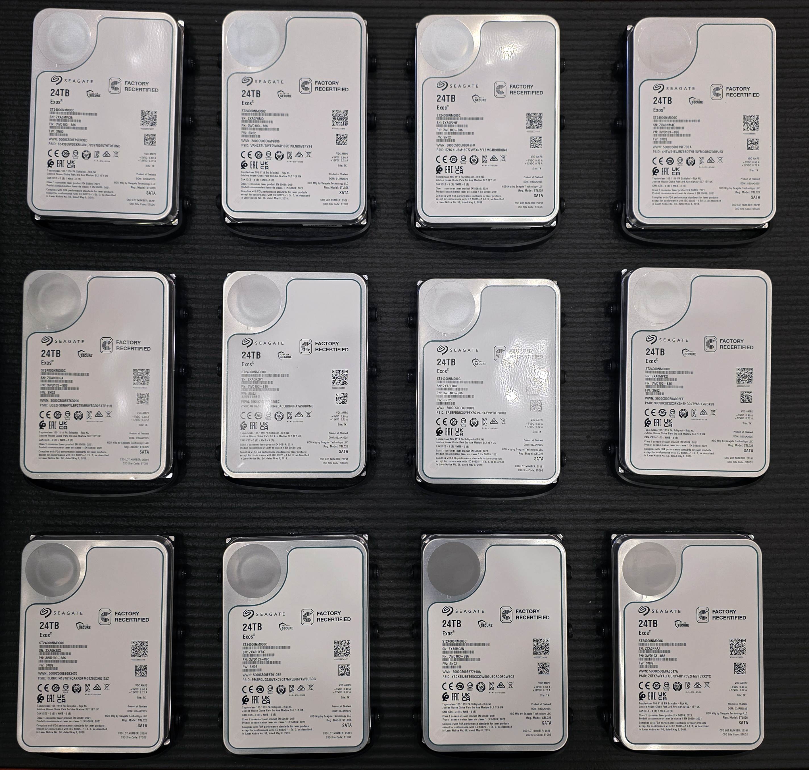

Bulk storage is provided by 12 x [Seagate Exos ST24000NM000C 24 TB](https://east-digital.myshopify.com/products/st24000nm000c-seagate-exos-24tb-3-5-sata-7200rpm-256mb-enterprise-hard-drive-1?variant=51898392150289) drives. These are refurbished enterprise disks with a three‑year warranty, which keeps costs under control without dropping down to pure consumer hardware.

The ST24000NM000C is a HAMR (Heat‑Assisted Magnetic Recording) drive. It uses a laser to heat the recording medium during writes, allowing for higher data density. In this build these drives are mainly used for static content:

- Media (movies, TV, music)
- Documents and archives
- ISOs, installers, and similar rarely‑modified data

That kind of workload is a good match for high‑capacity HAMR disks.

This model also comes in 20, 22, 26 and 28 TB variants, but the 24 TB version was the best price‑per‑TB when I bought them. For reference, the datasheet for this line is linked from the seller’s site.

To keep the overall build cost sensible, I deliberately chose refurbished drives. With redundancy on the pool and separate backups for the most important data, I’m comfortable with the slightly higher risk compared to brand‑new enterprise drives, given the savings per terabyte.

## Storage

### Wiring

The Jonsbo N5 has two separate backplanes for the 3.5" bays. One handles 8 drives and the other handles 4. Each backplane has its own SATA data connections and its own power inputs, with a mix of SATA power and Molex power connectors.


The PSU already had SATA power cables, so where I needed Molex I used simple SATA to Molex adapters. That direction is fine electrically. The other way around (Molex to SATA) is the risky one. The usual saying applies: "molex to sata, lose all your data". The problem is the way voltages and wiring are adapted; a bad design or fault can put the wrong voltage on a pin and take a drive out.

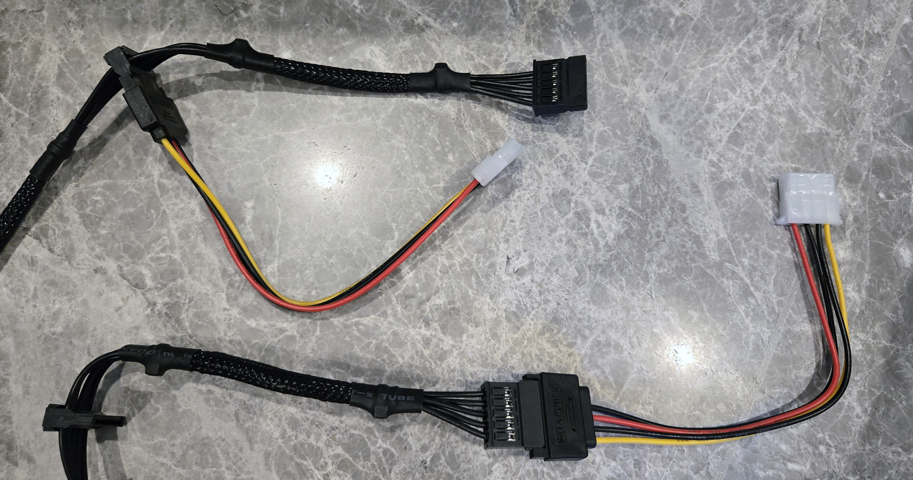

On the motherboard there are 8 usable SATA ports in total:

- 4 standard SATA ports
- 4 more via the SlimSAS (SFF‑8654) connector, using the appropriate breakout cable


That covers 8 of the 12 bays. For the remaining 4 drives I added an M.2 to SATA adapter based on the ASMedia 1166 chipset (PCIe Gen3 x2 to 6 x SATA), which takes one of the M.2 slots and exposes six extra SATA ports. There is a short review and discussion of that chipset on the [Level1Techs forum](https://forum.level1techs.com/t/short-review-edging-asmedia-1166-pcie-gen3-x2-m-2-to-6-x-sata-hba-chipset-it-doesnt-suck/208743).

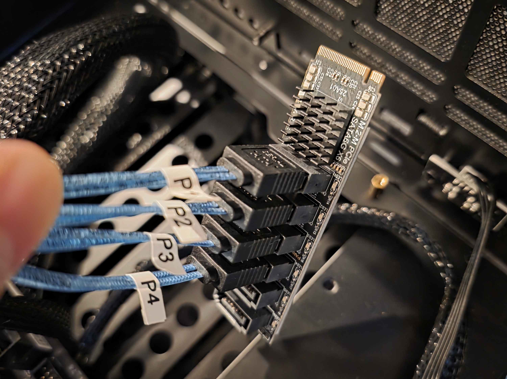


I used 0.5 m SATA cables for all three connection groups, which was long enough without leaving a pile of slack.


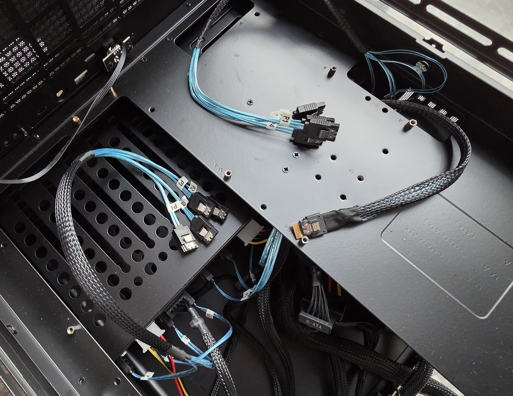

For the ports in front of the PSU I used right‑angle adapters because of the tight space. They were not strictly necessary, but they make it easier to run the cables vertically and keep the wiring cleaner.

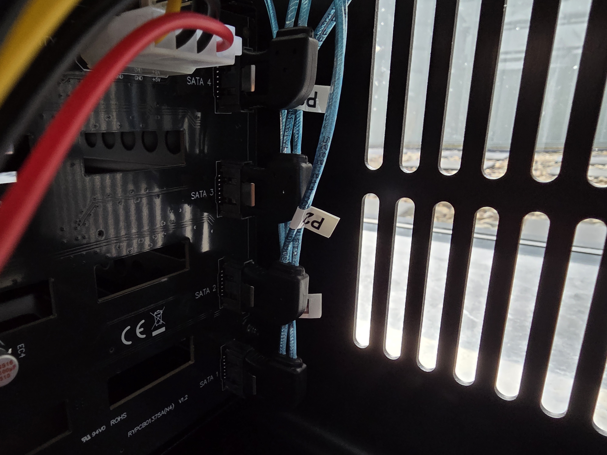

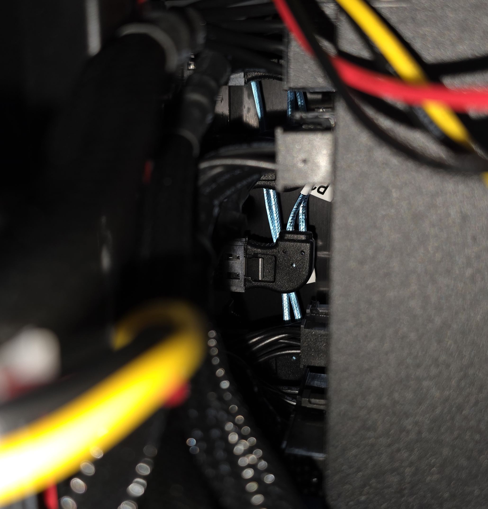

### Burn In

A burn-in test is a stress test you run on a new or re-purposed hard drive. It reads and writes to every sector repeatedly to make sure it behaves correctly under load. The point is to catch early failures, not to wear the drive out. Hard drives tend to follow a bathtub curve of failures. Early on there is a higher chance of failure (infant mortality). Then you get a long flat period of reliable operation. At the end of life the failure rate starts to rise again. Burn-in helps push the drive through that early high-risk period while it is empty and still under warranty.

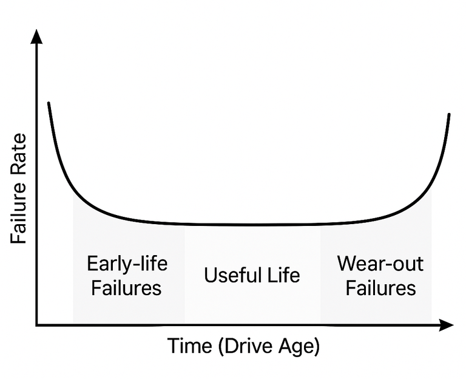

I ran the [Spearfoot/disk-burnin-and-testing](https://github.com/Spearfoot/disk-burnin-and-testing) script in parallel on all drives. The full process took about 15 days due to the size of the drives. The process the script goes through is:

1. SMART short test
1. [badblocks](https://wiki.archlinux.org/title/Badblocks) with four write passes to every block, then reads back and verifies.
   1. `0xaa (10101010)`
   1. `0x55 (01010101)`
   1. `0xff (11111111)`
   1. `0x00 (00000000)`
1. SMART extended test


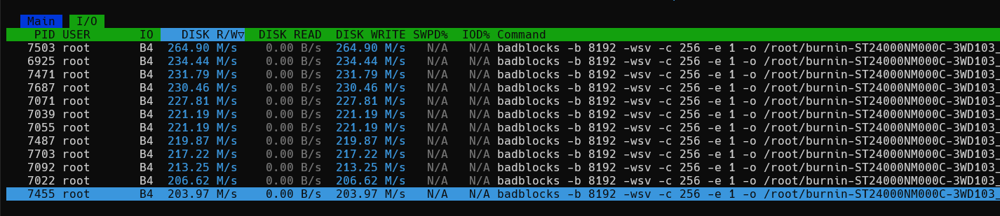

I started seeing the SMART raw value for Command Timeout (188) jump to very large numbers on a few drives, which looked worrying at first. It turned out to be a `smartctl` issue rather than a disk problem. The raw value is a [hex field split into three parts](https://www.disktuna.com/big-scary-raw-s-m-a-r-t-values-arent-always-bad-news/), and the `smartctl` version I was using misinterpreted it as one big decimal number, making healthy drives look like they had huge timeout counts.

After burn-in I also ran [gamestailer94/farm-check](https://github.com/gamestailer94/farm-check) specific to Seagate drives. It compares SMART power-on hours with FARM power-on hours to detect potentially fraudulent or misrepresented drives, an issue highlighted in the Seagate hard disk fraud investigation reported by [heise](https://www.heise.de/en/news/Fraud-with-Seagate-hard-disks-Dozens-of-readers-report-suspected-cases-10259237.html).

All of the drives passed both the burn-in and the fraud checks.

### Firmware Updates

Updates for the Samsung 990 Pro were straightforward to handle on Linux, thanks to Matt Edwards’ guide on [upgrading Samsung SSD firmware on Linux](https://mattedwards.org/2023/04/upgrading-the-firmware-on-a-samsung-980-ssd-using-linux/).

The M.2 to 6 x SATA adapter based on the ASMedia 1166 chipset also has firmware updates available from [Station-Drivers](https://www.station-drivers.com/index.php/th/component/remository/Drivers/Asmedia/ASM-106x-Sata-6G-Controller/Firmwares/lang,th-th/). Updating it is possible from Linux as well, because [Radxa provides a small CLI tool](https://dl.radxa.com/accessories/m2-to-hexa-sata-adapter/tools/) for their own M.2 to Hexa SATA adapter, which uses the same chipset.

## Front Fan Adapter

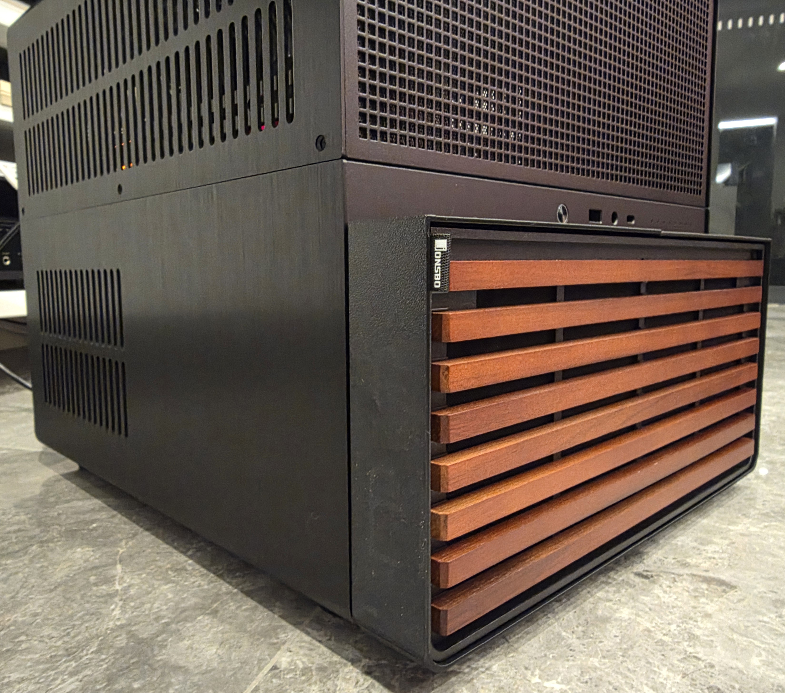

To improve drive cooling in the Jonsbo N5 I used a [3D-printed front fan adapter from a creator named Nirvash on Printables](https://www.printables.com/model/1302775-front-fan-adapter-for-the-jonsbo-n5). It extends the front wooden fan grille so I can mount two 140 mm fans, and it uses magnets so it attaches to the case in the same way as the original wooden frame.

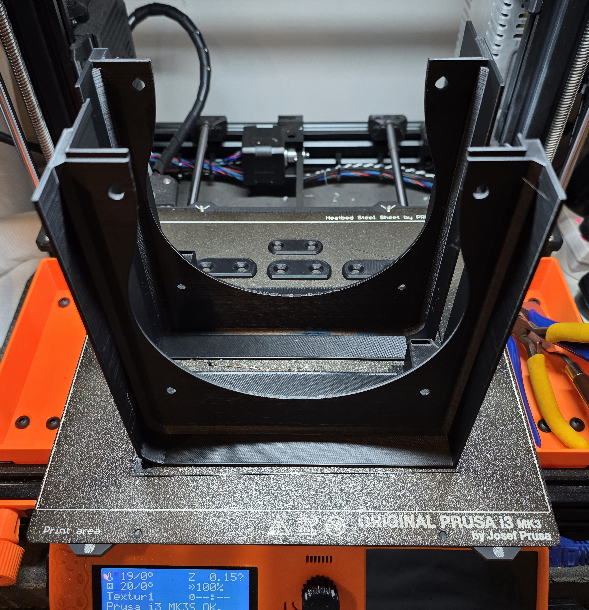

Fitting it cleanly required routing a fan cable through the front I/O area. I desoldered the headphone jack on the front panel and passed a fan extension cable through that opening. To do that I had to depin the fan extension cable, thread it through, then repin it on the other side.

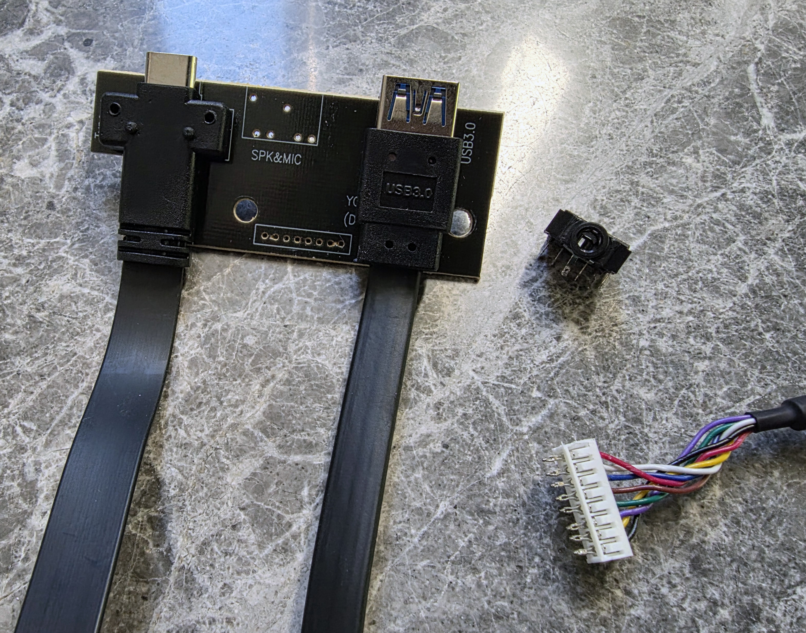

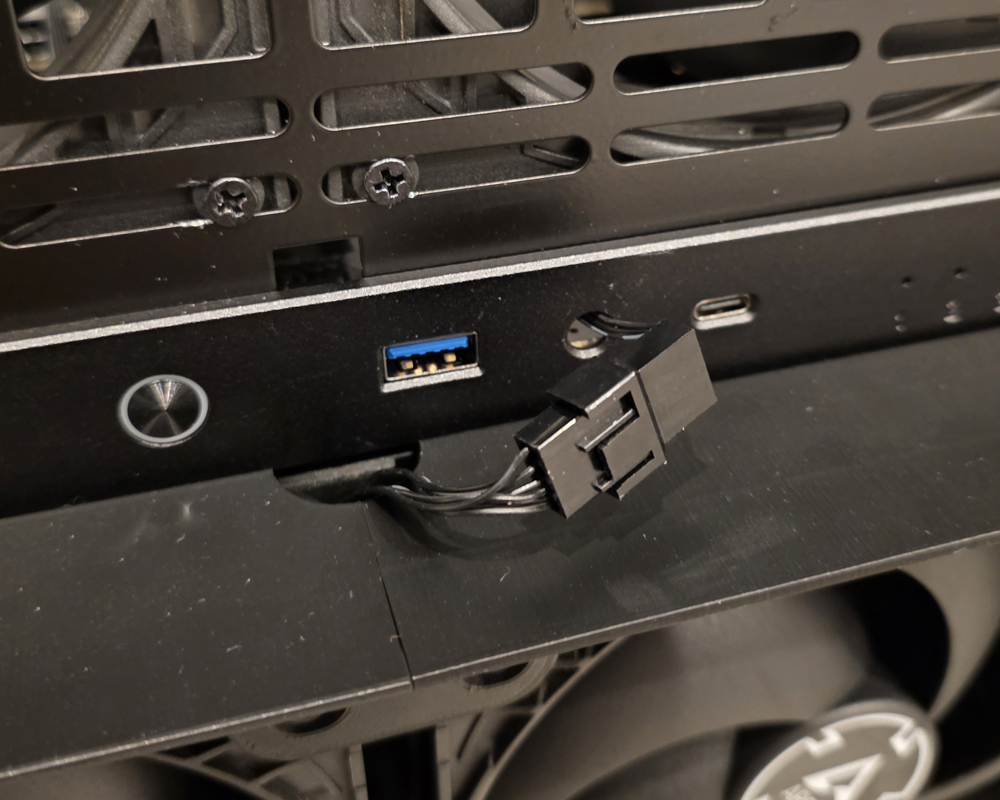

Right now I am using some older Arctic P14 140 mm fans on this adapter and will be swapping them out for the [Noctua NF-A14 industrialPPC-3000](https://www.noctua.at/en/products/nf-a14-industrialppc-3000-pwm) fans for higher static pressure and airflow.


## (A)RGB

I did not really want or need ARGB for this build, but the Thermalright fan packs I bought came with ARGB support so I decided to use it. It is very obvious when the server is on now, although with 11 fans in the case it was never exactly subtle to begin with.

<video autoplay loop controls width="100%" height="auto">
  <source type="video/webm" src="argb/cycle.webm">
  <p>Your browser does not support the video element.</p>
</video>

The ARGB controller, splitters and extension cables all came from AliExpress and support a bunch of different effects and modes. I ended up just using a simple mode that slowly transitions between colours, which is enough to make the whole thing look alive without being completely over the top.

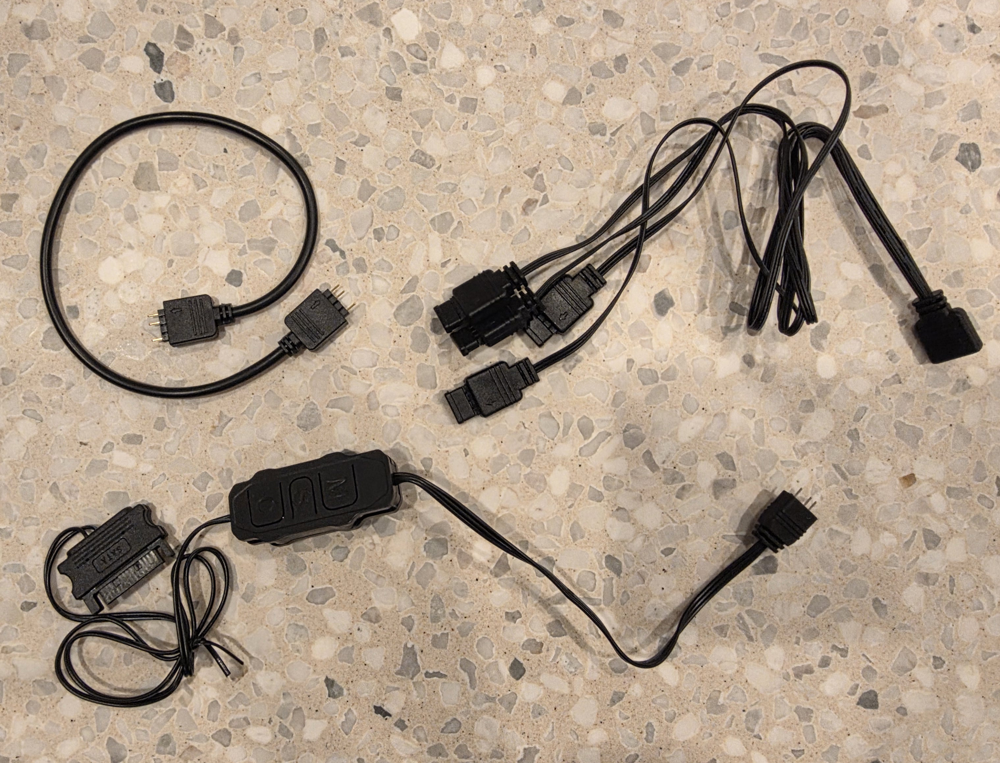

## Revisiting Goals

### Performance

Compared to [the old server (Xeon E5-1620 v4, 128 GB DDR4, Samsung 840 Pro SSDs and 9 x 8 TB Ironwolf HDDs)](/my-72tb-freenas-server/#hardware), this build is a clear step up in every area.

- CPU: Xeon E5-1620 v4 to an i7-14700, with more cores, better single-thread performance and Quick Sync while still keeping ECC on W680
- Memory: 128 GB DDR4 to 256 GB DDR5 ECC, giving a lot more headroom for containers and services
- SSDs: SATA Samsung 840 Pro to PCIe 4.0 Samsung 990 Pro NVMe, a big jump in I/O performance
- HDDs: 9 x 8 TB Ironwolf to 12 x 24 TB Exos, massively increasing raw and usable capacity
- PSU: Corsair AX760 to a Be Quiet! Dark Power 13 750 W Titanium, giving higher efficiency and a more modern power platform

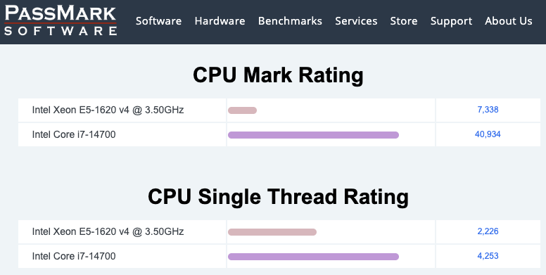

### Size

The old server lived in a Fractal Design Meshify 2 XL, which is a large full-tower case. It worked, but it took up a lot of room.

The new build moves everything into the Jonsbo N5. It still fits an ATX board, a full-size PSU and now 12 drives, but in a roughly 50 L chassis that is much more compact than the Meshify 2 XL. It is still very much a real server, but it no longer dominates the space it sits in.

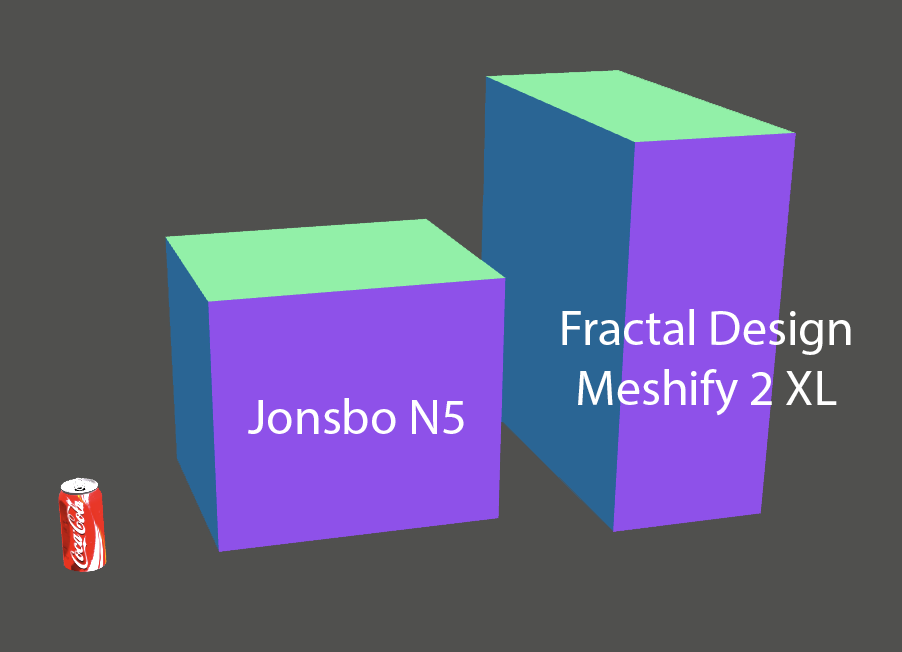

### Power Consumption

I measured both servers at the wall with a smart plug.

| System     | Idle / Baseline | Typical range | Short peaks  |
|------------|-----------------|---------------|--------------|
| Old server | ~160-170 W      | ~170-190 W    | ~220-250 W   |
| New server | ~140-160 W      | ~160-190 W    | up to ~300 W |

The new server idles a little lower and sits in roughly the same 160-190 W band under normal use, despite a faster CPU, more RAM and more disks. Most of the time it sits around 150 W, with brief spikes into the 200-250 W range and only occasional peaks a bit above 300 W during heavy work.

Some of this comes from the platform change, but the PSU helps too. The old build used a Corsair AX760. The new one uses a Be Quiet! Dark Power 13 750 W with an 80+ Titanium rating, which is more efficient at the loads this server actually runs at. Given current power prices, the extra efficiency should pay back the price difference over a few years while keeping heat and noise down.

A 600-650 W Titanium unit would also have been enough for this build on paper, but in Australia there were no lower‑wattage Titanium PSUs that were cheaper or easier to get than the Dark Power 13 750 W. Given the small price difference and the higher efficiency at my actual loads, the 750 W model was the most sensible option.

## Conclusion

Overall this new server meets the original goals. Each major component is a meaningful upgrade over the previous build, the move from a full-tower case to the Jonsbo N5 cuts the physical footprint while still allowing 12 drives, and the newer CPU and high-efficiency PSU improve power usage for a system that is always on.

This post focused on the hardware side of the build. In Part 2 I will cover the software, including the operating system, storage layout and the services running on the server.
