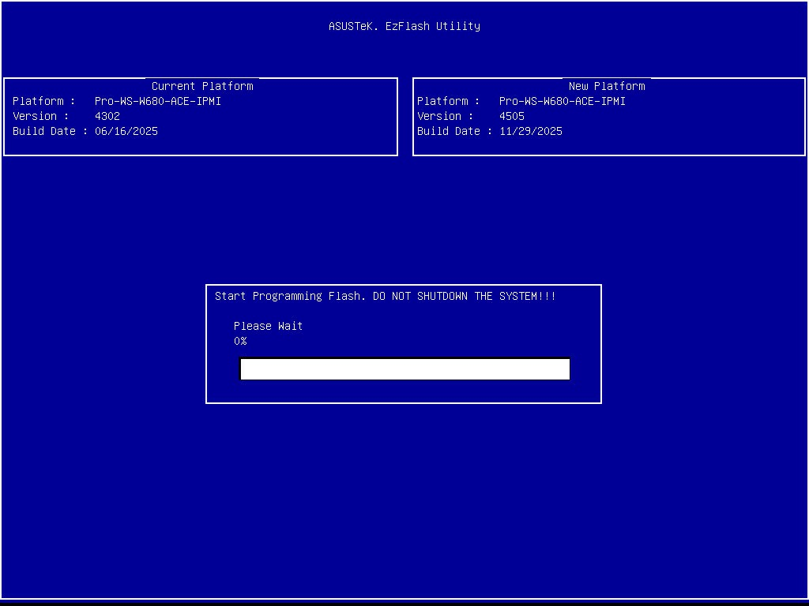
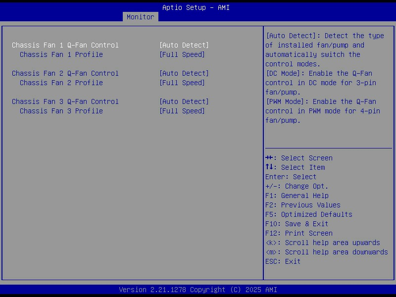
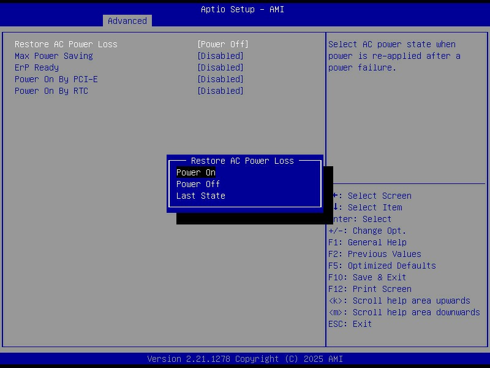
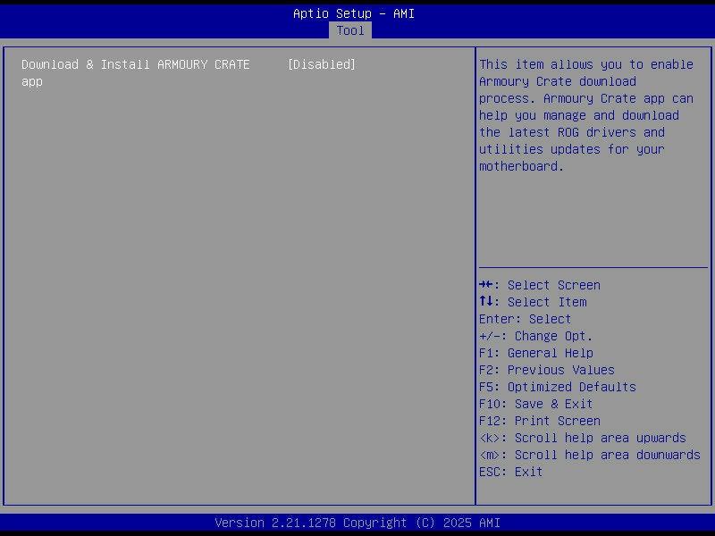
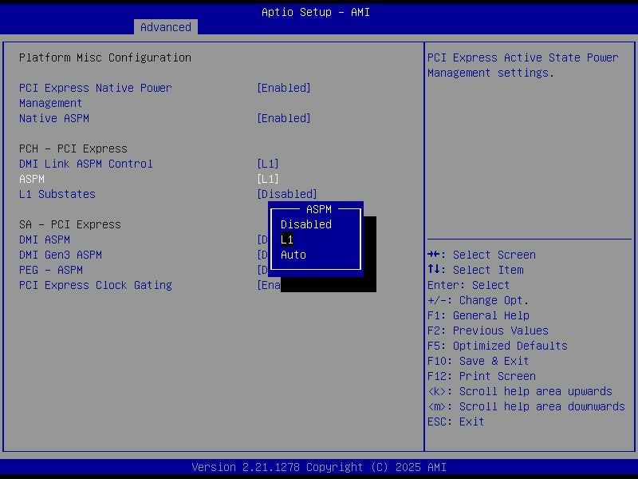
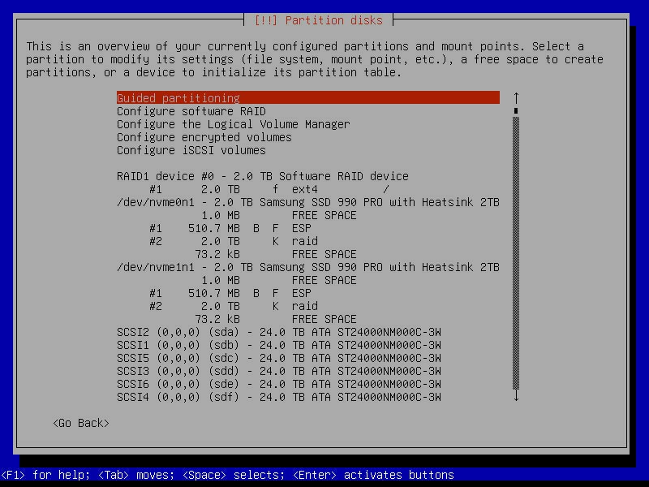
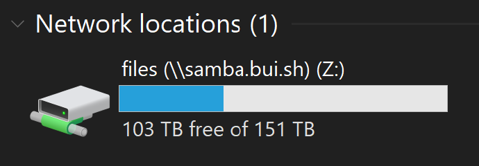

This post is the follow-up to my [previous post](/home-server-2025-part-1-hardware), where I covered the hardware build and the decisions behind each part, and it focuses on the software stack running on the system, including the BIOS configuration, the operating system, ZFS for storage, and how I am handling containerisation and services.

<!-- more -->

## Table of Contents

## BIOS

With the Intel 13th and 14th gen microcode issues hanging over this platform, keeping the BIOS up to date is a practical stability requirement rather than a 'maybe later' task, since the fixes have largely been delivered via firmware updates.



My general approach was to start from a known-good, current BIOS, then make a few deliberate changes:

- Set all fans to run at full speed to keep the drive stack and VRMs cool under sustained load.
- Configured AC power recovery so the server automatically powers back on after a blackout.
- Disabled ASUS Armoury Crate and the rest of the bundled vendor junk that has no place on a headless server.







C-states are CPU power-saving modes. When the system is mostly idle, the CPU can park cores and drop into deeper sleep states that reduce power draw, at the cost of slightly more latency when the CPU has to wake back up.


ASPM (Active State Power Management) does a similar job on the PCIe side, letting links between the CPU/chipset and devices like NVMe drives or HBAs enter lower power states when they are not busy.



## Operating System (Debian)

For the first time, I ditched [Ubuntu](https://ubuntu.com/) and went with [Debian](https://www.debian.org/). Debian has a better reputation for stability, and for a server that should run quietly for years, boring and predictable is the goal.

I installed the latest Debian Trixie (13) release. Ubuntu is a fork of Debian, so the move was not a huge jump. The day-to-day admin work is basically the same.

One of the main reasons I moved away from Ubuntu is that I am not a fan of how commercial it has become. I wanted a base system that is not constantly trying to upsell Snaps, Ubuntu Pro or MicroK8s.

### Partitioning

For the OS drives, I used the two Samsung 990 Pro 2 TB SSDs as a mirrored `mdadm` RAID1, so the machine can lose either NVMe drive and still boot and run normally.

The root filesystem (`/`) lives on the RAID1 device, which keeps the setup simple and gives me redundancy for the parts of the system that change constantly. Rather than carving out a dedicated swap partition, I went with a swapfile. It keeps the partitioning cleaner, and it also means I can resize swap later without having to shuffle partitions around or rebuild anything.



UEFI adds one annoying wrinkle. The EFI System Partition cannot live on the `mdadm` array, because the firmware needs to read boot files directly from a plain FAT32 ESP, and it does not understand Linux software RAID metadata. [The workaround](https://wiki.debian.org/UEFI#RAID_for_the_EFI_System_Partition) is to create a small ESP on each drive and keep them in sync, so each NVMe has its own bootable EFI partition even though the rest of the OS lives on the mirrored RAID device.

```shell-session
calvin@homeserver:~$ cat /etc/fstab

# /boot/efi was on /dev/nvme0n1p1 during installation
UUID=7799-4C98  /boot/efi       vfat    umask=0077      0       1
# /boot/efi2 was on /dev/nvme1n1p1 during installation
UUID=F287-3F47  /boot/efi2      vfat    utf8            0       0
/dev/sr0        /media/cdrom0   udf,iso9660 user,noauto     0       0
```

```shell-session
calvin@homeserver:~$ efibootmgr

BootCurrent: 0000
Timeout: 1 seconds
BootOrder: 0005,0000
Boot0000* debian2 HD(1,GPT,00b0d5a1-e05d-49b2-a9e2-bc88c2eec925,0x800,0x1e8000)/File(\EFI\DEBIAN\SHIMX64.EFI)
Boot0005* debian HD(1,GPT,11e33c90-68b2-49db-bc61-c4ce2d60c8d3,0x800,0x1e8000)/File(\EFI\DEBIAN\SHIMX64.EFI)0000424f
```

### Networking

For networking, I configured the two 2.5 GbE ports as a bonded link using LACP, which is the Linux equivalent of a LAGG. The goal is not to get a single 5 Gbit link to one client, because that is not how LACP works, but to increase aggregate throughput and add redundancy. Multiple clients can each get close to 2.5 Gbit at the same time, and if one cable or port drops out, the server stays online on the remaining link.

I built the bond with systemd-networkd rather than the old `/etc/network/interfaces` style configuration. The bond is `bond0` in 802.3ad mode, with both NICs attached as slaves. I also renamed the interfaces based on their MAC addresses so they have stable, human-readable names instead of whatever the kernel decides on a given day.


The bond itself is tuned for a fairly typical LACP setup. It uses `TransmitHashPolicy=layer3+4` so load balancing is based on IP addresses and ports, and `LACPTransmitRate=fast` so the switch and host exchange LACP packets more frequently and detect failures quicker. Link monitoring is done via MII at a 100 ms interval, with a short up-delay to avoid flapping during negotiation. The result is a single logical interface that gives me failover and better total throughput across multiple simultaneous connections.

## Storage (ZFS)

For storage, I stuck with [ZFS](https://openzfs.org/). It gives me checksumming, snapshots, scrubs, and RAID-like redundancy with end-to-end data integrity, which is exactly what I want for a large pool of mostly static data that I still care about not silently rotting over time. It is not the simplest option, and it is definitely not the lightest, but for a home server that is meant to last years, it has earned its reputation.



I did consider switching to [mergerfs](https://perfectmediaserver.com/02-tech-stack/mergerfs/) with [SnapRAID](https://perfectmediaserver.com/02-tech-stack/snapraid/) this time around. In practice, it still would have meant dedicating two drives to parity and ending up with basically the same usable space, just with a different set of trade-offs. Since I did not need the flexibility to arbitrarily add and remove drives over time, I did not see a strong reason to move away from ZFS.

With ZFS on this build, I used datasets properly for the first time, which let me tune behaviour per type of data instead of treating the whole pool the same. Using Jim Salter’s [ZFS tuning cheat sheet](https://jrs-s.net/2018/08/17/zfs-tuning-cheat-sheet/) as a guide, I kept most settings simple, but did a couple of deliberate tweaks:

- Used different `recordsize` values depending on the dataset, leaving small files at the default and using `1M` for Time Machine backups and media files.
- Set `ashift=12` when creating the pool to match 4K sectors and avoid alignment and write amplification issues.

```shell-session
calvin@homeserver:~$ zfs list -o name,recordsize

NAME                        RECSIZE
files                          128K
files/Applications             128K
files/Audiobooks                 1M
files/Backups                  128K
files/Backups/Time Machine       1M
files/Books                    128K
files/Downloads                  1M
files/Games                      1M
files/ISO                        1M
files/Misc                     128K
files/Movies                     1M
files/Photos                   128K
files/TV                         1M
files/Work                     128K
```

To migrate the data across from the old server, I used rclone rather than rsync. For large transfers over the network, it has been consistently faster for me, especially when you crank up parallelism, and it made pulling everything over to the new pool much less painful.

```shell-session
$ rclone sync homelab:/files /files --progress --transfers 32 --multi-thread-streams 1024 --ignore-checksum
```

## Containerisation (Podman)

For containerisation, I decided to try [Podman](https://podman.io/) as a Docker alternative. The pitch is appealing. It is more modern in a few areas, it has a stronger security story in the default architecture, and the daemonless model is nice in theory.

In practice, the first friction point was autostart. With Docker, I could rely on the daemon and restart policies, and containers would just come back after a reboot. With Podman, proper autostart is basically expected to be handled via [systemd and quadlets](https://www.redhat.com/en/blog/quadlet-podman). I ended up [writing my own startup script](https://github.com/calvinbui/ansible/blob/master/files/podman/podman-startup.service) instead, because I do not want systemd involved in every layer of my life. I know that is the direction on most distros, and it is very on brand for Red Hat, but it still feels like everything slowly gets absorbed, even things that used to be simple, like cron and NTP.

The one feature that made Podman worth trying for me was networking. Its macvlan setup works cleanly with DHCP, whereas my experience with Docker macvlan has been more about handing it an IP range and letting it assign addresses itself. The catch is that I still could not just set static IPs on the containers, so I ended up using [locally administered MAC addresses](https://en.wikipedia.org/wiki/MAC_address#Ranges_of_group_and_locally_administered_addresses) with DHCP reservations. It gets me what I want, but it is a bit clunky, and the bigger irony is that macvlan pushed me into running Podman rootful anyway, so the whole rootless angle mostly disappeared for this server.

There were also a bunch of smaller differences to account for:

- Rootless containers cannot bind to ports under 1024.
- Podman does not automatically create host directories for volume mounts as Docker does.
- Podman can expose a Docker-compatible socket, which keeps tooling like Traefik and Dozzle viable.
- No daemon means no Docker-style embedded DNS, so I could not rely on container names resolving neatly inside user-defined networks.
- Image names need to be fully qualified, so instead of just `nginx`, you end up writing `docker.io/library/nginx`.

The most annoying issue I am still dealing with is that when containers start or restart, they sometimes get an IP address but have zero network connectivity. Then, about 20 minutes later, it starts working as if nothing happened. It is intermittent, and it does my head in, and it has been the biggest mark against Podman so far.

At this point, I would not say Podman is clearly better or worse than Docker for my usage. There are trade-offs in both directions, and for now, I would call them roughly equal, with the caveat that Docker feels more mature and less surprising day to day.
