I upgraded only my CPU and motherboard while keeping everything else the same. Memory/RAM pricing has gone completely stupid. DDR5 prices have quadrupled, and DDR4 prices have tripled. The AI ~~boom~~ bubble has pushed demand through the roof, and I was not interested in paying the inflated prices to upgrade to a new platform.

<!-- more -->

```toc
# This code block gets replaced with the TOC
```

## The Upgrade

The CPU was the bottleneck in the system. When gaming at 3840x1600, the GPU is often the limiter, but the CPU can still bottleneck by failing to feed the GPU fast enough. The 7700K was starting to show its age through:

- stuttering
- inconsistent frame pacing
- minimum FPS drops

### Current Build

This build started life in the Intel i7 7700K era from 2017. It is a great example of why "my PC is fine" stayed true for years, then suddenly games started expecting more than 4 cores.

I play single-player AAA games at **3840x1600** and I aim for a minimum of **60 FPS**. I use DLSS where possible, and in a few games, I have used [FSR3 frame generation mods](https://github.com/Nukem9/dlssg-to-fsr3/releases) to stretch the hardware lifespan further.

| COMPONENT   | ITEM                                           |
|-------------|------------------------------------------------|
| CPU         | Intel i7 7700K ([Delidded](/delidding-7700k/)) |
| MOBO        | ASRock Z270M Pro4                              |
| RAM         | Corsair Vengeance LED 32GB 3200Mhz C16         |
| GPU         | ASUS TUF RTX 3080 Ti                           |
| SSD (OS)    | Samsung 960 EVO 1TB                            |
| SSD (GAMES) | Kingston A2000 1TB                             |
| PSU         | Corsair SF750                                  |
| CPU FAN     | Noctua NH-L9i                                  |
| CASE        | [SAMA IM-01](/quzao-sama-im-cooling/)          |
| MONITOR     | Alienware AW3821DW                             |

### Staying with DDR4

Most of the popular modern gaming CPUs and platforms from both Intel and AMD require DDR5. Upgrading my CPU would also require both a motherboard and RAM upgrade. It's currently not a cheap upgrade when RAM is involved.

This rules out a bunch of the current default recommendations, like the Ryzen 7 7800X3D or 9800X3D, because even if the CPU pricing makes sense, the RAM cost does not.

The only choice I had was to upgrade to a platform/CPU that still worked with DDR4, while keeping everything else compatible.

### CPU (Ryzen 7 5700X)

The i7 7700K is a 2017 CPU. Even at 3840x1600, where most games are GPU-bound, it was increasingly showing its age when faced with minimum FPS, frame pacing, and stuttering.

Games are also just better at using more cores than they used to be. A 4C/8T CPU can still deliver a decent average FPS, but it is much more likely to hit 100% CPU usage spikes in busy scenes and cause hitching.

I went down the rabbit hole, finding the best CPU upgrade that still used DDR4:

| CPU                     | Notes                                    |
|-------------------------|------------------------------------------|
| Ryzen 5600 / 5600X      | 6C CPU, but I wanted 8C                  |
| Ryzen 5700              | A 5700G variant with smaller cache.      |
| Ryzen 5700X             | 8C/16T, efficient, good value.           |
| Ryzen 5800X             | A hotter version of the 5700X            |
| Ryzen 5700X3D / 5800X3D | The best DDR4 gaming CPUs, but expensive |
| Ryzen 5900X / 5950X     | Overkill for my gaming and runs hot      |

I ended up buying an [AMD Ryzen 7 5700X](https://www.amd.com/en/support/downloads/drivers.html/processors/ryzen/ryzen-5000-series/amd-ryzen-7-5700x.html), but that meant replacing the motherboard since this was an Intel to AMD switch.

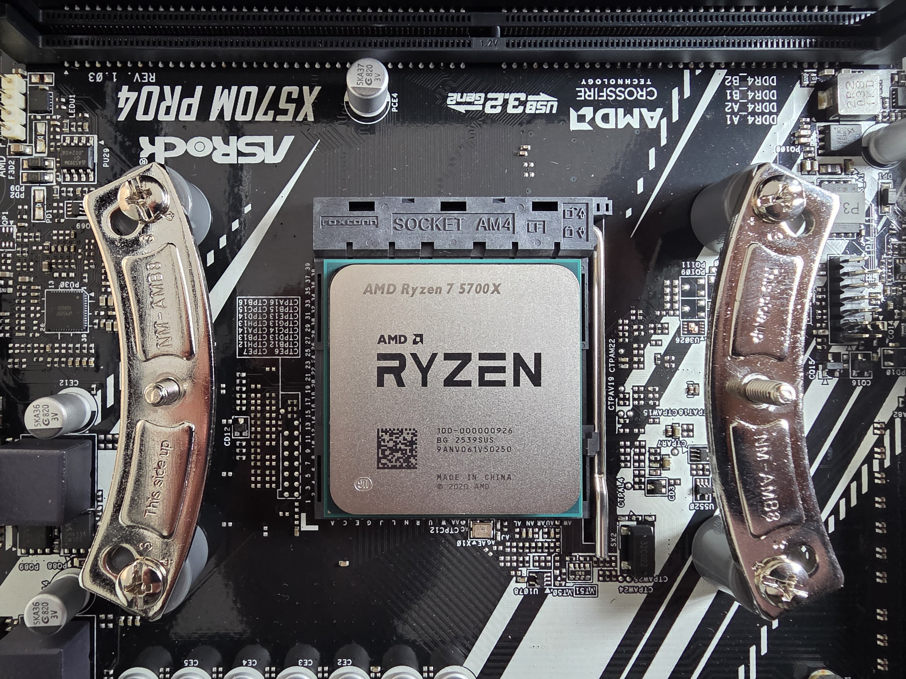

The other thing AMD does better than Intel is platform longevity. AM4 lasted forever, and AM5 looks like it will as well. Intel seems to change sockets constantly, which makes cheap upgrades harder.

I bought the 5700X from AliExpress for **$188.02 AUD** after all discounts (coupons, cashback, credits, etc.). These CPUs are EOL, and they are definitely used, but AliExpress is full of them, and the deals were better than what I was seeing locally.

### Motherboard (X570)

AM4 has a bunch of chipsets (eight, depending on how you count). Wikipedia has a [good comparison table](https://en.wikipedia.org/wiki/Socket_AM4#Chipsets).

In 2026, the two choices that mattered are B550 and X570:

| Feature               | B550            | X570        |
|-----------------------|-----------------|-------------|
| CPU PCIe Lanes        | PCIe 4.0        | PCIe 4.0    |
| Chipset uplink to CPU | PCIe 3.0 x4     | PCIe 4.0 x4 |
| Chipset PCIe lanes    | Mostly PCIe 3.0 | PCIe 4.0    |
| Chipset Fan           | No              | Yes         |

In other words, B550 is not "bad". It is just a bit more constrained once you start adding extra NVMe drives, PCIe cards, or anything that benefits from faster chipset lanes. If you are only running a GPU and a single NVMe drive, B550 is usually the right choice.

The specific thing that pushed me to X570 is that B550 is mostly PCIe 3.0 on the chipset side. I have a PCIe 4.0 x1 10Gbps networking card. PCIe 3.0 x1 tops out at about **985 MB/s** of real throughput (roughly **7.9 Gbit/s**), which can bottleneck a 10GbE link under ideal conditions. PCIe 4.0 x1 doubles that, so it is basically the minimum I wanted.

I bought an [ASRock X570M Pro4](https://www.asrock.com/MB/AMD/X570M%20Pro4/index.asp) from AliExpress for **$150.12 AUD**. There are a few Micro-ATX AM4 boards available, but this had the PCIe layout I needed and support for two NVMe drives. The funniest part is that I somehow ended up with another ASRock Pro4 board. Even the rear I/O layout is basically the same, which made the swap feel weirdly familiar.

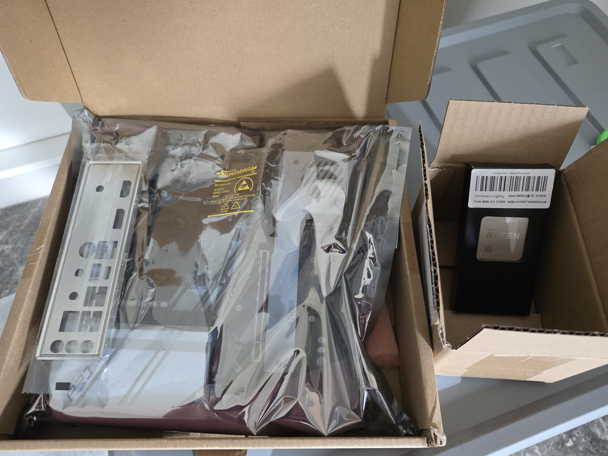

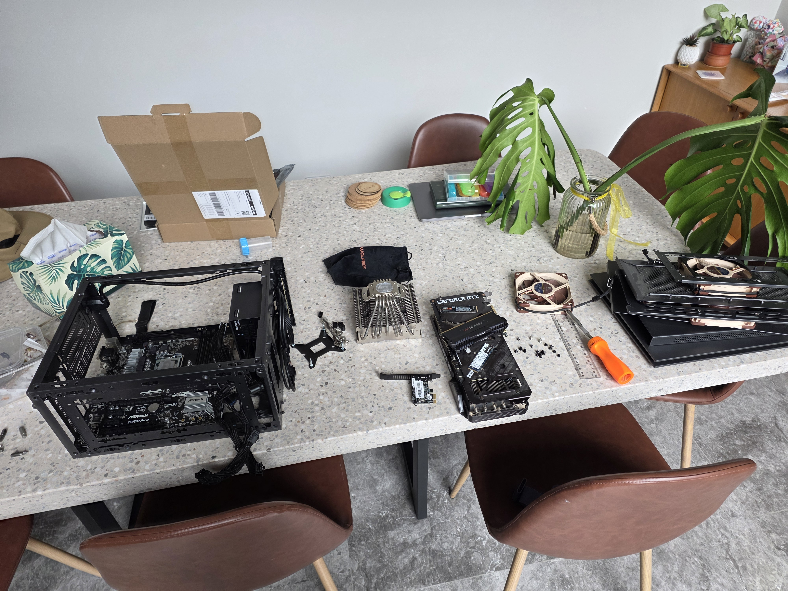

### Cost

The cost of the CPU and motherboard combined was $338.14 AUD. After selling my Intel parts for $100, the overall cost reduced to $238.14. As mentioned before, everything else stayed the same.

| Component | Before                       | After                          | Price   |
|-----------|------------------------------|--------------------------------|---------|
| CPU       | Intel i7 7700K (4C/8T, 2017) | AMD Ryzen 5700X (8C/16T, 2022) | $188.02 |
| MOBO      | ASRock Z270M Pro4            | ASRock X570M Pro4              | $150.12 |

## Benchmarking

### Methodology

I wanted benchmarks that were simple to replicate, so I used built-in benchmark tools from popular games and took screenshots of the results screen.

My hypothesis going into this was that I would be *mostly* GPU-bound at 3840x1600, so the average FPS would not move much. The more interesting changes would show up in minimum FPS and in games that are unusually CPU-heavy.

The main thing I looked for wasn't whether Average FPS increased, but whether:

- minimum FPS improved for less hitching/stuttering
- CPU-limited titles stopped being CPU-limited
- games that were GPU-bound finally looked that way

### Results

Below are the headline numbers from the built-in result screens.

#### Average FPS

| Game / Benchmark               | 7700K |  5700X |     Change |
|--------------------------------|------:|-------:|-----------:|
| Hitman 3 (overall score)       | 69.41 | 101.95 |     +46.9% |
| Horizon Zero Dawn Remastered   |    51 |     76 |     +49.0% |
| Shadow of the Tomb Raider      |    95 |    119 |     +25.3% |
| Forza Horizon 5 (Achieved FPS) |    82 |     99 |     +20.7% |
| Returnal                       |    85 |     96 |     +12.9% |
| Cyberpunk 2077                 | 55.94 |  68.12 |     +21.8% |
| Metro Exodus Enhanced Edition  | 65.86 |  71.22 |      +8.1% |
| Red Dead Redemption 2          | 83.42 |  89.96 |      +7.8% |
| **Average change**             |       |        | **+24.1%** |

#### Minimum FPS

| Game / Benchmark              | 7700K | 5700X |     Change |
|-------------------------------|------:|------:|-----------:|
| Horizon Zero Dawn Remastered  |    22 |    20 |      -9.1% |
| Returnal                      |    35 |    60 |     +71.4% |
| Cyberpunk 2077                | 43.06 | 61.19 |     +42.1% |
| Metro Exodus Enhanced Edition | 41.52 | 45.92 |     +10.6% |
| Red Dead Redemption 2         | 30.53 | 30.78 |      +0.8% |
| **Average change**            |       |       | **+23.2%** |

#### Maximum FPS

| Game / Benchmark              |  7700K |  5700X |     Change |
|-------------------------------|-------:|-------:|-----------:|
| Horizon Zero Dawn Remastered  |    116 |    178 |     +53.4% |
| Returnal                      |    122 |    143 |     +17.2% |
| Cyberpunk 2077                |  69.54 |  77.59 |     +11.6% |
| Metro Exodus Enhanced Edition | 100.91 | 110.45 |      +9.5% |
| Red Dead Redemption 2         | 104.45 | 122.43 |     +17.2% |
| **Average change**            |        |        | **+21.8%** |

#### Non-FPS Benchmarks

| Game / Benchmark          | Metric                   | 7700K | 5700X | Change |
|---------------------------|--------------------------|------:|------:|-------:|
| Civilization VI           | Turn time                | 44.25 | 34.42 | +22.2% |
| Final Fantasy XIV         | Score                    | 12189 | 13108 |  +7.5% |
| Shadow of the Tomb Raider | CPU Game Avg (FPS)       |   108 |   149 | +38.0% |
| Shadow of the Tomb Raider | GPU Bound (%)            |   24% |   76% |   +52% |
| Forza Horizon 5           | CPU Simulation Avg (FPS) | 137.5 | 201.9 | +46.8% |
| Forza Horizon 5           | GPU limited (%)          | 19.3% | 44.9% | +25.6% |

### Benchmark Notes

#### Hitman 3

This was one of the biggest wins. The overall score went from **69.41 FPS** to **101.95 FPS**.


#### Horizon Zero Dawn Remastered

This result surprised me the most: **51 to 76 FPS**.

The benchmark also reports separate CPU and GPU figures, which makes it pretty obvious what was happening:

- On the 7700K, CPU FPS basically matched the overall result.
- On the 5700X, the CPU number moved up, but the GPU number moved even further.

It's also a good reminder that high resolutions aren't always GPU-bound. Even at 3840x1600, this title was still clearly CPU-limited on both CPUs.

The difference is just that the ceiling moved from **51 FPS** to **76 FPS**, and the gap between GPU/CPU bottleneck became much more obvious.

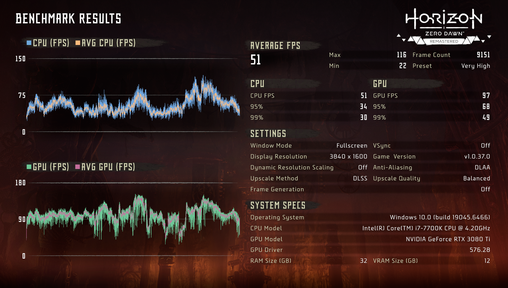

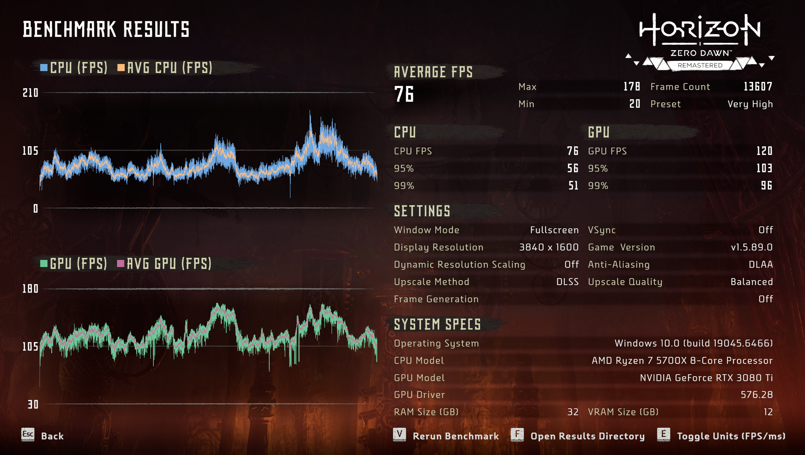

#### Shadow of the Tomb Raider

Average FPS improved **95 to 119**, but the more interesting number here is the built-in CPU breakdown ("CPU Game").

This is one of the few benchmarks that makes it easy to show "yes, the CPU upgrade mattered" even when pushing a high resolution.

The fun part is the **GPU Bound** percentage:

- 7700K: **24% GPU bound**
- 5700X: **76% GPU bound**

Same GPU, same resolution, but the CPU stopped getting in the way as much.

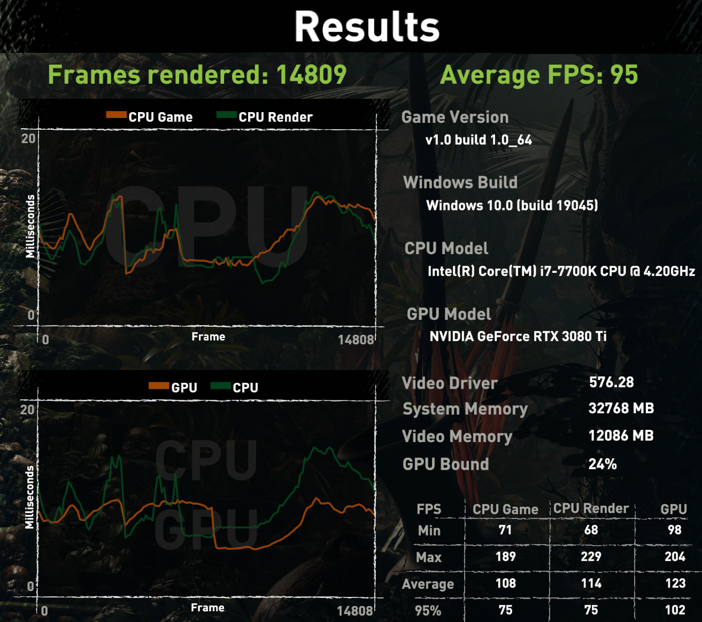

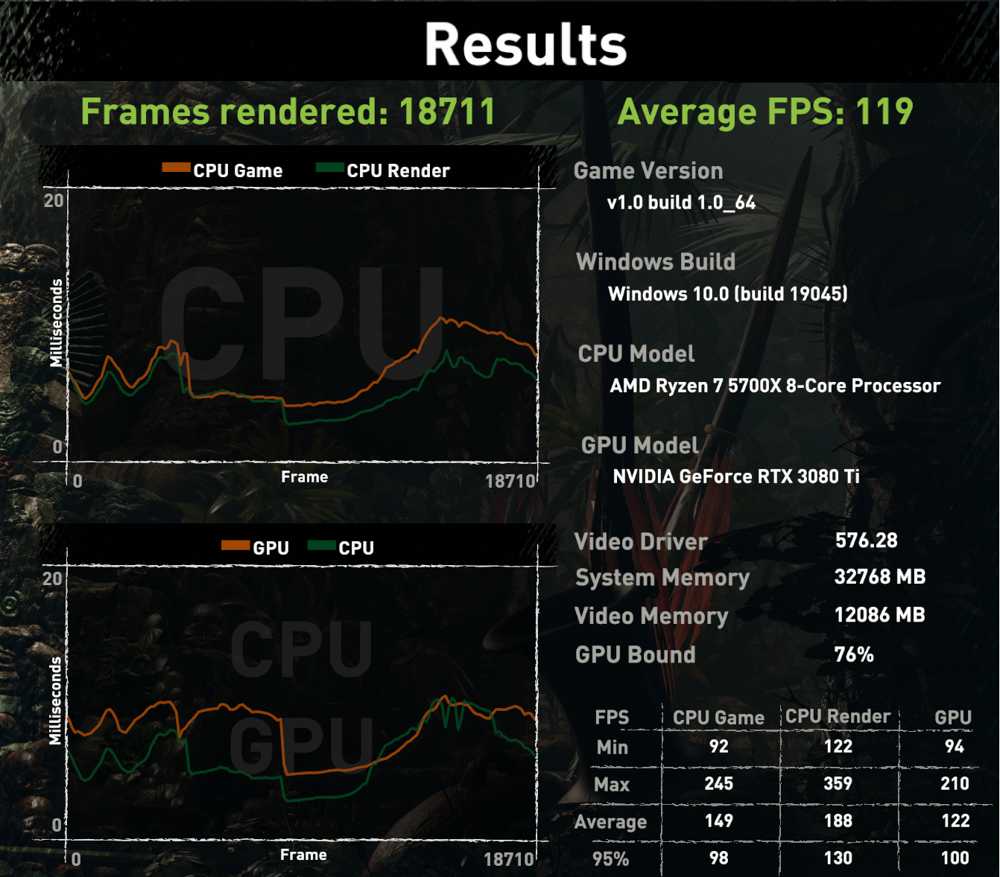

#### Forza Horizon 5

The FPS went from **82 to 99**, but the bigger story is the **CPU Simulation** result:

- **137.5 to 201.9 FPS**

Even when the GPU is busy, having a lot more CPU headroom for the simulation side is exactly the kind of thing that shows up as fewer small stutter moments.

It also lines up with what the benchmark calls out:

- GPU limited went from **19.3% to 44.9%**
- average latency dropped from **35.1 ms to 29.5 ms**

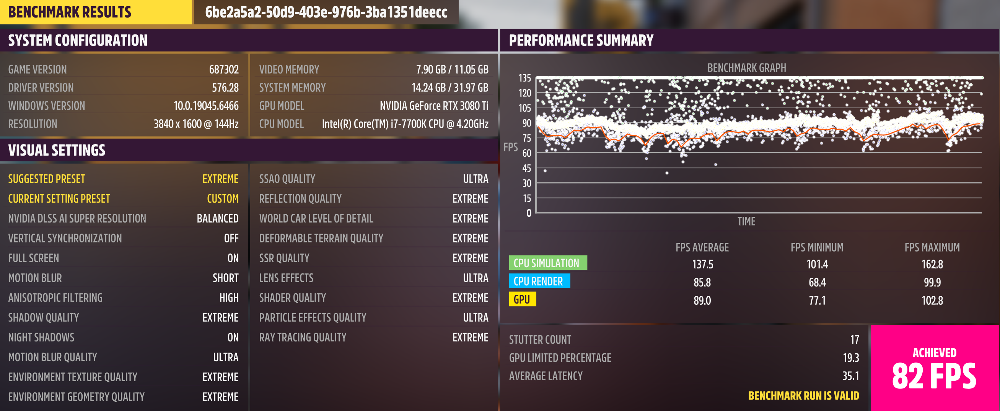

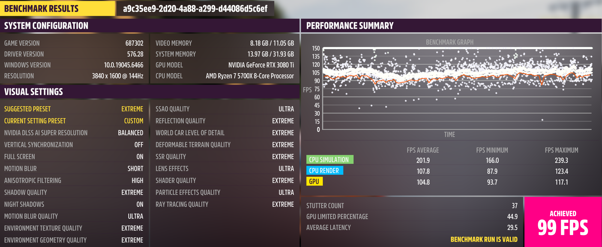

#### Returnal

Returnal is a perfect example of why average FPS isn't the whole story.

- Average: **85 to 96 FPS** (+12.9%)
- Minimum: **35 to 60 FPS** (+71.4%)

That minimum FPS jump is the difference between a benchmark graph that looks mostly fine and one that stays consistent.

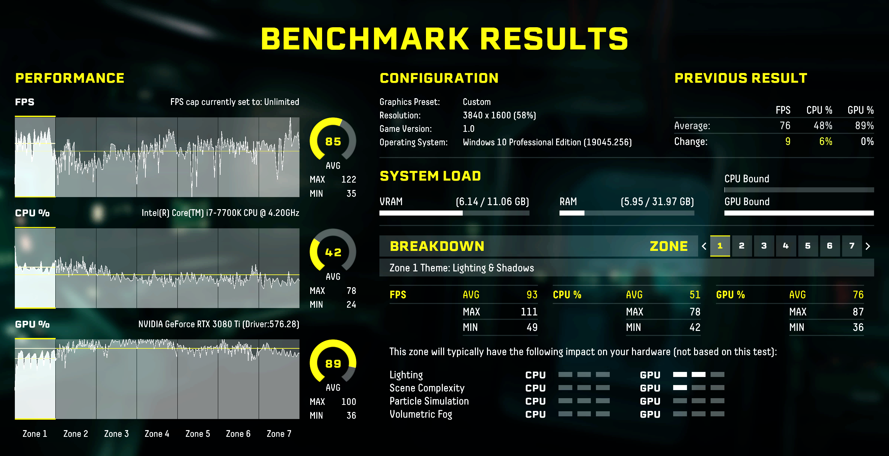

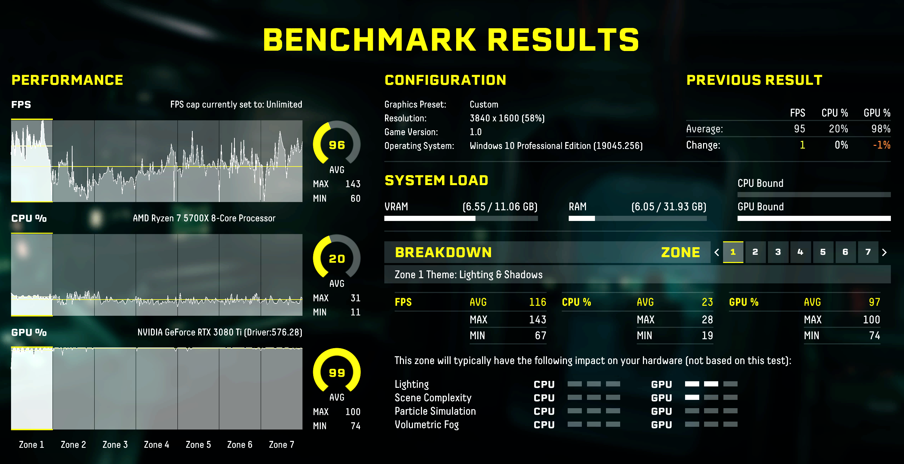

#### Cyberpunk 2077

Cyberpunk's benchmark gives Average / Min / Max, and it's another case where the lows mattered more than the average.

- Average: **55.94 to 68.12 FPS** (+21.8%)
- Minimum: **43.06 to 61.19 FPS** (+42.1%)

Crossing 60 FPS on the minimum result is the headline for me.

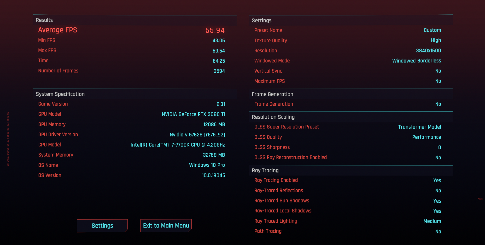

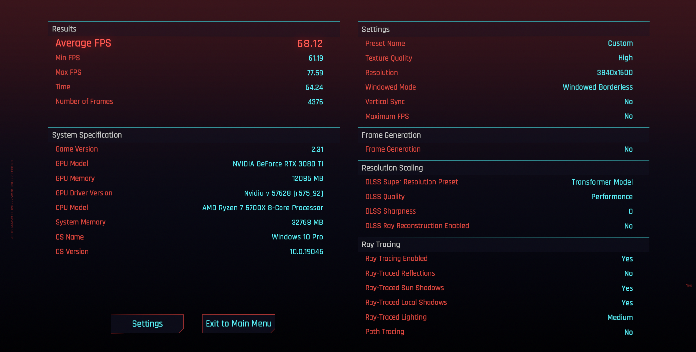

#### Civilization VI

This is the least ambiguous CPU benchmark. It doesn't care about resolution, and it doesn't pretend your GPU matters.

Turn time dropped from **44.25s to 34.42s** (about **22% faster**). If you play Civ, that's a real quality-of-life improvement that you feel constantly.


#### Metro Exodus Enhanced Edition

This behaved the way I expected a GPU torture test to behave at 3840x1600 with only a small uplift.

- Average: **65.86 to 71.22 FPS** (+8.1%)


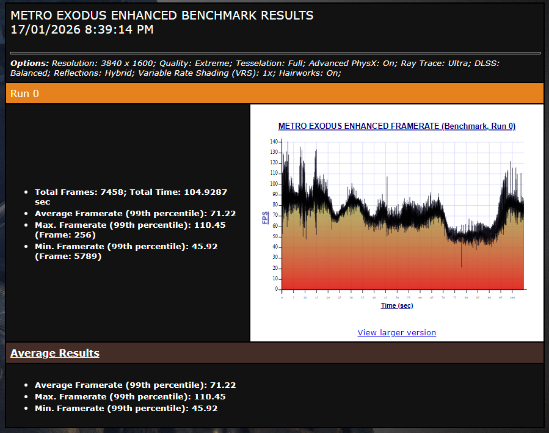

#### Red Dead Redemption 2

As with Metro, this game is mostly GPU-limited at this resolution.

- Average: **83.42 to 89.96 FPS** (+7.8%)

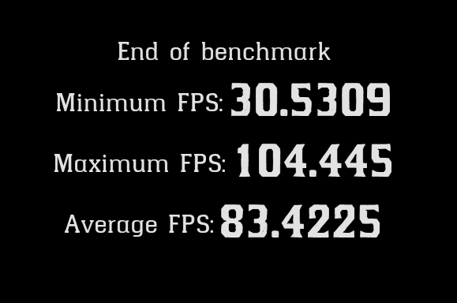

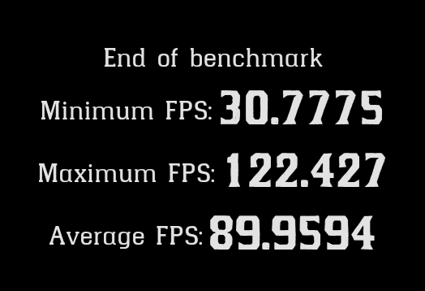

#### Final Fantasy XIV

The benchmark score increased **12189 to 13108** (+7.5%). This isn't a massive swing, but MMO performance tends to get worse in the messy real world (busy cities, lots of players), where extra CPU headroom matters.

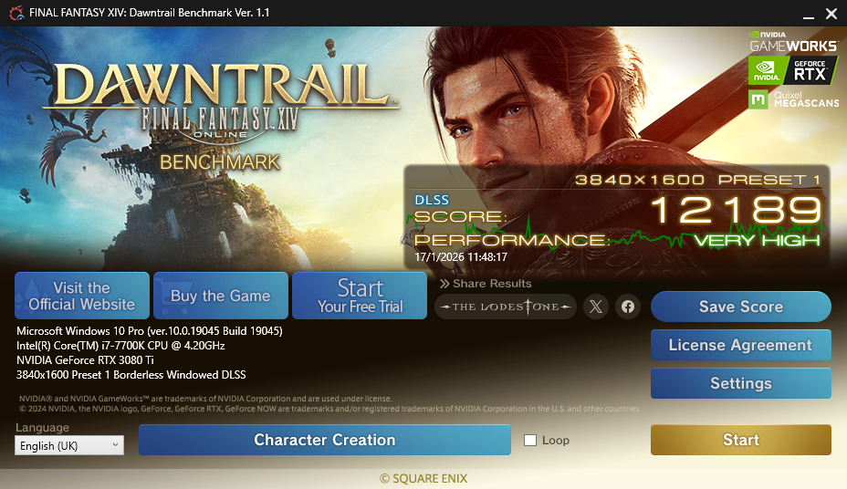


## Cost Per Frame

I paid **$338.14 AUD** for the CPU and motherboard. Both parts were from AliExpress, and they were definitely used. Even then, it was still cheaper than what I was seeing on Facebook Marketplace and eBay.

A rough "cost per average frame gained" calculation (summing the average FPS deltas across the FPS-based benchmarks above) comes out to about **~$2.53 AUD per FPS**. If you count the net cost after selling my 7700K and motherboard, the cost per frame comes out to **$1.78 AUD**.

This isn't meant to be a rigorous metric, but it's a nice sanity check that this upgrade was mostly about getting smoother performance without paying GPU money. For comparison, GPU upgrades often work out closer to **$5 to $8 per average FPS** gained.

## Summary and Lessons Learnt

I spent years assuming my high resolution made me entirely GPU-bound, but this upgrade proved that even at **3840x1600**, the 7700K was a massive bottleneck.

- **Consistency is King:** The **71% jump in minimum FPS** in *Returnal* and **42% in Cyberpunk** matter more than averages. It’s the difference between a stuttery experience and a fluid one.
- **Unlocking the GPU:** My "GPU Bound" metric in *Tomb Raider* jumped from **24% to 76%**. I’m finally getting the full value out of my 3080 Ti.
- **The DDR4 Side-grade:** Sticking with AM4 allowed me to dodge outrageous RAM prices while still gaining **25% more performance** on average.

By ignoring the DDR5 hype and focusing on minimum FPS, I’ve managed to turn a legacy 2017 build back into a high-end contender and finally stopped my CPU from holding the 3080 Ti hostage.
