In September 2025, NBN started offering 2000 Mbps plans in Australia. I had already tested [NBN 250](/testing-nbn-250-superfast/) and [NBN 1000](/testing-nbn-1000-ultrafast/), so moving up again was the obvious next step.

If I wanted to actually make use of the faster Internet, I had to upgrade my home network as well.

<!-- more -->

```toc
# This code block gets replaced with the TOC
```

## Background

I have dabbled in 10 gigabit networking before through [virtual machines](/napp-it-10gbps-network-solaris-11/) and later with [some SFP+ gear](/10-gigabit-installation-notes/). That was enough to get familiar with the ecosystem, but it was not a whole network setup.

The home market is slowly moving to 2.5G (and 5G to some extent), but for my usage I did not see a strong reason to stop there. 10G has been around in the enterprise and prosumer space for a long time, and there is finally enough second-hand gear and cheaper client hardware for it to make sense at home.

At a minimum, I needed:

- A 10G switch with both RJ45 and SFP+ ports
- A new OPNsense router with 10G support
- 10G adapters for wired devices
- 10G-capable wireless access points

## Network Switch (EnGenius ECS5512FP)

The switch was the main piece because it determined how the rest of the build could be wired. I specifically wanted a model with both RJ45 and SFP+ so I could mix newer copper devices with older SFP+ hardware.

I compared a lot of options and kept coming back to [ServeTheHome's cheap 10GbE switch buyer's guide](https://www.servethehome.com/the-ultimate-cheap-10gbe-switch-buyers-guide-netgear-ubiquiti-qnap-mikrotik-qct/). The cheaper Chinese switches from brands like Hasivo and Nicgiga were tempting on price, but too many reviews mentioned weird issues like configuration resets after a restart and no firmware upgrades or bug fixes. I was not interested in debugging the switch itself.

I eventually landed on the [EnGenius ECS5512FP](https://www.engeniustech.com/engenius-products/cloud-managed-8-port-poe-10-gigabit-switch-with-4-sfp-ports/), which I found on Amazon for $700 AUD. It ticked all the boxes:

- 8 x 10GBase-T (RJ45) ports
- 4 x 10G SFP+ ports
- PoE++ with a 420 W budget
- Smart switch features such as VLAN support

I used a short SFP+ DAC cable to connect it to [my Juniper EX3300-48P](/juniper-ex3300-48p/) as a 10G uplink.

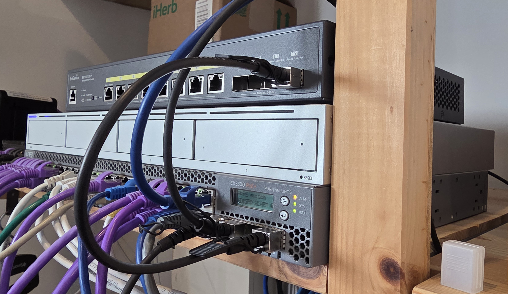

## OPNsense Router (Topton Mini PC)

My existing OPNsense box was a small Qotom mini PC:

- Qotom Mini PC Q300G4-S05
- Intel i5-5250U @ 1.60 GHz
- 2 GB DDR3
- 4 x Intel i211 gigabit ports
- Intel 80 GB SSD

That box has been fine for gigabit internet, but it was not the right fit once 10G uplinks entered the picture.

I replaced it with a Topton mini PC from AliExpress for $616.95 AUD:

- Intel i7-13620H
- 2 x 10G SFP+ ports using Intel ES82599ES
- 4 x RJ45 ports
- No RAM or storage included

There was also a cheaper-looking four-port version using Intel i226, but it was about 50% more expensive, which did not make much sense for this build.

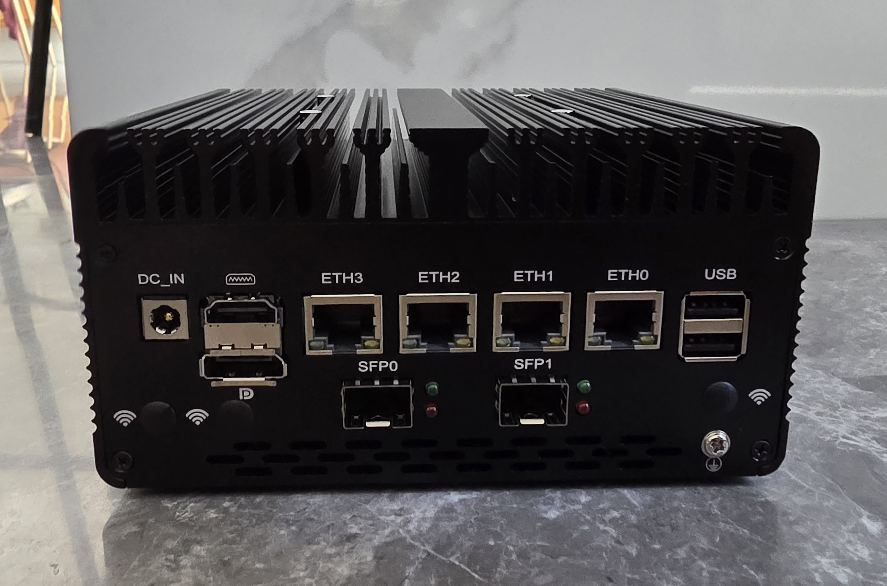

I added a used 8 GB DDR5 SODIMM for $25 and a Patriot P300 128 GB SSD for $19.19. OPNsense runs from memory and mostly uses the disk for logging and related tasks, so I did not need anything expensive on the storage side. I attached some heat spreaders to both.

My new NBN modem has a 2.5G RJ45 port rather than SFP. For that link, I bought a RJ45 to SFP+ transceiver based on the [Marvell AQR113C](https://www.moduletek.com/en/application_notes/an_00084.html). It can run the switch side at 10G and still negotiate correctly with 1/2.5/5G devices using pause frames. There is also [some discussion on ServeTheHome](https://forums.servethehome.com/index.php?threads/mix-10g-2-5g-slow-speed-high-retr.33217/page-4) about this approach. The cheapest one I found was [a HORACO module on AliExpress](https://www.aliexpress.com/item/1005009249048179.html) for $35.72. 10GTek's ASF-10G2-T also uses the same Marvell chip.


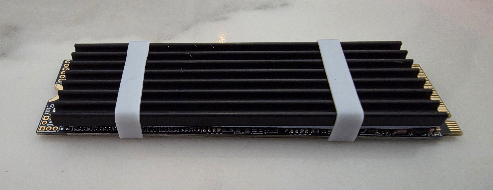

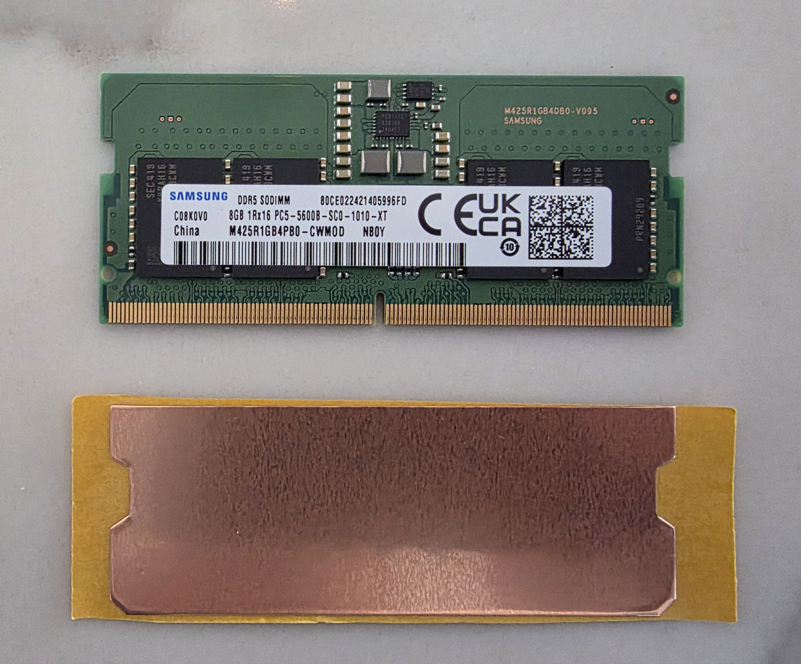

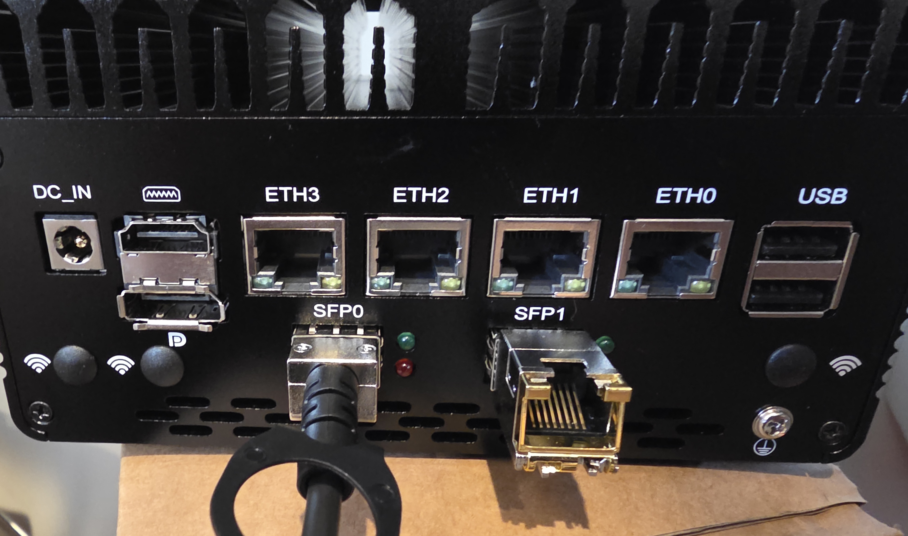

The funny part is cooling. The box ships with an external 70 mm fan mount. Without the fan, the CPU sat around 60 C. With the fan fitted, it dropped to 39 C. I can put my hand on it for more than a second now. I also printed a [fan grill](https://www.printables.com/model/355846-customizable-fan-grill-cover/files) and spacer, along with longer M3 screws so I could mount it cleanly.

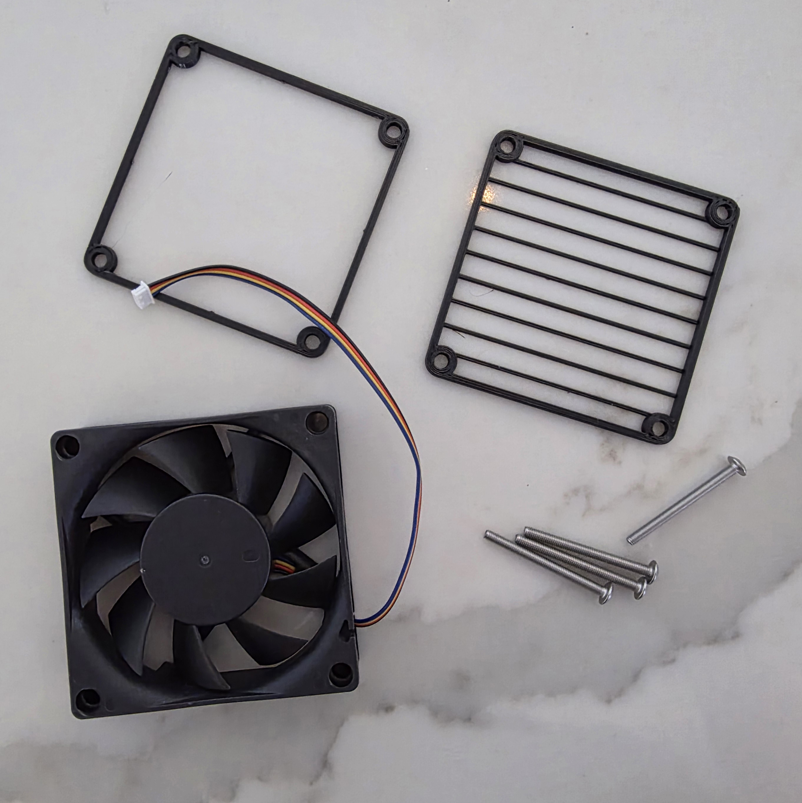

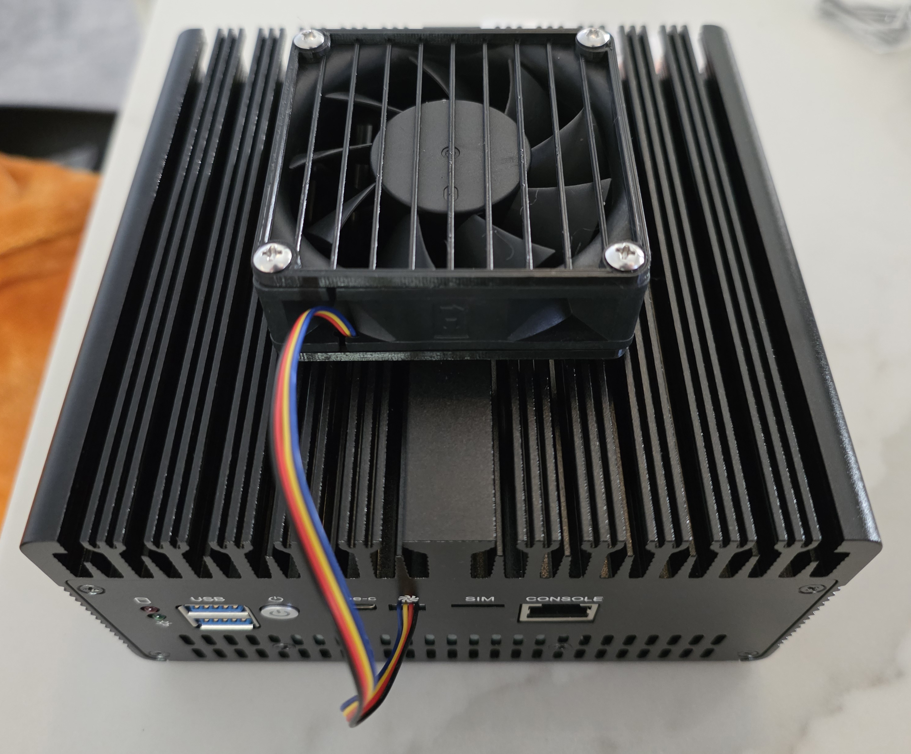

## Wireless Access Points (UniFi U7 Pro XG)

Wireless was the most annoying part because I wanted to improve both Wi-Fi performance and wired backhaul at the same time.

I was looking for Wi-Fi 7 access points with 6 GHz support. Wi-Fi 7 was released in January 2024, and the 6 GHz band has lower latency and less interference than 5 GHz. The downside is shorter range and weaker device compatibility. In my case that trade-off was acceptable because all of our phones support 6 GHz already. My M1 MacBook does not, and I would need something newer like an M4 MacBook to get that support.

Wi-Fi 7 also adds multi-link operation (MLO), which allows devices to use multiple bands at the same time. In other words, I would not be locked to 6 GHz alone and all of its disadvantages.

This upgrade meant replacing 4 x TP-Link EAP620 units. Once I started looking around, there were only a small number of 2.5G or 10G Wi-Fi 7 access points worth considering, mostly from TP-Link and UniFi.

On the TP-Link side:

- EAP770 and EAP772 are both EOL and were made before Wi-Fi 7 was ratified
- They have 2.5G uplinks and 6 GHz support
- The difference between them appears to be mostly branding
- The EAP773 has 10G
- They draw around 24 W

I also was not especially happy with the performance of my previous TP-Link access points, so I was already leaning away from that path.

On the UniFi side, the [U7 Pro XG](https://techspecs.ui.com/unifi/wifi/u7-pro-xg) looked like the sensible home option. The XGS model adds 4x4 radios, but phones are 2x2, and no 4x4 devices exist to make use of it yet. It also includes a spectral analyser (which I would never use) and Zero Wait DFS (a killer feature, which isn't even working yet).

I skipped the older U7 Pro and Max models because they had a fan. I also briefly looked at the UniFi E7, which would be end-game, but buying four of them would have been excessive.

I ended up buying 4 x UniFi U7 Pro XG units for $303.80 each after discounts, or $1,215.20 total.

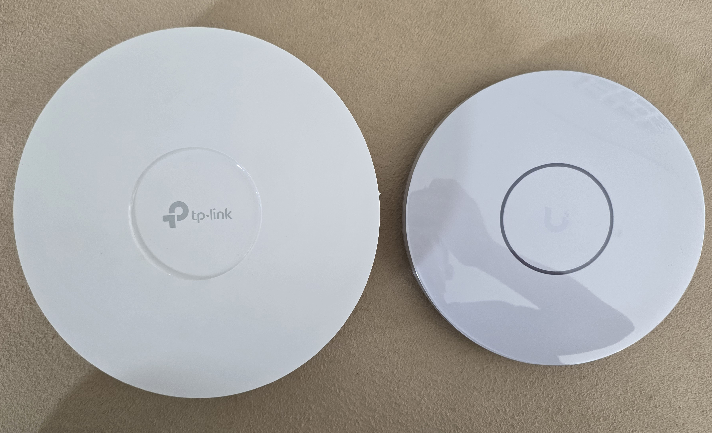

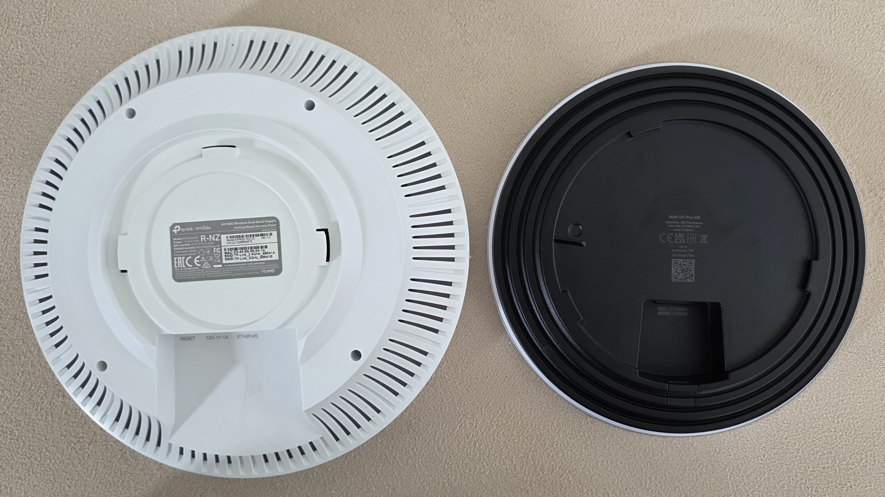

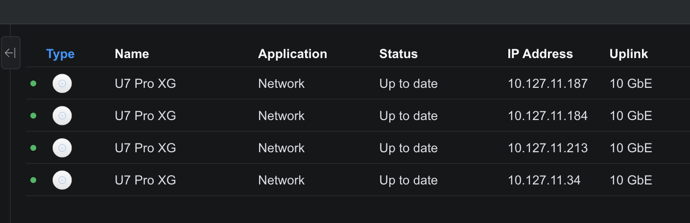

## Home Server (Mellanox ConnectX-4)

My [home server build from last year](/home-server-2025-part-1-hardware/) only has 2 x 2.5G onboard networking, so it needed an upgrade as well.

The choice was between Intel and Mellanox. I had looked at Intel X520 cards and Mellanox ConnectX-3 cards before, but for this round I wanted something a bit newer with better thermal behaviour and power usage.

I eventually found a Mellanox ConnectX-4 on eBay. That mattered because a lot of the Intel X710 cards I came across were clones from China. The ConnectX-4 gives me 2 x 25G SFP28 ports, which are backwards compatible with 10G SFP+, so it gives me some room above 10G as well.

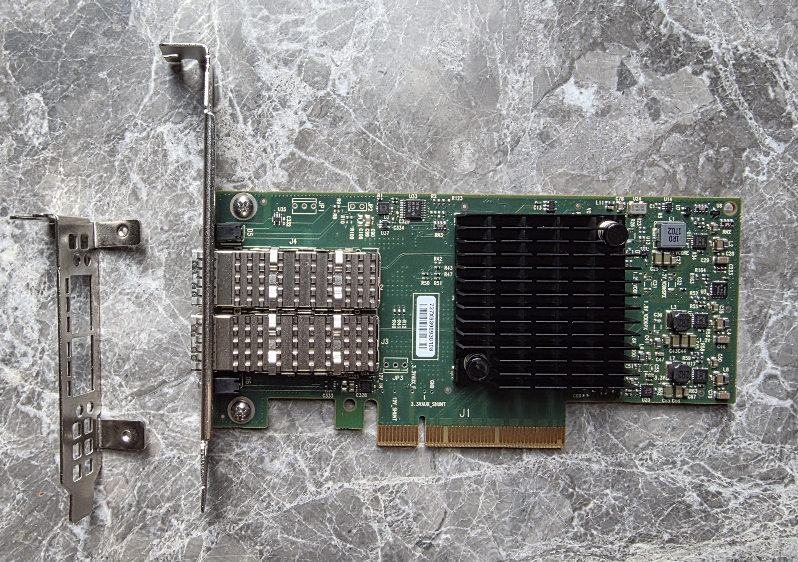

It is a PCIe 3.0 x8 card. In my server, the only other add-in card is the IPMI card, so I was not worried about lane pressure.

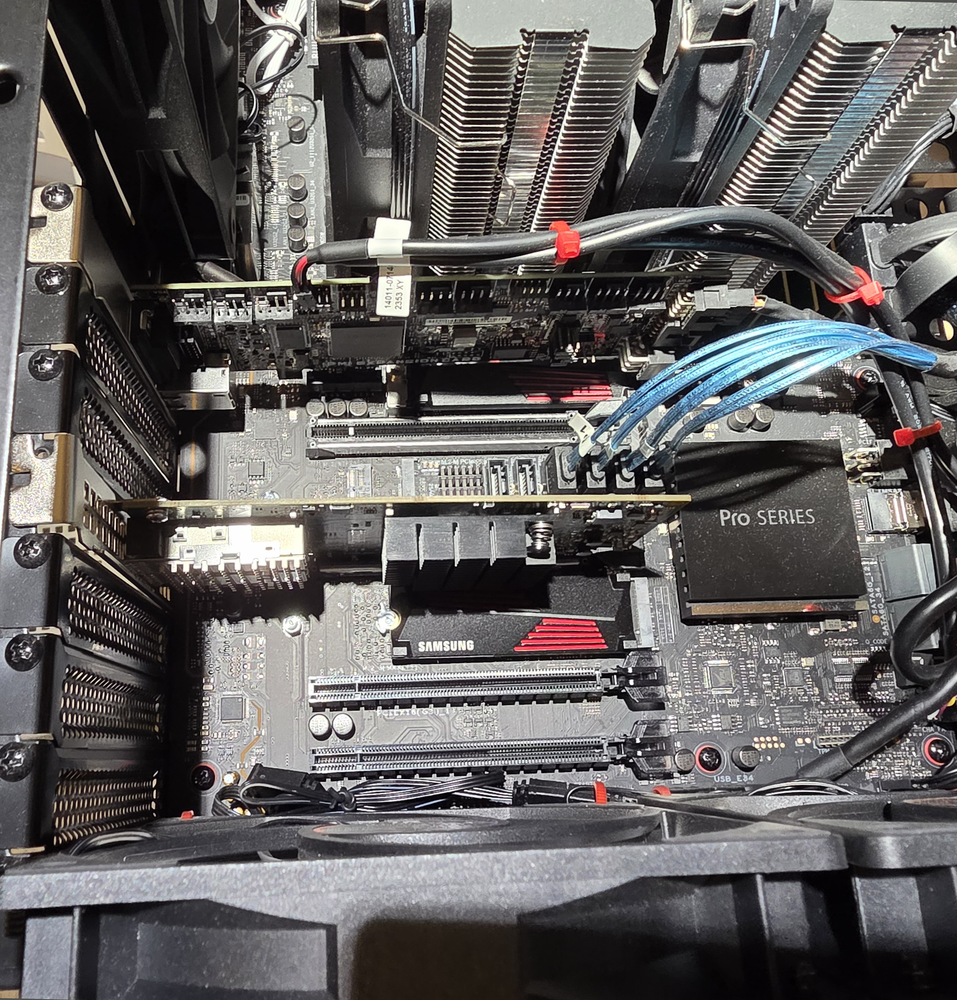

The only nuisance was that the card arrived with a low-profile bracket, so I had to buy a full-height bracket separately from AliExpress.

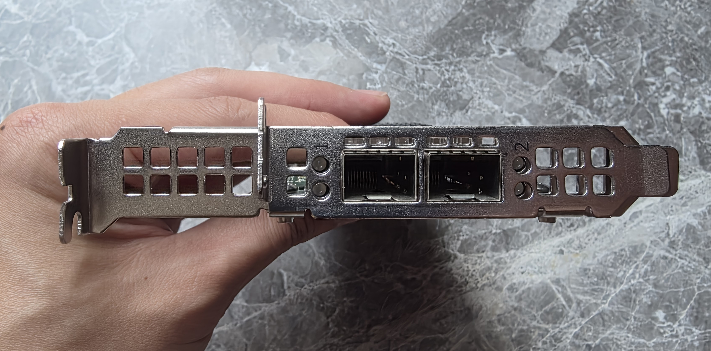

Total cost for the card came to $73.63.

## Study Switch (MikroTik CRS304-4XG-IN)

My study only has one network run coming into it, but that room contains both my gaming PC and my work laptop. Until now I had been using a small [Netgear GS305E](https://www.netgear.com/au/business/wired/switches/easy-smart/gs305e/) under the desk.

Currently there are two small-ish 10G switches that are also fanless and reasonably power efficient. Both have 4 x 10G ports and a management port.

- [MikroTik CRS304-4XG-IN](https://mikrotik.com/product/crs304_4xg_in) for $300
- [UniFi Flex 10 GbE (USW-Flex-XG)](https://techspecs.ui.com/unifi/switching/usw-flex-xg) for $600

Both have been [reviewed by ServeTheHome](https://www.servethehome.com/ubiquiti-flex-10-gbe-usw-flex-xg-review-the-low-cost-ubiquiti-10gbase-t-switch-marvell-10gbe/3/) and are almost identical in performance.

I went with the MikroTik, obviously, because it was half the price and doesn't require an external controller. It also fits under my desk without any issues.

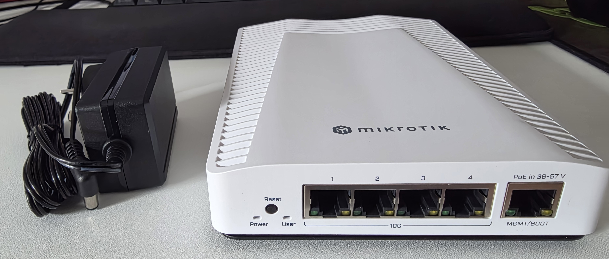

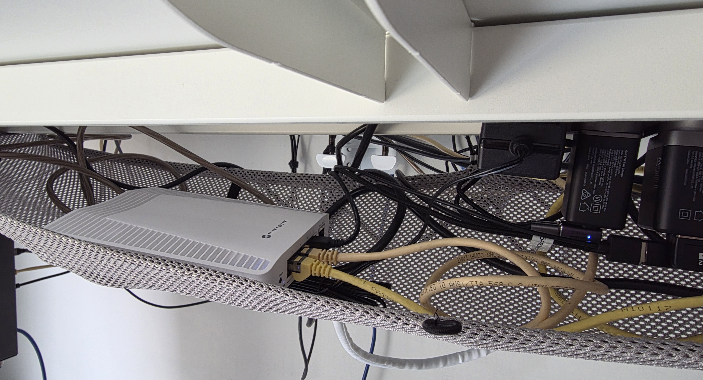

## Gaming PC NIC (Realtek RTL8127)

My [gaming PC upgrade from earlier this year](/gaming-pc-cpu-upgrade/) had a 1G port on the motherboard. I bought the [X570 board specifically because it exposes a PCIe 4.0 chipset lane](/gaming-pc-cpu-upgrade/#motherboard-x570) to add a 10G PCIe card down the line. On a B550M board, that same card would have been limited to PCIe 3.0 and bottlenecked to roughly 7.9G.

One of the more interesting recent developments is cheap 10G PCIe 4.0 x1 networking from Realtek. I found a card on [AliExpress](https://www.aliexpress.com/item/1005010168645556.html) using the Realtek RTL8127 and took a gamble on it for $41.51 after discounts. ServeTheHome has since [reviewed this exact chip](https://www.servethehome.com/cheap-10gbe-realtek-rtl8127-nic-review/).

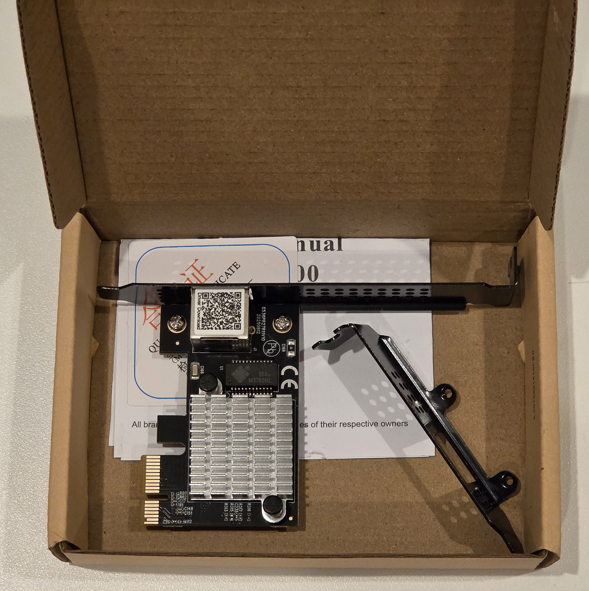

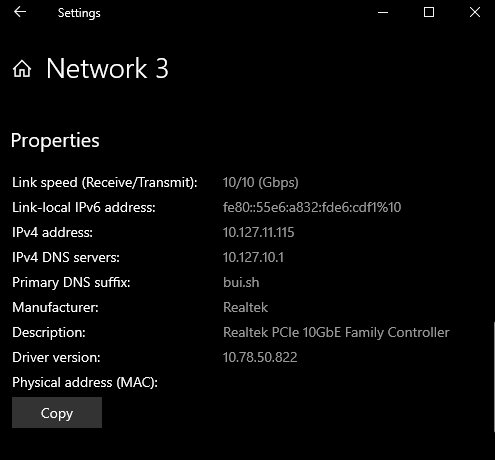

Realtek also seems to be pushing more low-cost 10G parts into the market:

- 8127AT: 10 GbE via PCIe 4.0 x1
- 8127ATG: 10 GbE via PCIe 3.0 x2
- 8159: 10 GbE via USB 3.2 Gen 2x2
- RTL8261C: 10 GbE PHY only, rated at 1.65 W, for switches

There is also [a discussion on ServeTheHome](https://forums.servethehome.com/index.php?threads/realtek-10-gbe-usb-adapters-might-be-on-the-way.47683/) covering the newer USB options.

The obvious downside is MacOS support. Realtek drivers are not available there, so this card is only useful on the PC side.

## Work MacBook (ACASIS NT0201)

For the work MacBook, the answer is external rather than internal. The machine uses Thunderbolt 3 / USB4 over USB-C, so the practical path is a 10G adapter based on an Aquantia/Marvell controller as Realtek is not supported.

There are a few different brands selling essentially the same Aquantia/Marvell AQC107 or AQC113 chip, which are also used by Apple in their devices with built-in 10 GbE. Because of that, I did not care much about the brand itself. I mostly cared about finding an adapter with the right chip. I ended up with the [ACASIS NT0201 USB4 to 10 Gigabit Ethernet Adapter](https://www.acasis.com/en-au/collections/acasis-interface-adapter/products/acasis-10-gigabit-ethernet-adapter-compatible-with-thunderbolt-5-4-3?variant=46560949108965) for $80.22 from AliExpress. It uses the AQC113 chip and connects over Thunderbolt 3, so it gets PCIe tunnelling rather than normal USB overhead.


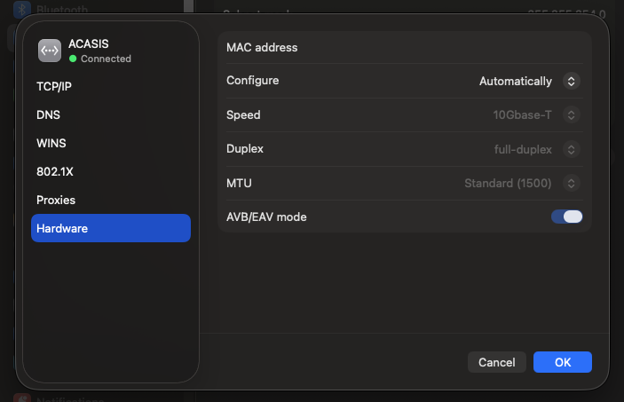

It does run hot. I measured 45 C on the body. After adding heatsinks, that dropped to 42 C on the main enclosure, and I will probably add more.

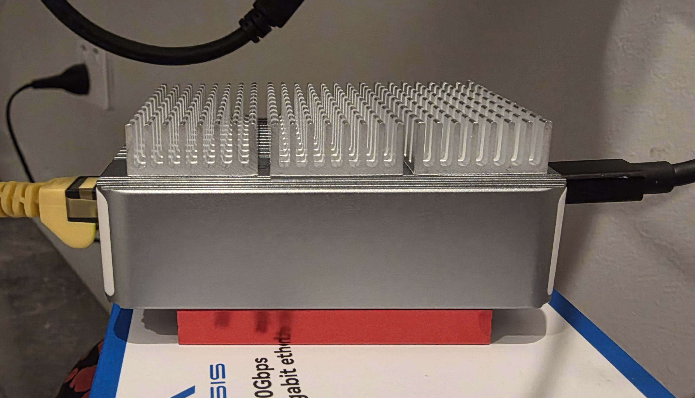

## Benchmarks

### File Transfers

File transfers to and from my home server easily reached 1 GB/s.

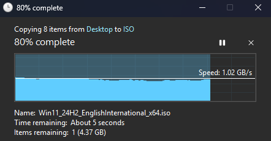

Finder on macOS does not show the transfer speed, but "less than a minute" for ~25 GB of data is probably 1 GB/s.

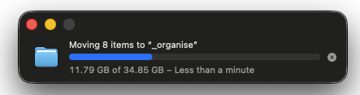

### Speed Test

I ran speed tests using [OpenSpeedTest](https://openspeedtest.com/) running on my home server.

On my MacBook Pro, I essentially got a 10G download, but upload was lower. Usually browser upload tests are limited by its JavaScript/websocket throughput, single-threaded fetch behaviour and socket handling. The tests were run in a Chromium based browser, with Firefox uploads even slower.

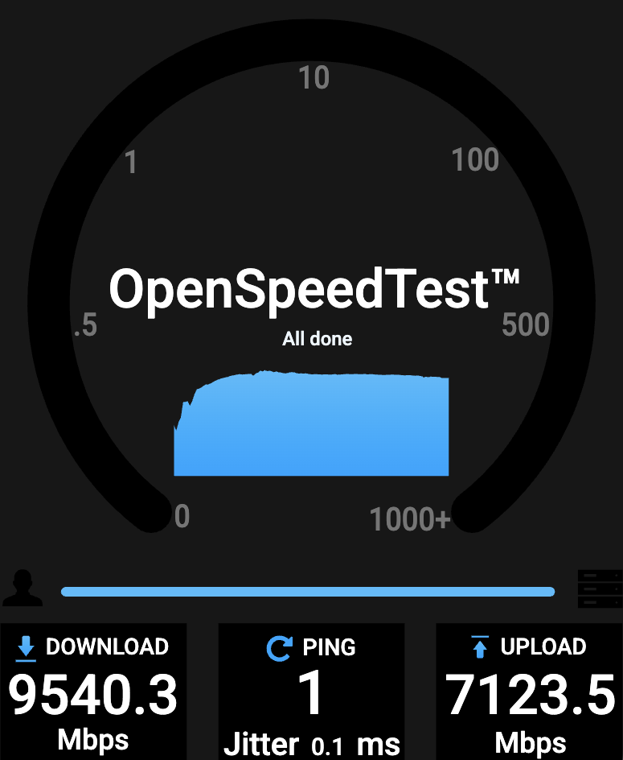

From my Samsung Galaxy Z Fold 7 over Wi-Fi, I got 2 GB down and 1.5 GB up. These numbers make sense as the phone's chipset is usually the bottleneck, not the access point. Honestly, the results be near the ceiling of a single 2 x 2 MIMO client today. I don't have a powerful

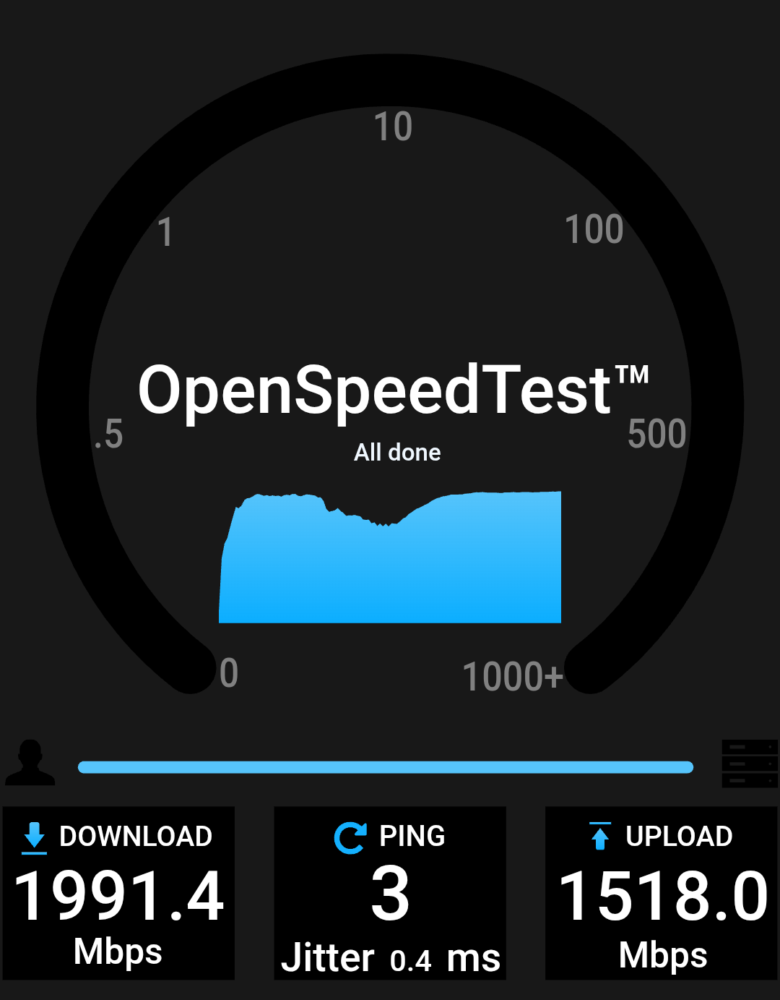

### iperf3

The [iperf3](https://software.es.net/iperf/) server runs on my OPNsense router. There are zero retransmits across all streams with a sustained 9.34 Gbps throughput.

```shell-session
[ ID] Interval           Transfer     Bitrate         Retr
[  5]   0.00-10.00  sec  4.59 GBytes  3.94 Gbits/sec    0            sender
[  5]   0.00-10.00  sec  4.59 GBytes  3.94 Gbits/sec                  receiver
[  7]   0.00-10.00  sec  3.11 GBytes  2.67 Gbits/sec    0            sender
[  7]   0.00-10.00  sec  3.10 GBytes  2.67 Gbits/sec                  receiver
[  9]   0.00-10.00  sec  3.18 GBytes  2.73 Gbits/sec    0            sender
[  9]   0.00-10.00  sec  3.18 GBytes  2.73 Gbits/sec                  receiver
[SUM]   0.00-10.00  sec  10.9 GBytes  9.34 Gbits/sec    0             sender
[SUM]   0.00-10.00  sec  10.9 GBytes  9.33 Gbits/sec                  receiver
```
