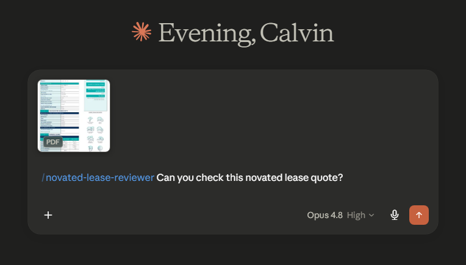
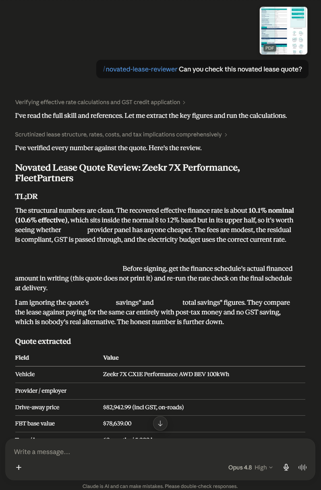
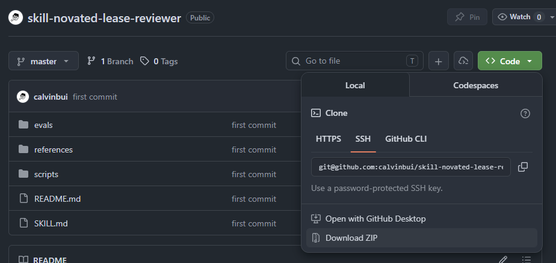
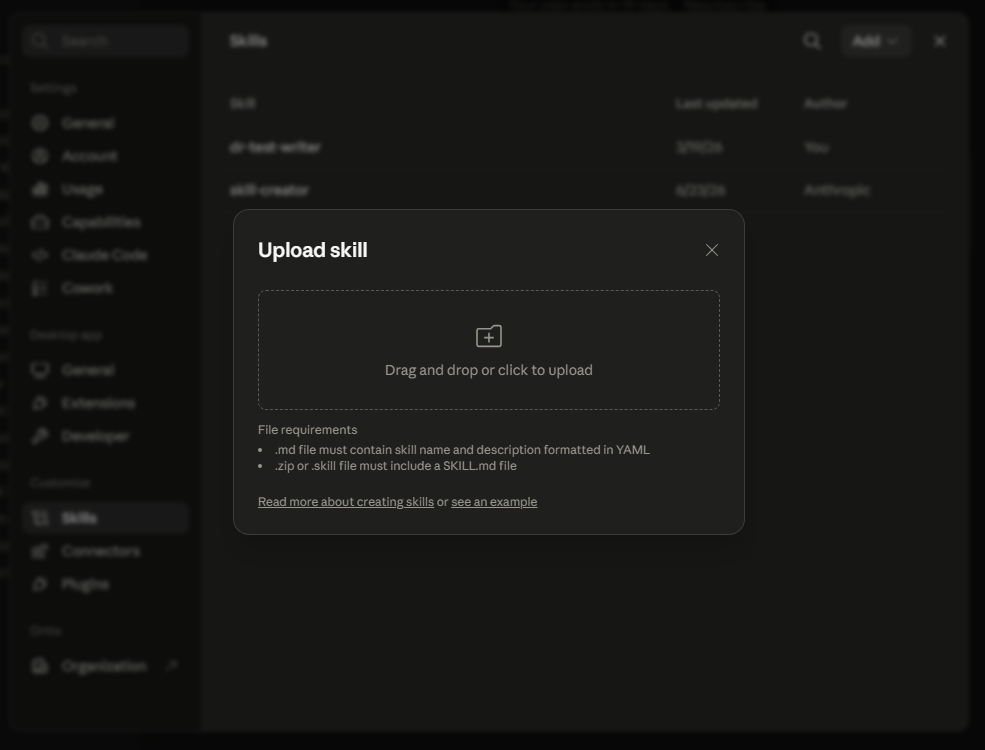
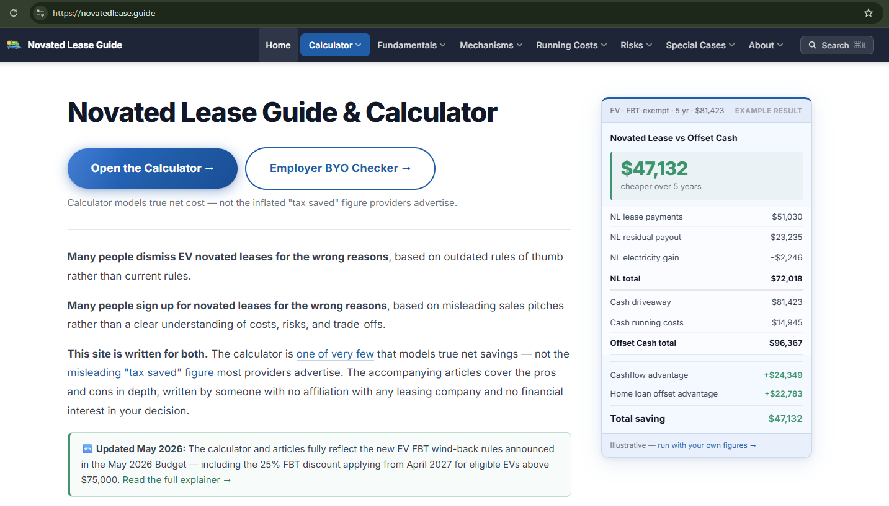

I wrote an AI skill to review Australian novated lease quotes for electric vehicles. It is available on GitHub at [calvinbui/skill-novated-lease-reviewer](https://github.com/calvinbui/skill-novated-lease-reviewer).

<!-- more -->

```toc
# This code block gets replaced with the TOC
```

## How To Use It

Give the AI assistant a novated lease quote PDF and ask it to review it: the finance, the tax side effects, the eligibility, the bundled extras. That is the whole workflow.

The skill should produce a plain-English report explaining what looks fine, what looks wrong, and what should be challenged with the provider. The point is not to reproduce the PDF, but to make the quote easier to question before signing anything.

Ask: `/novated-lease-reviewer Can you check this novated lease quote?`



Then wait for it to analyse the quote.



## Installation

The skill is built for Claude, where installation is simplest: download the ZIP from [GitHub](https://github.com/calvinbui/skill-novated-lease-reviewer/archive/refs/heads/master.zip) and upload it to the assistant. That is the whole installation.





[Agent Skills](https://agentskills.io) are an open standard, so the same `SKILL.md` format is starting to work elsewhere too. ChatGPT, the Codex CLI, Cursor and GitHub Copilot have all begun adopting it, though support outside Claude is newer and less polished, so expect some rough edges.

## What Is an AI Skill

An [AI skill](https://agentskills.io) is a small package that teaches an AI assistant how to do a specific job. Instead of starting from a blank chat every time, the skill gives the assistant:

- instructions for how to approach the task
- reference notes to load when needed
- helper scripts for calculations or checks
- a consistent report format
- test cases to make sure it behaves properly

That makes sense for a novated lease quote because the same checks need to happen every time. The model can read and explain the PDF, but the skill keeps it pointed at the parts that actually matter.

## The Problem

Novated leasing is a strange product. It looks like car finance, salary packaging, tax optimisation, employer administration and bundled running costs all mashed together into one PDF.

I have written about buying a used [Hyundai i30](/hyundai-i30-sr-premium-hatchback/) before, which was mostly a normal car decision: model, trim, condition, price and the accessories that followed. A novated lease quote is more complicated, because the actual car is only one part of the deal.

The [electric vehicle FBT exemption](https://www.ato.gov.au/businesses-and-organisations/hiring-and-paying-your-workers/fringe-benefits-tax/types-of-fringe-benefits/fbt-on-cars-other-vehicles-parking-and-tolls/electric-cars-exemption) made novated leasing worth looking at, because the tax treatment can be genuinely useful. The catch is that "FBT-exempt" does not mean "automatically a good deal". A bad quote can still lose money through inflated finance, weak GST pass-through, bundled add-ons, admin fees, or a punishing early termination clause.

For most people, the useful question is simple: does this quote actually make sense, or is it hiding something expensive?

## What It Checks

The skill assumes the quote should prove itself. That sounds dramatic, but it is the only sane default when a provider can show a large "you save money" number while hiding margin somewhere else.

The report works through these areas:

- **The financed amount**: The quote should reconcile back to the car's drive-away price, setup fees and GST treatment. If it does not, the gap needs an explanation. I have seen quotes where about $8,000 disappeared into that gap, which is not a rounding error.

- **Early exit risk**: The biggest risk in a lease is often what happens if you change jobs, get made redundant, or the car is written off.

- **Optional extras**: The skill strips out bundled insurance markups, paint protection, tint, minor damage memberships and duplicate factory inclusions.

- **The real finance cost**: The advertised rate is not always the real cost of money. The skill recovers the effective interest rate from the payments and residual value instead of trusting the headline rate.

- **Eligibility and comparison**: It checks the EV FBT eligibility rules, including whether an existing lease is grandfathered against the announced wind-back, and compares multiple quotes on the parts that matter: finance, admin and residual. Running costs are mostly a pre-tax budgeting bucket, so they should not decide the winner by themselves.

- **GST and tax side effects**: The skill checks whether GST credits are being passed through and estimates reportable fringe benefits / adjusted taxable income impact. Even an FBT-exempt EV lease can still affect things like Child Care Subsidy, HECS/HELP repayments, or Division 293.

## What It Produces

The output is a structured plain-English report. It is not meant to reproduce the PDF line by line. It is meant to answer:

1. What looks fine
2. What looks wrong
3. What needs to be challenged
4. What questions should be sent back to the provider

The skill deliberately does not tell someone whether to lease or buy the car outright. That depends on cash position, borrowing capacity, tax situation, job stability and risk tolerance. The skill's job is narrowed to cleaning up the quote so the decision is based on the real numbers.

## Evals

Evals are automated test cases for the skill. Each one is a sample quote with a known answer, so I can run the skill against it and confirm the report reaches the right verdict. They are how I know a change to the instructions actually made the skill better rather than quietly worse.

I built a set of deliberately rigged quotes, each hiding a specific trick the skill should catch:

- hidden brokerage buried inside the financed amount
- a GST credit that is not passed through
- an ineligible PHEV sold as FBT-exempt

There is also a clean, fair quote in the set, and that one matters just as much. The skill has to catch a bad quote, but it also has to leave a good one alone. A reviewer that flags everything is no more useful than one that flags nothing, so the evals check that a fair quote comes back clean and only the rigged ones get pulled up.

## Limits

The skill is not financial or tax advice. It just makes a confusing quote easier to understand before you sign.

There are also parts that need regular maintenance. Tax thresholds, FBT rules, residual percentages, Child Care Subsidy settings and announced policy changes can move over time. The phased FBT wind-back announced on 4 May 2026 is the obvious example: the EV exemption is not guaranteed to stay in its current form, so a quote that looks great today may rely on rules that are already being unwound. The skill includes references for those areas, but anything material still needs to be checked against the ATO, the lease provider and your own circumstances before signing. Not-yet-legislated measures, such as post-2027 grandfathering, should be confirmed before you rely on them.

Overall, this was a good use case for an AI skill because the task is repetitive, document-heavy and full of small traps. The model can read and explain the quote, while the skill constrains it to the checks that matter. That is a much better shape than pasting a PDF into a fresh chat and hoping the answer is not quietly vibes-based finance.

## Credits

The skill was built from publicly available information, principally [novatedlease.guide](https://novatedlease.guide/) and the posts and comments on [r/NovatedLeasingAU](https://www.reddit.com/r/NovatedLeasingAU/). Both did the hard work of documenting how these deals actually behave.


